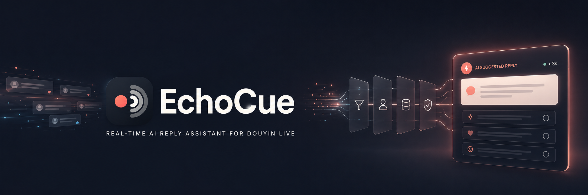

# Echocue

[](https://www.electronjs.org/)
[](https://www.typescriptlang.org/)
[](https://react.dev/)
[](https://vitejs.dev/)
[](https://nodejs.org/)
[](https://vitest.dev/)
[](LICENCE)

🇨🇳 简体中文 | 🇺🇸 [English](README_en.md)

Echocue 是一款面向抖音直播主播与运营团队的 Windows 独立桌面应用（Electron + React + TypeScript）。
它将实时弹幕转化为更快、与人设一致的回复建议：从 WebSocket 帧到达，到置顶浮窗渲染出建议，端到端 P95 时延**目标**不超过 3 秒。

每条消息都流经同一条可审计、可取消的单通道流水线：安全过滤 → 人设路由 → Qdrant（BM25）检索 → 可选 LLM 生成 → 浮窗展示。
同一时刻只进行一次建议尝试；建议展示期间收到的新消息直接丢弃，不排队。

## 典型场景

- 主播在忙碌的直播间里想快速获得自然、贴切的回复建议，不必离开直播界面。
- 团队希望回复始终与每个成员的人设以及直播间语气保持一致。
- 运营希望有一套结构化、可追溯的直播互动辅助流程，包括复核与打标。

## 环境要求

- 目标平台为 Windows x64；Linux 用于开发与 CI。
- Node.js 22+
- npm
- douyinLive 与 Qdrant 二进制随包存放在 `assets/`，运行期不下载任何二进制。

## 快速开始

安装依赖：

```bash
npm install
```

以开发模式运行（watch 构建 main 与 preload，并启动 renderer dev server）：

```bash
npm run dev
```

或构建并启动 Electron 生产包：

```bash
npm run preview
```

验证构建与测试套件：

```bash
npm run typecheck
npm run test:contracts
npm test
```

## 常用命令

| 命令 | 用途 |
| --- | --- |
| `npm run dev` | watch 构建 main/preload 并启动 renderer dev server |
| `npm run build` | 生产构建 main、preload 与 renderer |
| `npm run start` | 从构建产物启动 Electron |
| `npm run preview` | `build` + `start` |
| `npm run typecheck` | main 进程与 node 配置类型检查（`tsc --noEmit`） |
| `npm test` | 运行完整 Vitest 套件 |
| `npm run test:unit` | 单元测试（纯逻辑） |
| `npm run test:contract` | 契约层测试 |
| `npm run test:contracts` | 共享契约 schema + fixture 测试 |
| `npm run test:integration` | 集成测试（SQLite / Qdrant / 文件系统） |
| `npm run test:e2e` | E2E 测试（mock 外部服务） |
| `npm run test:coverage` | 带覆盖率报告的测试 |
| `npm run benchmark:safety-routing` | 基于版本化样本的安全/路由基准测试 |
| `npm run license:check` | 依赖许可证策略检查 |
| `npm run sbom` | 生成 CycloneDX SBOM |
| `npm run compliance` | `license:check` + `sbom` |

## CI

GitHub Actions（`.github/workflows/test-windows.yml`）在每次 push/PR（`master`、`develop`）时于 Windows 上运行：
契约、单元、契约层、集成与 E2E 测试，`typecheck`，许可证检查与 SBOM 生成，并上传合规产物。

## 仓库结构

```
src/contracts/   共享 Zod 契约包 — 全进程权威类型
src/main/        Electron 主进程（配置、加密、存储、安全、人设、检索、Provider、服务、窗口、遥测）
src/preload/     Preload 脚本（严格 IPC 白名单）
src/renderer/    React 渲染进程（主窗口 + 浮窗）
tests/           单元 / 契约 / 集成 / E2E 测试套件
docs/            需求、产品、架构、数据契约、设计与实施文档
prototype/       静态 React UI 原型（仅 mock 数据）
assets/          随包 sidecar 二进制（douyinLive、Qdrant）
```

## 文档

权威项目文档位于 `docs/`，覆盖需求（`01-requirements`）、产品（`02-product`）、技术调研（`03-research`）、
架构（`04-architecture`）、数据接口（`06-data-interface`）、评审（`07-review`）、交付/路线图（`08-delivery`）、
详细设计（`09-design`）、UI（`10-ui`）与实施（`11-implementation`）。
`docs/06-data-interface/schema/contracts-v1.ts` 中的机器可读 Zod schema 是全部共享类型的唯一事实来源。

## License

本项目基于 [Apache License 2.0](LICENSE) 开源。

---

**题外话**

1. 项目的所有需求分析和设计、MVP、里程碑等文档（见 `docs/` ）完整提交 Github，供其他同好交流学习用。
2. 项目完全采用 Vibe Coding，所有子任务进度档也完整提交（见 `progress/`），方便后续 Coding Harness 交流借鉴。
3. UI 原型在目录 `prototype/` 下，实际产品 UI 与初版设计有**较大出入**，这里仅供参考。
4. 本项目派生自 [Douyin-EchoCue](https://github.com/Ahsen17/Douyin-EchoCue)，项目已 **ARCHIVED**，具体原因可见该项目 Issue。

**特别鸣谢：** jwwsjlm/douyinLive by @jwwsjlm
