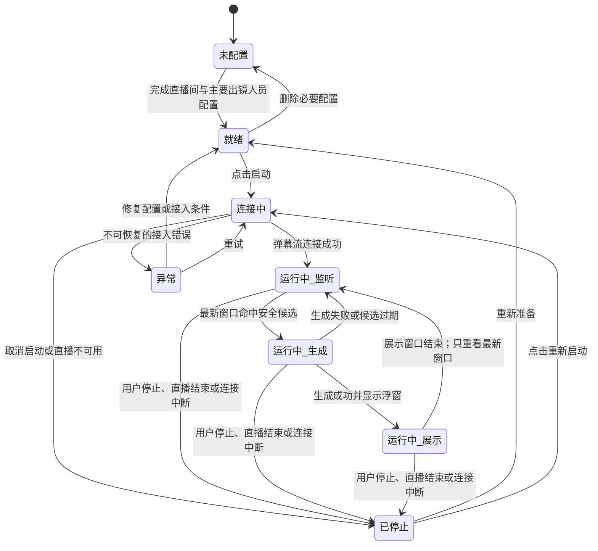

# Echocue 产品需求文档（PRD）

| 项目 | 内容 |
| --- | --- |
| 文档版本 | v0.1 |
| 状态 | 已确认产品基线；外部 POC 仍待执行 |
| 阶段 | 产品设计 |
| 日期 | 2026-08-21 |
| 上游依据 | 《Echocue 需求澄清与 MVP 定义 v0.1》 |
| 确认记录 | 甲方已认可产品原型与本 PRD 主线；技术 POC 结果不由产品确认替代 |

## 1. 产品定义

Echocue 是一个运行于 Windows 的单直播间实时互动建议 client。它读取真实抖音直播间弹幕，忽略风险与无互动价值内容，从最新弹幕中选择最值得回应的一条，按当前出镜人员的人设生成短回复建议和提词，并以置顶浮窗呈现给主播。

它是主播的实时表达辅助工具，不是自动回复机器人：系统绝不替主播对外发送内容，也不要求主播确认或采纳建议。

## 2. MVP 目标、非目标与原则

### 2.1 目标

1. 验证真实直播间中“发现值得接的弹幕 → 生成贴合人设的话术 → 主播在浮窗快速看到”的闭环。
2. 保持内容新鲜：只服务当前时刻仍值得回应的弹幕，不积压、不补发旧建议。
3. 降低主播连续输出的组织语言成本，并减少前后人设口径不一致。
4. 在 Windows standalone client 内完成全部 MVP 操作：配置、启动、运行和浮窗控制。

### 2.2 非目标

- 自动回复、代主播发布任何平台内容；
- 多直播间、MCN 机构、成员权限、账号体系；
- Web 管理端、独立后端服务；
- 聚合型直播运营数据分析、跨直播间审计工作台；
- 手机、macOS 或浏览器端。

### 2.3 产品原则

| 原则 | 产品含义 |
| --- | --- |
| 新鲜优先 | 不按弹幕到达顺序回复；展示窗口结束后只从最新滚动窗口挑选候选。 |
| 人设优先 | 默认围绕主要出镜人员；成员指向清晰时才使用该成员人设。 |
| 安全前置 | 风险弹幕必须在生成前剔除，不能进入浮窗。 |
| 低干扰 | 单次只呈现一条建议；展示窗口内不再生成下一条。 |
| 主播掌控 | 浮窗仅提供建议，是否使用完全由出镜人员决定。 |
| 先可用后扩展 | MVP 以本地单直播间为边界，避免提前引入机构服务化复杂度。 |

## 3. 用户与核心场景

### 3.1 角色

| 角色 | 行为 | 关键诉求 |
| --- | --- | --- |
| 主要出镜人员 | 观看浮窗、口头采用或忽略建议 | 建议快、短、符合自己人设、不遮挡直播操作 |
| 其他出镜成员 | 可能被弹幕明确提及 | 被提及时，建议应使用其本人风格而非主出镜人员风格 |
| 配置人员 | 创建团队/成员人设和禁忌，调整 client 偏好 | 自然语言配置、容易预览、无需技术知识 |

一个人可以兼任全部角色。MVP 不区分账号权限。

### 3.2 核心场景

**场景 A：默认围绕主要出镜人员接话**

直播间弹幕出现“今天这个造型太有辨识度了”，系统识别其正面且与主要出镜人员人设相关，生成一条可直接接话的短回复和 2–3 个提词，浮窗显示 10 秒。

**场景 B：明确提及团队其他成员**

弹幕出现“XX 今天跳得太稳了”，并且 `XX` 是已配置、可被可靠识别的成员别名。系统路由至该成员人设后生成建议；不再使用主要出镜人员的人设。

**场景 C：无效或风险弹幕**

弹幕包含攻击、个人信息、政治、色情、违法、医疗/金融建议、竞品或交易价格等风险内容。系统忽略它，不生成建议、不展示原文，也不进入待回复队列。

**场景 D：高流量中的时效性控制**

浮窗正在展示一条建议时，client 继续接收弹幕，但不启动下一轮生成，也不创建待展示队列。10 秒展示窗口结束后，丢弃历史候选，仅基于最新滚动窗口重新筛选下一条。

## 4. 端到端体验与状态

### 4.1 主路径

```text
配置团队与人设
  → 选择直播间并启动
  → 连接弹幕流
  → 接收/过滤/聚合最新弹幕
  → 选择候选并路由人设
  → 生成回复建议与提词
  → 浮窗置顶展示 10 秒
  → 不排队，回到最新窗口重新筛选
```

### 4.2 助手运行状态

| 状态 | 说明 | 用户可见提示 | 可执行动作 |
| --- | --- | --- | --- |
| 未配置 | 未完成必要直播间或主要出镜人员人设配置 | “请先完成直播间与人设配置” | 进入配置 |
| 就绪 | 配置可用，尚未启动 | “准备就绪” | 启动助手、进入配置 |
| 连接中 | 正在连接直播弹幕流 | “正在连接直播间” | 取消启动 |
| 运行中-监听 | 正在接收并判断最新弹幕 | “正在监听弹幕” | 停止、调整浮窗 |
| 运行中-生成 | 已选择候选，正在生成建议 | “正在生成建议” | 停止 |
| 运行中-展示 | 浮窗正展示一条建议，展示窗口倒计时中 | “建议展示中” | 停止、调整浮窗 |
| 已停止 | 用户主动停止、直播结束或连接不可恢复 | 对应停止原因 | 重新启动、进入配置 |
| 异常 | 接入、配置或生成发生需要用户处理的问题 | 简明错误与建议动作 | 重试、配置、查看诊断 |

**状态约束**：`运行中-展示` 时不得转换至 `运行中-生成`；展示窗口结束后仅可进入 `运行中-监听`，由最新窗口重新触发生成。



图中 `运行中_展示 → 运行中_监听` 是避免过时队列的关键转换：展示结束并不会取出此前缓存的候选，而是重新计算当时的最新弹幕窗口。

### 4.3 建议生命周期

| 步骤 | 规则 |
| --- | --- |
| 接收 | 为每条弹幕记录接收时间，仅供本地实时处理与最小诊断。 |
| 过滤 | 命中基础或团队禁忌的内容直接忽略。 |
| 候选 | 从最新滚动窗口的安全弹幕中选择高优先级候选。 |
| 路由 | 成员指向明确且可信时使用成员人设；否则使用主要出镜人员人设。 |
| 生成 | 生成一条短回复建议和一组提词。失败时该轮直接丢弃，回到监听，不阻塞后续最新内容。 |
| 展示 | 成功结果立即展示；默认 10 秒，可配置。 |
| 过期 | 展示期间和展示前的未选中候选均不可排队补发。 |

## 5. 功能需求

### 5.1 FR-01：本地直播间配置

client 必须支持维护一个 MVP 直播间配置，至少包括用于连接目标直播间的必要标识/链接及显示名称。配置仅存储于本机，具体敏感字段的加密与存储位置在技术设计中确定。

验收：用户能创建、编辑、保存并选择一个有效的直播间配置；配置不完整时无法启动助手，并能看到缺失项提示。

### 5.2 FR-02：团队与 Markdown 人设配置

client 必须支持一个团队下的多个人设文档：

- 一个且仅一个主要出镜人员；
- 零至多个其他成员；
- 每位成员有显示名、独立的“人设匹配名称/昵称”列表，以及 Markdown 人设正文；显示名用于界面展示，匹配名称/昵称仅用于在生成前路由人设；
- 人设正文可自由编辑，系统提供可选模板与预览；不以 JSON 或固定表单限制配置表达；
- 人设正文至少建议覆盖：角色定位、语言语气、表达习惯、常用表达、互动边界、禁忌和可参考的表达示例；
- 主要出镜人员删除或未设置时，助手不可启动；其他成员缺少人设时不参与成员路由。

验收：配置人员可创建主要出镜人员和至少一名成员、编辑 Markdown、预览并保存；助手可在配置完整时启动。

### 5.3 FR-03：成员识别与人设路由

当候选弹幕进入生成前，系统必须按如下确定人设：

1. 在生成前，使用成员专属的“人设匹配名称/昵称”列表进行独立路由；不得将成员路由交给生成模型判断；
2. 先进行规范化精确匹配（例如大小写、空白、常见符号差异）；命中唯一成员时，使用其人设；
3. 精确匹配未命中时，可使用非生成式的高可信模糊匹配处理已配置的同音、常见错别字和别称变体；只有结果唯一且达到后续技术设计确定的高阈值时，才使用该成员人设；
4. 命中多个成员、模糊匹配置信度不足、无法确定或对应人设不可用时，使用主要出镜人员人设；
5. 不得因大语言模型的猜测、解释或推理改变成员路由结果。

验收：针对精确成员昵称、已配置同音/错别字变体、无成员名、歧义别名和低可信错别字五类测试弹幕，分别得到成员人设、成员人设、主要出镜人员人设、主要出镜人员人设和主要出镜人员人设。

### 5.4 FR-04：内容安全与团队禁忌配置

系统必须在生成前忽略以下内容：侮辱谩骂、攻击挑衅、主播个人信息或疑似人肉、政治、色情、违法、医疗/金融建议、竞品、交易价格，以及甲方配置的团队专属禁忌。

团队专属禁忌配置必须同时支持：

- 自然语言说明，例如“不要讨论成员的感情状态和住址”；
- 关键词/短语列表，例如成员称呼、敏感词或禁用商品名。

基础风险分类、自然语言禁忌解释和关键词规则如何组合，由技术设计定义；产品要求是宁可忽略不确定的风险候选，也不得把它生成成主播建议。

验收：每个基础风险类别和每条自定义关键词规则都至少有一条测试样本，命中后均不生成浮窗建议。

### 5.5 FR-05：候选筛选与实时窗口

系统必须持续接收实时弹幕，并使用滚动时间窗口从安全内容中寻找候选。安全过滤后，必须先通过本地 Qdrant 双 collection 语义检索完成弹幕互动价值的初筛：`golden_set` 严格以当前人设版本过滤，通用 `pre_set` 不受人设版本限制；两路并行召回后根据归一化置信度 rerank 形成最终 TopK。候选优先级按下列顺序评估：

1. 与已路由人设直接相关的正面互动；
2. 明确点名成员且具有正面互动价值的内容；
3. 有趣、可自然接话的玩笑或反差；
4. 能带动氛围或延展当前交流的话题。

若 Top-1 来自 `golden_set` 且归一化置信度达到直出阈值（初始建议 0.85，须由 POC 校准并作为内部配置管理），系统须先按当前人设版本、当前禁忌规则、结构、长度和安全类别复验该 payload；通过后才直接展示回复/提词，不调用 LLM。否则以合并 TopK 和当前人设为上下文，调用一次 LLM 生成。`pre_set` 只用于参考和生成上下文，不可直接推送。Qdrant 语义初筛是 MVP 前置能力，且无论采取何种算法，必须遵循“最新窗口优先、展示期间暂停生成、绝不排队补发”的规则。

验收：在包含高优先级候选、低价值安全弹幕和风险弹幕的测试流中，系统应只为高优先级安全候选生成建议；展示期结束后不得出现旧候选的延迟建议。

### 5.6 FR-06：回复建议与提词

每条建议必须由以下内容组成：

| 字段 | 用户可见要求 |
| --- | --- |
| 目标弹幕 | 显示 `@观众昵称`（存在昵称时）以及原文或不改变关键语义的短概要；不得展示被过滤内容。 |
| 短回复建议 | 一句可供主播直接说出或轻微改写的话，贴合被路由的人设。 |
| 提词 | 2–3 个简短关键词或短语，帮助主播延展，不写成长段落。 |

除三项内容外，浮窗不显示模型、置信度、规则、工作流等技术细节。

验收：每条展示建议都有短回复和提词；存在 `userNickname` 时显示 `@userNickname`，缺失时不显示空 `@`；人工评审样本中，建议不应明显违背当前人设或团队禁忌。

### 5.7 FR-07：浮窗展示与交互

浮窗必须：

- 保持置顶；
- 新建议到达时自动显示，并开始默认 10 秒、可配置的展示窗口；
- 展示窗口结束后自动隐藏；
- 同一时刻只显示一条建议；
- 支持拖拽移动、调整窗口尺寸、透明度、字体大小、深浅主题与点击穿透；
- 允许配置人员在 client 中修改这些偏好，并在下次启动后保留；
- 无需提供手动唤回历史建议的功能。

验收：用户调整的展示偏好能保存并生效；新建议显示时窗口处于置顶状态；10 秒后隐藏；展示期内不出现第二条建议。

### 5.8 FR-08：启动、停止与异常反馈

client 应提供启动/停止入口，并使用非技术化语言反馈以下情况：

| 情况 | 最小反馈 |
| --- | --- |
| 必要配置缺失 | 指出需要补全直播间或主要出镜人员人设。 |
| 正在连接 | 显示连接进行中。 |
| 直播未开始/不可接入 | 显示未能连接到可用直播弹幕，并允许重试。 |
| 直播未开播或下播 | 立即关闭 `douyinLive` 本地 WS；显示服务未启动/已停止，允许用户手动重试启动。 |
| 连接中断 | 显示已停止监听并释放本地 WS，允许重新启动。 |
| 单轮生成失败 | 不弹出主播建议；在 client 状态区显示“本轮建议未生成，正在继续监听”。 |
| 主动停止 | 隐藏浮窗并停止弹幕处理和生成。 |

验收：任一上述情况均不会导致 client 无响应或残留浮窗；停止后不再生成新建议。

### 5.9 FR-09：最小本地诊断

MVP 需要一个只面向配置人员的本地诊断视图，用于确认链路是否工作，而非提供运营复盘。至少展示：

- 当前连接/运行状态；
- 最近一次弹幕接收时间；
- 最近一次建议生成或过滤的时间与结果摘要；
- 最近一次端到端时延；
- 可复制的非敏感错误摘要。

诊断视图不得默认显示或长期保留被过滤弹幕、个人信息或模型密钥。

### 5.10 FR-10：全链路本机审计追溯

MVP 必须为每条进入处理链路的弹幕创建唯一 `trace_id`，以显式状态机记录不可跳步的迁移和时间戳。审计详情必须能按 `trace_id` 完整回放，且至少包含：

1. 接入原始事件、规范化弹幕原文、`receivedAt`、去重结果与硬规则过滤结论；
2. 人设路由所用的成员名称/别名命中、模糊匹配候选与分数、歧义回退原因、最终 `persona_id`，以及当时生效的自然语言人设版本和原文快照；
3. `pre_set` 与 `golden_set` 两路的 Qdrant 查询、payload filter、原始命中、归一化置信度、最终 TopK、语义分类、payload 原文与初筛结论；
4. 候选排序/时效结论，以及走“payload 直出”“LLM 生成”“过滤/丢弃”的原因；
5. 若调用 LLM：已渲染提示词原文、非敏感请求参数、provider/model/request ID、原始响应、解析后的 `quick_reply`/`cues`、结构/安全校验结果和错误信息；
6. 浮窗展示、隐藏、取消、超时、失败或丢弃的最终结果及时间戳。

审计工作区必须提供两个入口：其一查看单条弹幕的完整 workflow 上下文与状态链，其二对最终建议进行主观质量打标和人工修正。它们不要求是独立页面或弹窗，可采用同页分栏、详情面板、抽屉或其他合理交互组织。打标时：认可填写 0–100 分；不认可记录 0 分，并可填写主播更希望说出的短回复/提词，修正答案默认 85 分且允许修改。打标记录必须绑定 `trace_id`、最终 `persona_id` 和 `persona_version`；用户视图仅显示“未打标、已认可、已拒绝、已修正、无需打标”等可理解状态，避免重复打标。回流至案例库、同步状态、bad case、置信度阈值及其内部机制均不得在该工作区向用户展示。

审计记录必须保存在 client 本机受保护的独立审计存储中，默认永久保存且 MVP 不支持导出；原文审计数据不得写入普通日志、Prometheus label、OTel attribute 或默认诊断页。API Key、Cookie、签名 URL、请求 Authorization header 永不记录。审计详情仅在配置人员主动进入“审计追溯”页后显示，并应有本机访问提示。

验收：任选一条“展示”“过滤”“直出”“生成失败”和“过期丢弃”的弹幕，都能从 `trace_id` 追溯其完整状态链与上述适用原文；不能出现只有最终回复而无法解释路由、检索或模型结果的记录。

### 5.11 FR-11：桌面窗口、任务栏与托盘

主窗口采用进阶 macOS 风格的自绘标题栏与三按钮视觉：关闭、最小化、最大化/还原。三个按钮必须具有明确 tooltip、键盘可达性和 Windows 平台上的等价窗口行为；自绘标题栏的其余区域可拖拽，按钮区域不可拖拽。

点击关闭按钮或主窗口系统关闭事件时，默认仅隐藏主窗口并最小化到系统托盘，**不得退出进程或停止正在运行的 AI 服务**。托盘菜单至少提供“显示主窗口”和“退出 Echocue”；只有用户选择“退出 Echocue”才执行服务停止、关闭本地 WS/Qdrant sidecar、关闭浮窗并退出进程。

任务栏/应用图标的唯一设计源为仓库根目录相对路径 [`../../svg/douyin-echocue-client-app-icon.svg`](../../svg/douyin-echocue-client-app-icon.svg)；托盘图标的唯一设计源为 [`../../svg/douyin-echocue-client-tray-icon.svg`](../../svg/douyin-echocue-client-tray-icon.svg)。Windows 安装包及运行时所需 ICO/PNG 均从上述 SVG 构建生成，不得另行替换图标设计。

验收：关闭主窗口后进程仍在托盘、正在运行的服务不中断；托盘“显示主窗口”可恢复窗口；托盘“退出 Echocue”能完整停止服务并退出；任务栏和托盘显示指定图标。

## 6. 信息架构

```text
Echocue Windows client
├─ 启动与运行页
│  ├─ 当前直播间、团队与主要出镜人员
│  ├─ 启动/停止与运行状态
│  ├─ 浮窗控制入口
│  └─ 最小诊断摘要
├─ 直播间配置
├─ 团队与人设
│  ├─ 主要出镜人员（Markdown）
│  └─ 其他成员（名称、别名、Markdown）
├─ 安全与禁忌
│  ├─ 自然语言边界
│  └─ 关键词/短语
├─ 浮窗偏好
├─ 诊断
└─ 审计追溯
   ├─ 查询与筛选
   ├─ 入口：单条 workflow 完整上下文
   └─ 入口：建议质量打标与人工修正
```

## 7. MVP 页面与交互规格

### 7.1 启动与运行页

首次使用时展示“完成配置”引导；配置完成后显示直播间、团队、主要出镜人员和启动按钮。运行中显示简明状态，避免展示技术术语。停止按钮始终可用。

### 7.2 团队与人设页

每位成员使用一个卡片入口。主要出镜人员卡片必须明显标记且不可为空。编辑页包含：

- 显示名称：仅用于配置界面；
- 人设匹配名称/昵称：可维护多个名称、昵称、常见别称、同音字/常见错别字变体，供生成前独立路由使用；
- Markdown 人设编辑器与渲染预览。

成员删改应有本地确认提示。系统应提醒配置人员：匹配词越宽泛，越可能产生歧义；歧义结果不会路由给成员，而会回退主要出镜人员。

### 7.3 安全与禁忌页

页面说明平台基础风险内容将自动忽略；提供：

- “团队边界说明”Markdown/多行自然语言输入；
- “关键词和短语”列表，可添加、删除与编辑；
- 一段明确提示：规则命中的内容不会生成建议。

### 7.4 浮窗偏好页

提供默认值恢复及以下控件：展示时长（默认 10 秒）、置顶（MVP 应默认开启且不允许关闭）、点击穿透、透明度、字体大小、主题、窗口宽高。拖动位置直接在浮窗上完成。

### 7.5 浮窗内容布局

从上到下展示：

1. 目标弹幕/简短概要；
2. 视觉上最突出的短回复建议；
3. 低干扰的“提词”及 2–3 个关键词。

不得显示完整推理、风险判断、置信度或历史建议列表。

## 8. 验收指标

| 指标 | MVP 验收口径 |
| --- | --- |
| 完整链路 | 在真实抖音开播测试中，能从弹幕流接入到浮窗展示至少一条建议。 |
| 时延 | 采样有效建议的端到端时延以 P95 ≤ 3 秒为持续优化的业务目标；`t0` 为 client 收到原始 WebSocket frame 的单调时钟，`t_end` 为浮窗首帧确认。未达目标不阻断后续开发，但不得被视为最终可接受结果。 |
| 安全过滤 | 预定义基础风险样本和团队自定义禁忌样本均不得触发建议。 |
| 人设路由 | 主要出镜、明确成员指向、歧义成员指向三类样本符合 FR-03。 |
| 新鲜度 | 展示窗口中不生成下一条；窗口结束后不得展示窗口前未选中候选的延迟建议。 |
| 浮窗 | 置顶、自动出现/隐藏、10 秒时长配置、拖拽、尺寸、透明度、字号、主题、点击穿透可用且设置持久化。 |
| 稳定性 | 单轮生成或连接异常不导致 client 崩溃；用户可停止并重启。 |
| 语义初筛 | Qdrant 本地 collection 能在首次安装后自动初始化，并对测试弹幕完成语义检索初筛。 |

## 9. 开放项与下一阶段输入

| ID | 事项 | 处理阶段 |
| --- | --- | --- |
| O-01 | 第三方抖音弹幕接入方案是否稳定、合规、可满足 P95 时延。 | 技术调研与选型 |
| O-02 | 滚动窗口长度、Qdrant collection/向量方案、候选评分、成员识别可靠性条件与去重策略。 | 技术调研、详细设计 |
| O-03 | 模型服务、内容分类与隐私过滤的组合方案、成本和失败降级。 | 技术调研与选型 |
| O-04 | 自然语言人设/禁忌的 SQLite 版本组织、加密、备份策略；多 Provider 配置与 API Key 的本地安全存储。 | 技术详细设计 |
| O-05 | 实际浮窗默认尺寸、位置、透明度和交互细节。 | 原型验证、详细设计 |

## 10. 变更控制

本 PRD 的 MVP 范围变更必须同步更新上游需求基线，并标注其对时延目标、standalone 边界和开发排期的影响。技术方案不得自行扩大为服务端或多租户架构，除非甲方明确批准调整 MVP 边界。
