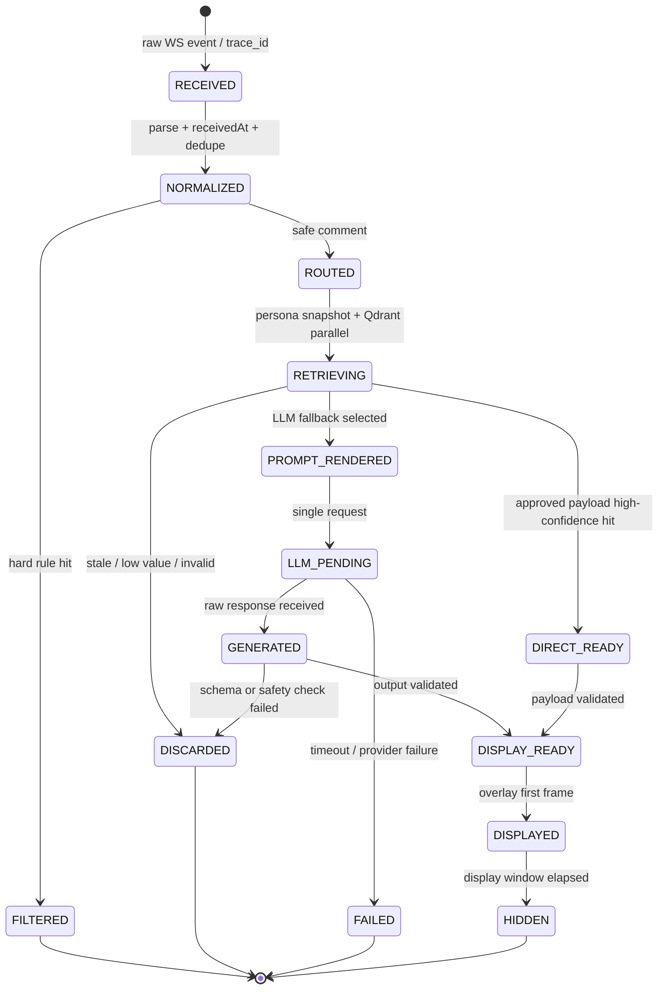

# Echocue 技术调研与选型报告

| 项目 | 内容 |
| --- | --- |
| 文档版本 | v0.1（第一轮调研） |
| 状态 | 选型结论已确认；POC-01/POC-02 待执行并归档 |
| 日期 | 2026-08-21 |
| 调研优先级 | 官方/大型企业公开能力 → GitHub 成熟开源方案 → POC 实测 |
| 上游依据 | 《Echocue 需求澄清与 MVP 定义 v0.1》；《Echocue PRD v0.1》 |

## 1. 结论摘要

### 1.1 关键结论

1. **抖音官方公开能力当前不能直接满足 MVP 的全量普通弹幕接入。** 官方“直播间评论互动能力”仅提供挂载“直播小玩法”的直播间中、包含特殊指令的评论；它不是任意直播间的普通弹幕流。[官方评论互动能力说明](https://developer.open-douyin.com/docs/resource/zh-CN/interaction/jierushuoming/hudongshuju/pinglunshuju)
2. 抖音官方直播 SDK 的公开资料描述的是面向特定合作方的 Android 直播能力；SDK 不公开发放，且与 Windows standalone client 和全量主播侧弹幕采集并不等价。[官方 SDK 接入说明](https://open.douyin.com/platform/resource/docs/develop/guide/douyin-live-sdk/android)
3. 因此，若 MVP 坚持“真实抖音普通弹幕 + Windows standalone”，第三方逆向 WebSocket 接入是当前唯一可调研的工程路径，但它必须被标记为 **P0 风险依赖**，不能承诺长期稳定性、合规性或消息完整性。
4. **甲方已确定 `jwwsjlm/douyinLive` 为当前 MVP 弹幕接入方案。** 它是 MIT 许可、约 445 stars、提供 Windows 可执行文件与 Go 库，具备断线重连、未开播轮询、基础保活和本地 WebSocket 转发。它同时明确声明不保证任意业务消息一定能收到或完整解析，故仍须以可替换本地适配器封装，并通过 POC 验证风险。[仓库 README](https://github.com/jwwsjlm/douyinLive)
5. Windows client 推荐优先采用 **Electron + React + TypeScript + Vite**。React 负责界面组件与状态，Vite 负责开发服务器和生产构建，二者互补而非替代；Electron 负责 Windows 窗口与打包。其官方 `BrowserWindow` 能力覆盖置顶、透明、点击穿透、窗口尺寸/位置和系统外观等 MVP 浮窗要求；同时可通过 `safeStorage` 调用 Windows DPAPI 保存本机密钥。该结论仍须用原型验证与 OBS/常用直播软件的兼容性。[Vite 指南](https://vite.dev/guide/)；[Electron BrowserWindow](https://www.electronjs.org/docs/latest/api/browser-window)；[Electron safeStorage](https://www.electronjs.org/docs/latest/api/safe-storage)
6. 3 秒端到端目标不能靠文档保证。必须使用甲方真实直播间、真实网络、真实人设和首选 Provider 进行 POC 基准测试；正式开发应基于测试发现持续优化接入、筛选、提示词、模型参数和浮窗渲染，最终 MVP 验收以 P95 ≤ 3 秒为业务目标，不得将未达标状态默认为可接受结果。

### 1.2 本轮建议的暂定方向

```text
一个 Windows 安装包
├─ Electron 主应用：配置、运行控制、本地数据、模型调用、浮窗
├─ React/TypeScript + Vite UI：设置页、运行页、诊断页、浮窗 UI
├─ 本地弹幕接入适配器：优先封装 douyinLive Go 可执行文件
└─ 外部服务：抖音 Webcast（高风险依赖）+ 选定的大模型 API
```

这里的“本地弹幕接入适配器”是随 client 一起安装、由 client 生命周期管理的子进程，不是独立部署的后端服务，也不改变 standalone MVP 边界。

## 2. 调研范围与评估准则

### 2.1 本轮范围

- 真实抖音普通弹幕的官方与第三方接入可行性；
- Windows standalone client 与浮窗技术；
- 低时延文本生成的供应商接入方式；
- 本地配置、密钥保护和最小诊断；
- 对 3 秒目标的 POC 设计。

### 2.2 统一评估准则

| 维度 | 说明 |
| --- | --- |
| 需求吻合度 | 能否直接服务单直播间、实时普通弹幕与置顶浮窗。 |
| 合规与许可 | 平台条款风险、开源许可证、第三方凭证处理和商业化影响。 |
| 稳定性 | 上游协议变更、维护活跃度、重连与异常恢复能力。 |
| 时延 | 对 P95 ≤ 3 秒端到端目标的影响。 |
| 可替换性 | 是否可被统一适配器接口隔离，防止单一依赖锁定。 |
| MVP 成本 | 实现量、打包难度、运维需求和测试成本。 |

## 3. 抖音弹幕接入调研

### 3.1 官方能力结论

| 路径 | 公开能力 | 与 MVP 的匹配度 | 结论 |
| --- | --- | --- | --- |
| 抖音“直播间评论互动能力” | 对挂载直播小玩法的直播间，获取包含特殊指令的评论，并通过任务向开发者服务端推送。 | 不匹配：无法获取所需的任意普通弹幕，且面向玩法服务端。 | 不作为 MVP 数据源。 |
| 抖音直播 SDK | 面向具备一定流量/垂直领域条件的应用，经工单和技术支持提供；公开文档为 Android 接入。 | 不匹配当前 Windows standalone 形态；是否可获得额外合作能力未知。 | 不作为当前 MVP 前提；可由甲方未来商务咨询。 |
| 抖音数据开放接口 | 公开页面显示直播榜等离线/统计能力。 | 不匹配实时逐条弹幕。 | 不作为 MVP 数据源。 |

**决策**：官方路径记录为长期商务/合作备选，但不阻塞当前 POC。MVP 不得声称使用官方弹幕 API。

### 3.2 GitHub 开源候选

| 候选 | 公开资料观察 | 优点 | 关键风险/限制 | POC 结论 |
| --- | --- | --- | --- | --- |
| [`jwwsjlm/douyinLive`](https://github.com/jwwsjlm/douyinLive) | Go；MIT；约 445 stars；Windows 可执行文件；支持独立服务或库；本地 WS 转发、重连、保活、直播状态。 | 成熟度与使用形态最贴近；可作为本地 sidecar，也可在后续需要时以 Go 库嵌入。 | 基于逆向 WebSocket/签名；作者不保证消息完整性；协议变动和账号风险不可控。 | **已确定为 MVP 接入方案；POC 验证可用性与风险，不再进行替代方案选型。** |
| [`adseng/dy-comment-cast`](https://github.com/adseng/dy-comment-cast) | TypeScript；包含房间解析、签名、WebSocket、心跳、重连、gzip/protobuf 解码。 | 与 Electron/TypeScript 同语言，可作为内部重写或替代实现的参考。 | 社区成熟度相对未知；同样是逆向协议，需自行维护签名和兼容性。 | **备选/参考实现**，不作为首选基座。 |
| [`chuanyue98/douyin-live-toolkit`](https://github.com/chuanyue98/douyin-live-toolkit) | Python 采集与分析工具；明确含从其他项目借鉴的 AGPL-3.0 签名脚本/Proto。 | 功能丰富，可用于验证事件覆盖和问题排查。 | AGPL-3.0 传染性风险不适合直接纳入商业客户端；依赖 Linux/WSL；超出 MVP 范围。 | **不采用代码**，仅作调研参考。 |

### 3.3 接入架构要求

无论最终选择何项目，必须将其封装为 `LiveCommentSource` 本地接口。上层业务只能消费统一事件，不能依赖任一项目的 protobuf、房间 ID 或签名实现。

最小事件字段：

```text
LiveEvent {
  eventId, receivedAt, type, roomReference,
  commentId?, authorDisplayName?, text?, rawMetadata?
}
```

MVP 业务层只依赖 `type=comment` 的文本和接收时间；其他事件只用于连接/直播状态诊断。Cookie、签名 URL 和账号凭证不得进入日志或 UI。完整原始帧仅可作为 FR-10 审计记录写入受保护的独立本机审计存储，不能写入一般日志、遥测或默认 UI。

### 3.4 `douyinLive` 本地 WebSocket 事件流参考

已取得 `douyinLive` 在本地 WebSocket（`ws://127.0.0.1:1088/ws/{room_reference}`）上的实际事件结构参考。该协议应被 `LiveCommentSource` 适配器消费，UI 与业务模块不得直接绑定其原始字段名。

| 上游事件 | 识别字段 | 业务含义 | Echocue MVP 处理 |
| --- | --- | --- | --- |
| 开播状态 | `type=system`、`event=live_status`、`code=ROOM_ONLINE` | 直播间已开播，后续会推送直播事件。 | 通过启动门禁；继续持有本地 WS，进入候选筛选与建议生成。 |
| 弹幕 | `method=WebcastChatMessage`，正文位于 `content` | 普通观众弹幕，包含 `common.msgId`、`common.roomId`、`common.createTime` 和用户昵称。 | 规范化为 `comment` 事件，进入过滤、最新窗口、成员路由和生成链路。 |
| 礼物 | `method=WebcastGiftMessage` | 礼物事件，含礼物和次数信息。 | MVP 不进入建议生成；仅保留最小连接诊断能力。 |
| 点赞 | `method=WebcastLikeMessage` | 点赞事件，含本次与累计数量。 | MVP 不进入建议生成；不作为候选排序信号。 |
| 下播 | `type=system`、`event=live_status`、`code=ROOM_ENDED` | 上游直播已结束；上游可继续轮询，但这不是 Echocue 必须保持的连接。 | 立即停止生成、清空候选/展示状态、隐藏浮窗并主动关闭本地 WS；AI 服务进入已停止。 |
| 未开播 | `type=system`、`event=live_status`、`code=ROOM_OFFLINE` | 启动门禁探测到直播间尚未开播。 | 立即关闭本地 WS；拒绝启动 AI 服务。用户只能手动重试启动以发起新的状态探测。 |
| 再开播 | 新一次用户手动启动连接后收到 `ROOM_ONLINE` | 直播恢复。 | 通过启动门禁并开始本场 AI 服务；不保留或恢复上一次会话。 |

#### 标准化约束

1. `common.msgId` 是去重主键候选；若缺失，适配器必须产生本地临时 ID，且不得以弹幕正文作为去重键。
2. `common.createTime` 是上游提供的创建时间，仅作诊断参考；Echocue 的 P95 时延起点仍是 client 适配器接收并完成规范化的时间 `receivedAt`。
3. `room_id`、`roomId` 和连接 URL 中的直播间标识可能不是同一业务 ID。适配器必须统一映射为 `roomReference`（连接输入）与 `platformRoomId`（上游事件 ID），上层不可混用。
4. `livename`、`title`、`avatarThumb` 仅作为本地显示元数据；不可参与人设路由或安全判断。
5. 礼物/点赞虽不进入 MVP 生成链路，但接收到它们可作为“连接仍活跃”的辅助诊断信号。

#### 接入层与产品层的状态边界

`douyinLive` 在 `ROOM_ENDED` 后可保持 WebSocket 并轮询，是**上游适配器可选行为**，但 Echocue 已明确不采用该常驻模式。`douyinLive` 本地 WS 是 AI 服务运行资源：用户确认启动时创建；只有收到 `ROOM_ONLINE` 才继续持有；收到 `ROOM_OFFLINE` 或 `ROOM_ENDED` 立即关闭；用户停止服务同样立即关闭。

因此不存在自动恢复、恢复提醒或后台等待再次开播。用户只能手动点击启动，创建一次新的门禁探测连接；未开播即关闭，开播才转为本场持续监听。

### 3.5 风险与控制

| 风险 | 控制措施 |
| --- | --- |
| 平台协议或签名变化导致失效 | 适配器隔离；版本锁定；接入健康检查；准备 TypeScript 参考实现作为替换路径。 |
| Cookie/会话凭证泄露 | 不默认要求 Cookie；如 POC 必需，使用 Windows DPAPI 加密保存，UI 禁止回显、日志脱敏、提供清除操作。 |
| 账号风控或条款风险 | 仅使用甲方授权测试直播间；限制单账号、单房间、单 client；在开发前由甲方确认风险接受范围；不得规模化采集。 |
| 消息缺失、延迟或重复 | 记录接入时间戳；本地去重；测量到达间隔和重连次数；时延验收以接入到达为起点，不能证明平台端真实发出时刻。 |
| 开源许可证风险 | POC 前完成具体 tag/依赖树/SBOM 复核；不复制 AGPL 代码进入产品。 |

## 4. Windows standalone client 选型

### 4.1 候选比较

| 方案 | 优点 | 风险 | 结论 |
| --- | --- | --- | --- |
| Electron + React + TypeScript + Vite | React 负责 UI 组件和状态；Vite 提供开发服务器、热更新与生产静态资源构建；Electron 负责 Windows 窗口与打包。官方 API 支持置顶、透明、鼠标穿透与窗口控制。 | 包体/内存相对较大；需严守 Electron 安全边界。 | **推荐 MVP 选型**。 |
| Tauri + Web UI | 包体可能较小，原生能力较强。 | 本轮尚未完成针对透明、点击穿透、动态尺寸、打包与 Go 接入的同等验证；Rust 增加交付复杂度。 | 暂不选；可在 Electron 原型失败时复评。 |
| 原生 .NET/WPF/WinUI | Windows 深度集成和资源占用可控。 | UI 交付速度较低；与 TypeScript Webcast 参考实现不共享语言；团队技术偏好未知。 | 暂不选；作为性能/系统集成备选。 |

### 4.2 Electron 落地要求

- 一个主窗口用于运行与配置，一个独立无边框浮窗用于建议展示；
- 浮窗使用 `alwaysOnTop`、透明背景、动态尺寸和鼠标事件穿透；全部在真实 Windows 环境验证；
- renderer 保持 `contextIsolation` 与 sandbox，不开启 Node integration；仅经受限 `contextBridge` 暴露白名单 IPC；
- 不加载任意远程页面或远程脚本；Electron 官方将此列为高风险行为；
- API Key/Cookie 仅由 main process 管理，通过 `safeStorage` 异步 API 使用 Windows DPAPI 加密；renderer 不可读取原始密钥；
- 打包后由主进程启动、监控和关闭本地弹幕适配器；适配器崩溃时 client 自动停止监听并提供重试。

上述安全要求来自 [Electron 安全指南](https://www.electronjs.org/docs/latest/tutorial/security)、[沙箱说明](https://www.electronjs.org/docs/latest/tutorial/sandbox) 与 [safeStorage 文档](https://www.electronjs.org/docs/latest/api/safe-storage)。

### 4.3 standalone client 可观测性：Prometheus 与 OpenTelemetry

**结论：TypeScript/Node.js SDK 可用，且应只在 Electron main process 中初始化。** OpenTelemetry JavaScript 的 traces 和 metrics 已标为 Stable，而 logs 仍为 Development；Electron renderer 属于浏览器侧，官方说明其浏览器端 instrumentation 仍偏实验性。因此 MVP 不在 React renderer 内做完整观测，只由 main process 记录 client、弹幕适配器、Provider 调用和浮窗生命周期。[OpenTelemetry JavaScript](https://opentelemetry.io/docs/languages/js/)

| 能力 | TypeScript 方案 | standalone 集成方式 | MVP 结论 |
| --- | --- | --- | --- |
| Prometheus 指标 | `prom-client`（Node.js 库，内置 TypeScript 声明） | main process 创建独立 Registry；仅在启用时监听 `127.0.0.1` 的 `/metrics`，或按显式配置推送到受控 Prometheus 网关。 | **支持，纳入 MVP。** |
| OpenTelemetry traces | `@opentelemetry/api`、`@opentelemetry/sdk-node` 与 OTLP exporter | 应用启动最早阶段初始化；创建 `live.receive`、`candidate.select`、`llm.generate`、`overlay.show` 等 span；仅在设置中配置 OTLP endpoint 时导出。 | **支持，纳入 MVP。** |
| OpenTelemetry metrics | `@opentelemetry/sdk-metrics` | 记录计数、直方图和 gauge；可导出至 OTLP collector。 | **支持，纳入 MVP。** |
| OpenTelemetry logs | JS 实现处于 Development。 | 采用本地结构化日志作为事实来源；不依赖 OTel logs 完成 MVP。 | **不作为 MVP 依赖。** |

`prom-client` 的 Node.js 包支持 Counter、Gauge、Histogram、Summary 与 Prometheus exposition format，并附带 TypeScript 声明；OpenTelemetry 官方提供 Node.js SDK 的 traces/metrics 初始化示例。[prom-client](https://www.npmjs.com/package/prom-client)；[OpenTelemetry Node.js](https://opentelemetry.io/docs/languages/js/getting-started/nodejs/)

#### 观测事件与隐私边界

必须记录：弹幕接收计数、过滤计数（按类别）、候选计数、Provider 调用计数/错误类型/耗时、端到端时延直方图、浮窗展示计数、本地接入进程异常/崩溃次数。Echocue 不自动重连 WS；任何重新启动均由用户显式触发。

不得以 Prometheus label 或 OTel attribute 记录：用户 ID、直播间原始弹幕、昵称、成员名称、完整人设 Markdown、回复正文、API Key、Cookie、完整 URL 或 `messageId`。客户端默认不开启公网监听；`/metrics` 仅绑定 loopback 地址，OTLP 导出也必须由配置人员显式启用。

### 4.4 全链路审计状态机与数据隔离

审计不是 Prometheus/OTel 的替代品，也不是一般调试日志。前者保留每条业务弹幕的可回放原文和决策证据；后者只服务匿名聚合指标和故障诊断。MVP 在 Electron main process 内实现单条弹幕一条 `trace_id` 的显式状态机，并把每一次迁移追加为审计事件。任何异步分支完成后均须检查当前状态/窗口版本；过期结果只能记为丢弃，不能倒流展示。



每一个状态迁移写入 `audit_transition`：`trace_id`、序号、`from_state`、`to_state`、`at`、`reason_code`、内容快照引用和完整性摘要。关联快照按以下逻辑存入独立的 `audit_store`：

| 阶段 | 必须可回放的原文/证据 |
| --- | --- |
| 接入与安全 | 原始 WS 事件、规范化弹幕、去重结论、命中规则及理由。 |
| 人设路由 | 全部匹配候选/分数、最终选择或回退理由、`persona_id`、版本、当时 Markdown 原文。 |
| 检索初筛 | 查询文本、TopK 样本文本/ID/类型/得分/置信度、payload 原文、语义初筛结论。 |
| 决策与生成 | 直出或 LLM fallback 原因、渲染后 prompt、非敏感请求参数、provider/model/request ID、原始响应、解析结果、校验结果。 |
| 展示与终止 | 选择时的窗口版本、浮窗首帧时间、隐藏/取消/超时/失败/丢弃原因。 |

推荐以 SQLite 作为本机事务性审计事实库，业务表与大字段快照分表，字段级 AES-GCM 加密；数据密钥由 Electron `safeStorage` / Windows DPAPI 保护。审计写入在每个状态迁移完成前落盘；审计写入失败时不得继续产生新的主播建议，服务进入需要用户处理的审计故障状态，以保证“可完整回访”不被悄然破坏。可使用带 HMAC 的前序记录哈希形成篡改检测链，但单机存储不能单独提供法律意义上的不可抵赖性；若将来需要后者，必须另行设计可信时间戳或远端锚定。

API Key、Cookie、签名 URL、Authorization header 一律不进入 `audit_store`。审计记录默认永久保存在本机，不支持导出；产品不得自动清理或删除。容量/权限导致审计库不可写时，AI 服务必须停止，而不能以丢失审计为代价继续运行。

#### SQLite / TypeScript / Electron 选型

SQLite 适合单机、单直播间的本机审计事实库：它不需要独立服务进程，事务具有原子性、隔离性和持久性保证，即使程序、操作系统或电源中断，单个事务也应完整提交或完全不生效。[SQLite Transactional](https://www.sqlite.org/transactional.html) 对此类“状态迁移 + 证据快照必须一起落盘”的模型尤为适合。

| 候选 | Electron/TypeScript 特性 | 优点 | 风险/结论 |
| --- | --- | --- | --- |
| 官方 `node:sqlite` | Node 内置 TypeScript/JavaScript API，`DatabaseSync` 全部为同步调用。 | 无第三方原生 addon、无需 `electron-rebuild`；最小打包复杂度。 | `node:sqlite` 自 Node 22.5 引入，在 Node 22.13 起无需实验开关，但当前仍标为 Release Candidate；必须把 Electron 固定到内嵌 Node ≥ 22.13 的版本并做 POC。**首选，待 POC。** [Node.js SQLite](https://nodejs.org/api/sqlite.html) |
| `better-sqlite3` | 成熟的社区原生 Node addon，TypeScript 项目可通过类型定义调用。 | API 简洁，作为官方方案不满足时的实用后备。 | Electron ABI 与普通 Node 不同，升级 Electron 或打包时必须重编译 native addon；采用 `@electron/rebuild` 并在 CI 对 Windows x64 做安装包冒烟测试。**仅作兜底。** [Electron Native Modules](https://www.electronjs.org/docs/latest/tutorial/using-native-node-modules/) |
| 外部 SQLite 服务 / 云数据库 | 额外进程或网络服务。 | 可服务多端。 | 违背 standalone、增加部署与敏感数据外发；不采用。 |
| ORM（如 TypeORM/Prisma） | 数据库抽象层。 | 可降低常规业务 CRUD 心智负担。 | 审计表结构和迁移有限且稳定，ORM 增加体积、抽象和调试链路；MVP 直接使用参数化 SQL，不采用。 |

**暂定选型：`node:sqlite` + Node `worker_threads` + 参数化 SQL。** 数据库只能由 `AuditStoreWorker` 持有，Electron main process 通过受限消息接口写入/查询，renderer 经 preload 的白名单 IPC 读取脱敏后的审计视图，永不直接打开数据库。由于官方 `DatabaseSync` 是同步 API，不能在 main process 或 renderer 直接执行；所有数据库事务、加密/解密、哈希链计算和备份均在 Worker 中完成。

数据库放在每用户应用数据目录，例如 `audit/audit.sqlite`，启用 `PRAGMA journal_mode=WAL`、外键和合理的 busy timeout。WAL 允许读取与写入并发，但同一时刻仍只能有一个 writer，且 `-wal`/`-shm` 是数据库持久状态的一部分；备份、迁移、清理或导出必须以 SQLite backup/一致性快照方式执行，不能在运行中只复制 `.sqlite` 主文件。[SQLite WAL](https://www2.sqlite.org/wal.html)

POC 新增验证项：目标 Electron 是否包含可用 `node:sqlite`；每条状态迁移“加密快照 + 事务提交”的 P95 耗时；高频弹幕下单 writer 队列深度；异常退出后的完整性检查和恢复；WAL 增长/检查点；Windows x64 安装包首次运行与升级迁移冒烟。若任一前两项不达标，切换到 `better-sqlite3` 兜底，而上层 `AuditStore` 接口不变。

### 4.5 Qdrant 在 standalone client 中的可行性

Qdrant 官方提供 `@qdrant/js-client-rest` 作为 JavaScript/TypeScript 客户端，适合通过 REST 调用本机 Qdrant 实例。Qdrant Edge 虽然是无后台服务、无网络的嵌入式检索引擎，但当前官方 Quickstart 只给出 Python 与 Rust binding，**没有可直接用于 Electron/TypeScript 的 Edge binding**。[Qdrant Interfaces](https://qdrant.tech/documentation/interfaces/)；[Qdrant Edge Quickstart](https://qdrant.tech/documentation/edge/edge-quickstart/)

| 方案 | 一键安装体验 | TypeScript 使用方式 | 结论 |
| --- | --- | --- | --- |
| Qdrant Cloud | 无本地安装。 | `@qdrant/js-client-rest` 连接云端。 | 不符合 standalone/offline 优先与敏感人设本地化方向。 |
| Docker Qdrant | 要求用户预装 Docker；Windows mount 有官方提示的数据丢失风险。 | TS REST client。 | 不符合“无需复杂部署”。 |
| 随 Windows 安装包携带 `qdrant.exe` | 用户只安装 Echocue；main process 首次启动本地二进制、等待健康检查、创建数据目录/collection 并导入初始索引。 | TS REST client 仅访问 `127.0.0.1`。 | **当前推荐的 Qdrant 一键集成路径，待 POC 验证。** |
| Qdrant Edge | 无后台服务。 | 需额外 Rust/Python bridge，不能直接由 TS 调用。 | 暂不采用，除非后续愿意引入 Rust 本地模块。 |

Qdrant 官方说明本地服务可通过 Docker 或 binary executable 运行；服务默认使用 HTTP 6333、gRPC 6334，且默认配置需要额外安全控制。桌面方案必须：固定版本并随安装包分发；仅监听 loopback；由 main process 管理启动/停止；将数据置于应用专属目录；首次启动执行 `pre_set` 与 `golden_set` 两个 collection 的 schema 初始化。Qdrant 启动、健康检查或任一 collection 初始化失败时，AI 服务不得通过启动门禁，client 必须给出可理解的整改/重试提示。不得在产品首次启动时静默下载未知二进制。 [Qdrant 安装说明](https://qdrant.tech/documentation/installation/)

#### Qdrant 的 MVP 业务定位：BM25 稀疏检索与中文语义初筛

Qdrant 不是人设 Markdown 的 RAG，也不用于成员身份识别。它是 MVP 的本地弹幕**语义初筛与 LLM 成本控制模块**：客户端以 `jieba-wasm` 的 `cut_for_search` 生成中文词表，计算 BM25 的词频饱和与文档长度归一化后写入稀疏向量；Qdrant collection 的 `modifier: 'idf'` 维护动态逆文档频率并在查询时完成 IDF 加权。BM25 同时考虑词频、逆文档频率及文档长度，适合持续新增的 `golden_set`。

```text
WebcastChatMessage
  → 硬规则过滤（隐私、辱骂、关键词禁忌）
  → regex 移除无关符号 → Unicode 标准化 → jieba `cut_for_search`
  → BM25 文档稀疏向量写入 / Qdrant `modifier.IDF` 查询检索
  → TopK 相似样本、类型投票与置信度
  ├─ 明确应过滤 / 明确低价值：丢弃，不调用 LLM
  ├─ 高价值互动候选：进入最新窗口排序与选定 Provider 生成
  └─ 不确定灰区：按详细设计的保守阈值处理，不能错误丢弃潜在高价值弹幕
```

`pre_set` 与 `golden_set` 是独立 Qdrant collection，而不是同一 collection 的质量区间。前者随安装包提供预置相似案例/分类参考；后者由审计打标实时、幂等 upsert。共同字段仅包括 `case_id`、`text`、`semantic_type`、`enabled`、`is_bad_case` 与检索 profile 元数据；`persona_id`、`persona_version`、`reply`、`cues[]`、`source_trace_id` 和人工质量分仅属于 `golden_set`。不存在 JSONL 中转或全量重建流程。`semantic_type` 必须使用正式枚举，覆盖人设相关互动、正面夸赞、有梗玩笑、互动提问、氛围带动、低价值/无互动价值及过滤类。

**边界与安全原则**：明确安全风险仍由硬规则优先拦截；Qdrant 初筛不能替代个人信息、辱骂或团队关键词规则。成员名称/昵称路由继续采用确定性精确与高可信模糊匹配，不能交由稀疏语义检索。初筛阈值应以“明确可过滤才丢弃”为原则，灰区可进入后续候选流程，避免误杀有价值弹幕。

**中文与 TypeScript 可行性结论**：固定携带 Qdrant Server `>= 1.19.0` 的 Windows sidecar，并使用官方 `@qdrant/js-client-rest` 创建 sparse collection、写入 `indices/values`、发起查询。中文分词暂定 `jieba-wasm`：它是 `jieba-rs` 的 WASM binding，提供 TypeScript 声明和 `cut_for_search`，不依赖 Node ABI；对比之下 `nodejieba` 虽提供 `cutForSearch`，但属于原生 Node addon，Electron 打包需要 rebuild。本项目选择前者。分词器需在 main/worker 进程初始化一次，不能在实时路径重复初始化。

**BM25 职责边界（固定）**：写入向量只包含 `tf` 经 `k1`/`b`/`doc_len`/`avg_doc_len` 计算后的文档侧权重，**不包含 IDF**；查询向量的每个去重词权重均为 `1`。Qdrant `modifier: 'idf'` 基于当前 collection 的文档频率实时修改查询向量，最终点积即为 BM25 分数。IDF 是 BM25 公式的一部分，但其计算/维护责任在 Qdrant；若 client 写入 IDF 后仍开启 modifier，会产生双重加权，禁止这样实现。

**平均文档长度策略（固定）**：IDF 不依赖平均文档长度；`avg_doc_len` 只用于文档侧 BM25 长度归一化。首次导入 `pre_set` 后，以该库全部经 jieba pipeline 处理的有效样本 token 数计算 `avg_doc_len_baseline`，写入不可变 `Bm25ZhJiebaProfileV1`；`pre_set` 与 `golden_set` 均使用这个固定基线。每次新增 golden 样本只按该固定值计算新 point，**不**重算已有 point，也不因单次打标重建 collection。若将来需要变更分词器、热词词表、`k1`/`b` 或 `avg_doc_len_baseline`，必须创建新的检索 profile/collection 版本，批量重编码 `pre_set` 和当时有效 `golden_set` 后原子切换；这属于受控版本迁移，不属于打标实时回流流程。

**FastEmbed 调研与采纳方式**：FastEmbed 是 Qdrant 维护的 Python embedding 库，当前没有官方 TypeScript/JavaScript binding，不能直接纳入本 Windows TypeScript standalone client。Qdrant 官方将 FastEmbed 作为 client-side BM25 sparse vector 的参考实现，并明确其默认 `k1=1.2`、`b=0.75`，`avg_doc_len` 需由应用估计提供；Qdrant `>=1.15.2` 的服务端原生 BM25 采用同一转换语义。本项目不引入 Python 或 FastEmbed 运行时，而以 FastEmbed 的 BM25 文档侧权重公式、默认参数与测试样例为**算法参照基线**，实现 `Bm25TextPipelineV1` 的 TypeScript 中文版本；中文 token 来源固定为 jieba，而不是 FastEmbed 面向英文的 Snowball stemmer/stopword pipeline。

FastEmbed 的另一项必须采纳的设计是**无词典 token ID**：其源码用 `abs(mmh3.hash(token))`（MurmurHash3 x86 32-bit、UTF-8、seed=0）作为 sparse index，文档侧按该 ID 写权重，查询侧以同一 hash 去重并赋值 `1`。这样不需要维护或同步 vocabulary，新增 golden 样本立即可写入。TS 暂定使用纯 JS 且支持 UTF-8 bytes 的 `murmurhash3js-revisited`，再将 unsigned 结果转换为 FastEmbed 等价的 signed 32-bit 后取绝对值；不得使用字符串 UTF-16 code unit hash。开发阶段必须以 FastEmbed/Python `mmh3` 固定 token（含中文、emoji、ASCII）输出建立 cross-language golden tests，校验 token→index、文档侧权重与 Qdrant 最终排序；测试未通过不得启用 collection。

**POC 要求**：除 Windows binary sidecar + TS REST client 的启动/初始化验证外，必须在甲方真实中文弹幕样本上校准 BM25 的 `k1`、`b`、`avg_doc_len_baseline`、归一化/热词词表、TopK 和 score calibration，并测试检索延迟、分类准确率、低价值弹幕拦截率、目标互动弹幕漏召回率和 LLM 调用削减率。执行证据统一填写到 [`Echocue-Qdrant-jieba-BM25-POC记录模板-v0.1.md`](Echocue-Qdrant-jieba-BM25-POC记录模板-v0.1.md)，模板存在不代表已通过。Qdrant 因而是 MVP 核心模块，不是后置增强能力。

### 4.6 实时主链路是否采用 Agent 框架

**结论：MVP 实时主链路不采用 Agent 或多 Agent 框架。** Agent 的特征是由模型动态决定下一步和工具调用，并可能在反馈循环中执行多步；而本项目的实时路径是预先确定、可测量、可取消的单次工作流。LangGraph 的官方定义也区分了“预定代码路径的 workflow”与“动态决定过程和工具使用的 agent”。对于每条弹幕，动态规划、工具调用、持久化 checkpoint 或多轮反思既不是效果必需条件，反而会增加一次以上模型往返、尾延迟、不可预测性和排障难度。[LangGraph Workflows and agents](https://langchain-ai.github.io/langgraph/agents/tools/)

MVP 采用如下**检索优先、生成兜底（retrieval-first, generation-fallback）**工作流；它是业务代码中的显式状态机/异步任务编排，不依赖 LangChain、LangGraph、AutoGen、CrewAI 等 Agent 运行时：

```text
弹幕到达
  → 硬规则过滤、去重、成员确定性路由
  → 并行开始
      ├─ 从 SQLite `persona_version` 表快捷取得已路由人设档案
      └─ Qdrant 双路稀疏检索：`golden_set` + `pre_set`（先做 persona/version payload filter）
  → 合并结果并做最新窗口/时效校验
  ├─ Top-1 为 golden_set 且高置信：直接展示 payload 中的回复/提词
  └─ 其余候选：PE 渲染人设 + 当前弹幕 + 合并 TopK → 单次 Provider JSON 输出
  → 本地结构/安全复验 → 浮窗首帧展示
```

这里的 Markdown 人设不是“文档问答”。MVP 中人设数量有限、文件短且已由确定性成员路由选定，直接读取该成员当前版本 Markdown 比做 RAG 更快、更可控。Qdrant 检索的是**历史弹幕互动样本和可复用策略**，不用于选择人设。

#### 双 collection 检索与直出准入条件

检索时，`golden_set` 以当前 `persona_id`、`persona_version`、`enabled=true`、`is_bad_case=false` 做 payload filter；`pre_set` 是通用案例库，不以人设版本过滤，只过滤 `enabled=true`、`is_bad_case=false`。`is_bad_case` 默认 `false`，故未打标样本可被召回；仅拒绝的 golden 直出 point 才写为 `true`。两路 jieba-BM25 检索的 raw score 仍不得跨 collection 直接比较，必须经版本化 calibration 归一到 `retrieval_confidence ∈ [0, 1]`，才可跨库 rerank 得到最终 TopK；POC 负责校准 score 坐标系和门槛。每个命中保留 `source_collection`、raw score、归一置信度和 rank，完整写入审计。

直接复用必须同时满足：硬规则已通过；Top-1 来自 `golden_set`；路由人设和 `persona_version` 通过 payload filter；`retrieval_confidence >= direct_push_threshold`（初始建议 0.85，POC 后固化）；payload 包含有效 `reply`/`cues`；弹幕仍在当前最新窗口。任何一个条件不满足即转入单次 LLM 生成或丢弃，不排队等待。`pre_set` 永不直接推送。

“单路稀疏向量 + jieba-BM25”本质仍是词项匹配检索，不等价于通用语义理解。它可以靠 `cut_for_search`、文本归一、别名/热词词典和标注样本取得高性能，但对新梗、隐喻、错别字、跨表述语义仍应保守：只有高置信命中可直出，灰区必须走 LLM 兜底。后续若 POC 证明其召回不足，可在保持同一 `SuggestionRetriever` 接口下增加稠密向量或 hybrid retrieval；这不构成现在引入 Agent 的理由。

#### 冷启动与持续优化

冷启动期 `golden_set` 为空或规模很小，预期绝大多数有效候选进入首选 Provider 单次生成；通用 `pre_set` 仍提供语义分类和参考上下文。审计打标后，人工修正答案默认即时 upsert 至 `golden_set`；未修正 AI 答案的主观分 `>=85` 时同样即时 upsert。低分/拒绝结果不回流为可直出 payload。用户审计页面只展示未打标、已认可、已拒绝、已修正和无需打标；golden 回流与同步机制对用户不可见，由内部状态负责幂等写入和失败重试。

Agent 可在后续离线环节再评估，例如辅助运营人员归类候选样本、生成标注草稿或检查配置矛盾；这些任务不在 3 秒实时 SLO 内，且产出必须人工审核。若未来出现真正需要多工具动态决策、长任务持久化或跨系统协作的需求，再单独选择 Agent 框架和安全边界。

## 5. 模型服务调研与暂定策略

### 5.1 约束

模型调用是端到端时延中唯一明显不可由 client 本地完全控制的环节。MVP 不能在未实测前承诺任一供应商达到 P95 ≤ 3 秒；也不应将直播弹幕、人设 Markdown 和团队禁忌锁死于单一供应商。

### 5.2 候选接入方式

**甲方决策：DeepSeek 为 MVP 的首选模型服务。** 备选是甲方后续指定的第三方 LLM API 服务商；该服务商需要同时支持 OpenAI-compatible 与 Anthropic Messages 等多协议，以承接包括 Claude/Opus 在内的不同模型接口。

技术上实现一个 `TextGenerationProvider` 抽象，首个实现为 `DeepSeekProvider`。每个 Provider 必须声明自己支持的协议、模型、结构化输出能力、超时与错误映射；业务层只消费统一的“生成短回复与提词”能力，不感知 OpenAI 或 Anthropic 的具体请求格式。

不在本轮将混元作为候选供应商。其调研记录仅保留作已排除方案的参考，不进入 POC 比测。

### 5.3 官方 OpenAI TypeScript SDK 与 Provider 边界

OpenAI 官方提供 TypeScript/JavaScript SDK：在 Node.js、Deno 或 Bun 的服务端 JavaScript 环境中可通过 `npm install openai` 使用；官方 Quickstart 展示 `responses.create()` 调用方式。Electron main process 属于 Node.js 环境，因而可使用该 SDK；React renderer 不是密钥安全边界，禁止直接调用任何 LLM API。[OpenAI 官方 Quickstart](https://platform.openai.com/docs/quickstart/make-your-first-api-request)

对 Echocue 的正确使用方式：

1. SDK/HTTP 客户端只在 Electron main process 内创建；API Key 从 `safeStorage` 读取，绝不注入 Vite 的 `import.meta.env` 或 renderer；
2. 对实际 OpenAI 服务可使用官方 Responses API；
3. 对 DeepSeek 等 OpenAI-compatible 服务，仅使用该服务明确支持的接口子集（当前是 Chat Completions、JSON Output 等），并通过 `DeepSeekProvider` 处理协议差异；
4. 不得因为使用了 `openai` npm 包，就假设 Responses API、内置工具、Tool Calls、存储、流事件或错误格式能被第三方服务完整兼容；
5. Provider 对业务层暴露统一的 `generateReply(input): Promise<ReplyResult>`，而不是暴露任一 SDK 的原始对象。

### 5.4 DeepSeek 接口评估

DeepSeek 的官方文档说明其 API 同时兼容 OpenAI 与 Anthropic 格式：OpenAI-compatible base URL 为 `https://api.deepseek.com`，Anthropic-compatible base URL 为 `https://api.deepseek.com/anthropic`，并提供 Node.js 示例。因此 TypeScript 可在 Electron **main process** 中通过官方 SDK/兼容 SDK 调用；API Key 不得放入 React renderer 或 Vite 的构建时环境变量。[DeepSeek 首次调用 API](https://api-docs.deepseek.com/zh-cn/)

| 维度 | 官方公开能力/结论 | 对 Echocue 的意义 |
| --- | --- | --- |
| 调用协议 | 同时支持 OpenAI-compatible 与 Anthropic-compatible API。 | 首选服务已满足当前和未来多协议 Provider 抽象。 |
| TypeScript | 官方提供 Node.js `openai` SDK 示例。 | 可直接用于 Electron main process。 |
| 输出结构 | 支持 JSON Output；文档要求设置 `response_format={type: json_object}`，并在提示中明确 JSON 格式。 | 可要求返回 `quick_reply` 与 `cues`，客户端仍须进行 JSON Schema 校验。 |
| Tool Calls / 严格 Schema | DeepSeek Tool Calls 有自身的请求、响应和 strict-mode（Beta）约束，不能假设可将通用 OpenAI Tool Call 对象不经处理直接透传。 | MVP 不依赖 Tool Calls；未来启用时必须由 DeepSeek 专用适配器构建请求、解析响应和处理 strict-mode 限制。 |
| 时延配置 | 支持流式/非流式；有非思考模式。 | MVP 优先使用非思考、短输出；流式是否改善 t3 由 POC 实测决定。 |
| 异常 | 官方列出 400、401、402、422、429、500、503 等错误码。 | Provider 必须归一化为认证、余额、限流、服务端、超时等可诊断错误；过期建议不重试。 |
| 并发 | 当前文档公布不同模型的账号级并发限制。 | 单直播间展示窗口内串行生成，容量足够；未来多直播间需重新评估。 |

依据：[JSON Output](https://api-docs.deepseek.com/guides/json_mode/)、[错误码](https://api-docs.deepseek.com/quick_start/error_codes/)、[限流与隔离](https://api-docs.deepseek.com/quick_start/rate_limit)。

### 5.5 腾讯混元兼容接口评估（已排除）

腾讯混元是腾讯云提供的托管大模型 API 服务，不是必须部署在 Windows client 内的运行时。client 通过 HTTPS 调用其 API；官方 OpenAI 兼容文档直接给出了 Node.js 的 `openai` SDK 示例，因此 TypeScript 可在 Electron **main process** 中直接使用。API Key 不得放入 React renderer 或 Vite 的构建时环境变量。

| 维度 | 官方公开能力/结论 | 对 Echocue 的意义 |
| --- | --- | --- |
| 平台与接入 | 腾讯云账号开通服务并创建 API Key；提供 OpenAI-compatible `chat/completions` endpoint，官方给出 Node.js 示例。 | 可作为 Windows client 的云端文本生成候选，不需要 Python/Go 后端。 |
| 基础生成 | 对话、多轮、流式 SSE、Function Calling、Embedding；原生 API 还支持多模态能力。 | MVP 仅使用单轮文本生成；不启用多 Agent、多轮或搜索。 |
| 低时延选项 | 官方说明关闭 `enable_enhancement` 可降低响应时延，尤其是流式首字时延。 | MVP 默认关闭增强/搜索；是否采用流式以 POC 为准。 |
| 并发 | 官方兼容接口文档写明默认 5 并发，主子账号共享。 | 单直播间且展示期不并发生成，默认限制足够；不适用于未来多直播间容量承诺。 |
| 控制台用量 | 官方文档说明可在控制台查看调用情况和计费详情。 | 可用于账号层面的用量/费用核对。 |
| 原始请求/响应审计 | 本轮官方资料没有承诺提供应用级 prompt、回复正文、错误上下文的可查询审计日志。 | 不能将供应商控制台当作 Echocue 审计；应用必须按 FR-10 写入受加密保护的本机原文审计库，而普通日志只记录脱敏后的请求 ID、模型、时延、状态与错误码。 |
| Prometheus / OpenTelemetry | 本轮未发现混元 API 自动导出应用请求指标或 OTel trace 的官方承诺。腾讯云可观测平台支持应用自行上报 Prometheus 自定义指标（含外部服务耗时），但这不是混元自动集成。 | MVP 应实现客户端侧观测；Prometheus/OTel 为可选集成，不将其作为混元固有能力。 |

依据：[混元 OpenAI 兼容接口](https://cloud.tencent.com/document/product/1729/111007)、[混元产品入口](https://cloud.tencent.com/document/product/1729)、[腾讯云自定义 Prometheus 监控](https://cloud.tencent.com/document/product/248/87379)。

**结论**：混元具备 TypeScript/OpenAI-compatible 接入条件，但甲方已决定当前不考虑它。该节仅保留为已调研、未入选的记录，不进入 POC 或默认供应商比较。

### 5.6 生成调用规则

- 每轮最多一次主生成调用；不采用多 Agent 串行链路；
- 上游先完成确定性风险过滤、成员人设路由、窗口筛选和长度截断，避免让模型承担不必要分类；
- 请求仅传：选中安全弹幕、已路由 Markdown 人设、必要团队禁忌和严格的短输出指令；
- 要求模型返回严格结构：`quick_reply` 与 `cues`；客户端校验失败即丢弃，不进行长时间重试；
- 服务商名称、Base URL、Model ID 与 API Key 由本机配置提供；单次模型调用硬超时初始设为 5 秒，但仍须服从 3 秒新鲜度 deadline，超时或过期直接回到监听；不实施费用上限，由甲方管理费用；
- 仅在用户显式配置并确认后保存 API Key；密钥不写入 Markdown、日志或导出内容。

#### DeepSeek Tool Calls 协议隔离

1. 完整 `DeepSeekToolCallAdapter` 属于后续 backlog，不是 MVP 完成条件，也不得接入 MVP 实时路径；MVP 若收到 `tool_calls` 响应，统一按 `PROTOCOL` 错误丢弃并审计。
2. 未来启用时，`DeepSeekProvider` 必须独立实现 Tool Calls 请求构建、响应解析、参数校验、错误映射和 Beta strict-mode 开关；任何业务工具先转换为项目内部 `ToolDefinition`，再映射为 DeepSeek 专用格式。
3. MVP 的“回复建议 + 提词”生成不调用 Tool Calls：使用 Provider 的 JSON Output，再通过本地 JSON Schema 校验 `quick_reply` 与 `cues`。这是降低协议差异、Beta 依赖和时延风险的明确边界。
4. 若未来采用 DeepSeek strict mode，必须使用其文档要求的 Beta base URL、`strict: true`、受支持 Schema 子集、所有对象字段 required 以及 `additionalProperties: false` 等约束，并新增专项兼容测试。

依据：[DeepSeek Tool Calls 官方文档](https://api-docs.deepseek.com/zh-cn/guides/tool_calls)。

## 6. 3 秒时延预算与 POC

### 6.1 计时口径

```text
t0：client 的 LiveCommentSource 收到原始 WebSocket frame（单调时钟）
t1：风险过滤、成员路由和窗口筛选完成
t2：模型返回并通过结构校验
t_end：Electron 浮窗返回首帧确认

E2E = t_end - t0；验收目标为有效建议样本的 P95 ≤ 3 秒
```

此口径包含 frame 解析与规范化，但不试图测量抖音用户按下发送键的时刻。上游 `createTime` 单独记录为旁路指标，不计入本地 SLO。

### 6.2 初步预算（待 POC 校准）

| 阶段 | 预算 | 说明 |
| --- | --- | --- |
| 本地过滤、路由、窗口筛选 | ≤ 100 ms | 必须同步/本地完成。 |
| 模型网络与生成 | ≤ 2,500 ms | 主要风险项；模型/API 必须实测。 |
| 结构校验与 IPC | ≤ 100 ms | 本地完成。 |
| 浮窗首帧展示 | ≤ 300 ms | Electron 原型实测。 |
| 总预算 | ≤ 3,000 ms | 预留极少，任何上游波动都可能导致失败。 |

### 6.3 POC-01：真实弹幕接入

**目的**：确认首选适配器在甲方真实直播间能在 Windows 上稳定接入普通弹幕，且不会要求产品采用不可接受的凭证处理方式。

**最小实施**：用 `douyinLive` Windows 二进制连接一个甲方授权、正在开播的直播间；client 原型消费其本地 WebSocket 输出；持续 30 分钟，采集连接状态、评论事件数、重复率、事件到达时间与错误摘要，并验证“手动启动→`ROOM_ONLINE` 后持续监听；`ROOM_OFFLINE` / `ROOM_ENDED` 后立即关闭”的门禁行为。

**通过条件**：能连续获得普通文本弹幕；无未处理崩溃；未开播和下播时不残留本地 WS，且只能由用户再次手动启动；不将 Cookie/签名密钥写入日志。此 POC 不宣称合规认可，也不验证大规模、多房间能力。

执行时必须使用 [`Echocue-douyinLive-Windows-x64-POC记录模板-v0.1.md`](Echocue-douyinLive-Windows-x64-POC记录模板-v0.1.md) 归档版本/SHA/SBOM、30 分钟计数、WS/sidecar close 时序、异常和凭证扫描证据。模板存在不等于 POC 已通过。

### 6.4 POC-02：端到端时延与内容质量

**目的**：在 POC-01 通过后，验证一个候选模型在真实网络下同时满足时延与人设质量。

**最小实施**：使用 30–50 条脱敏的、有标签测试弹幕（正面人设相关、成员点名、低价值、安全风险、团队禁忌），以真实到达节奏驱动 client；首先对 DeepSeek 测量 `t0–t_end`，记录输出、格式校验和人工质量评审。只有 DeepSeek 未通过时延、质量、可用性或成本门槛时，才纳入甲方后续指定的第三方多协议服务商进行同口径比较。

**评估目标**：有效建议样本 P95 ≤ 3 秒；所有硬规则风险样本在模型调用前被过滤；Qdrant 初筛能拦截明确低价值/过滤类样本且不出现不可接受的目标互动弹幕漏召回；成员路由符合 PRD；未出现展示窗口结束后补发旧建议。对 30–50 条标注样本，“可直接使用或轻微修改后可用”的建议比例以 80% 为阶段性质量目标。POC 同时输出 LLM 调用削减率、BM25 检索延迟及中文 tokenizer 误召回/漏召回样本。

### 6.5 决策门

| 结果 | 后续决策 |
| --- | --- |
| POC-01 可用且 POC-02 达到阶段目标 | 固化基准数据，进入详细架构、接口、数据模型和研发计划。 |
| POC-01 可用但频繁失效/账号风险不可接受 | 将接入稳定性列为最高优先级整改项；可继续开发与该风险无关的本地模块，同时推进适配器修复、官方合作咨询或甲方批准的替代路径。完整 MVP 不得在该风险未解决时验收通过。 |
| POC-01 通过、POC-02 时延或质量未达阶段目标 | 仍可继续开发；持续优化 prompt/输出、模型参数、网络调用、Qdrant 阈值/样本和渲染路径，必要时接入备选 Provider，并反复压测直至满足业务预期。不得将指标未达成默认为最终可接受结果。 |
| 风险过滤或路由误判未达目标 | 扩充规则/样本，完善确定性匹配，再重新测试；高风险漏放行不得带入可用交付。 |

## 7. 本轮正式选型与待确认事项

| 领域 | 当前结论 | 状态 |
| --- | --- | --- |
| 弹幕官方数据源 | 不满足全量普通弹幕 MVP。 | 已调研，不采用 |
| 弹幕接入方案 | `jwwsjlm/douyinLive`，以可替换适配器封装。 | 已确认，待 POC 验证 |
| Windows client | Electron + React + TypeScript + Vite。 | 已确认；浏览器静态原型已认可，Electron 窗口能力待工程验证 |
| 本地密钥保护 | Electron `safeStorage` / Windows DPAPI。 | 推荐 |
| 模型接入协议 | `TextGenerationProvider` 抽象；配置服务商名称、Base URL、Model ID、凭证引用；首个适配器为 DeepSeek。 | 已确认 |
| 首选模型供应商 | DeepSeek；不是业务层硬绑定。 | 已确认，待 POC 验证 |
| 数据与服务拓扑 | 单机 client + 随包本地适配器与 Qdrant sidecar；无独立后端。 | 已确认 |
| Qdrant 定位 | MVP 主链路的本地语义初筛；启动/初始化失败时禁止启动 AI 服务。 | 已确认 |
| `douyinLive` WS 生命周期 | 仅在用户启动 AI 服务时创建；未开播/下播/停止立即关闭；无自动恢复。 | 已确认 |
| POC 数据与凭证 | 甲方提供首选 Provider 凭证；允许使用真实人设和弹幕样本。 | 已确认 |

### 本轮确认完成

1. `jwwsjlm/douyinLive` 仍是当前 MVP 的 P0 外部依赖，采用可替换适配器封装，并以真实直播间 POC 验证；它不是对长期稳定性或合规性的承诺。
2. 甲方提供模型服务账号/API Key，client 提供服务商名称、Base URL、Model ID 与凭证的本机安全配置；DeepSeek 是首个适配器而非业务层硬绑定，POC 可使用甲方许可的真实人设与弹幕样本。
3. Qdrant 是 MVP 主链路的本地语义初筛，不参与人设路由；采用随安装包分发的 Windows sidecar + TypeScript REST client 方向验证。
4. P95 ≤ 3 秒和 80% 建议可用率是持续优化的业务目标，而非“未达标就不得开始开发”的阻断条件；高风险过滤正确性仍为不可妥协的安全要求。

## 8. 后续交付

本报告的设计结论已进入 04/06/09/11 与研发任务基线；真实接入、中文检索参数和 Provider 时延/质量仍须按 POC 模板补齐证据。POC 未达阶段目标不阻止不依赖该结论的工程开发，但不得把未测参数冻结为生产结论或宣称完整 MVP 验收通过。
