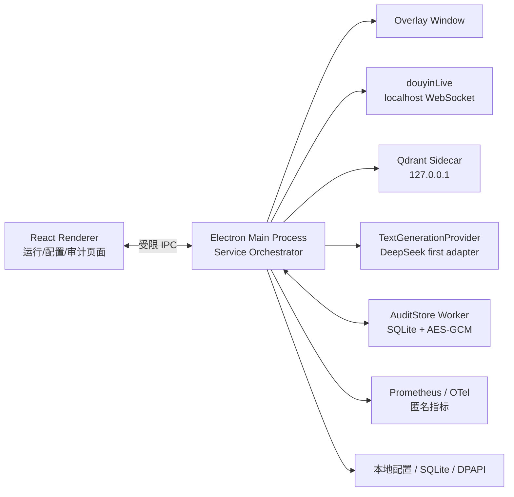
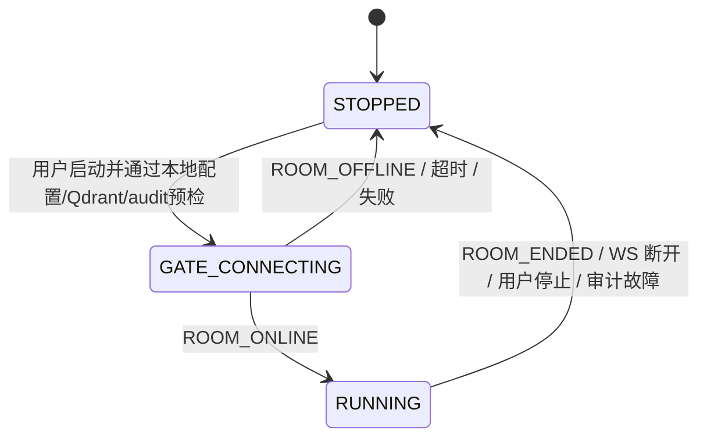
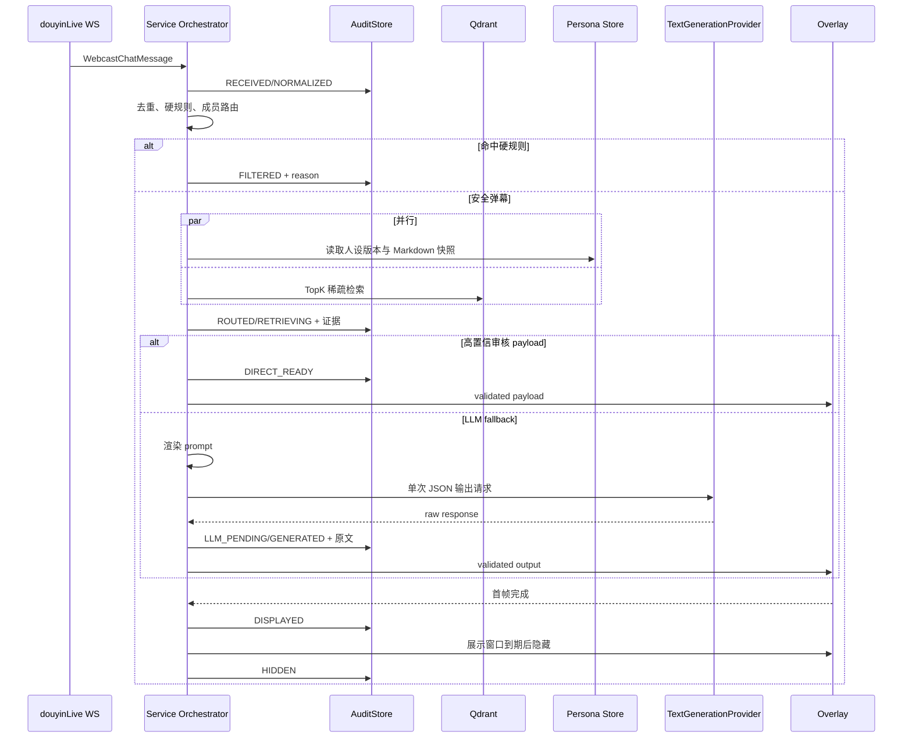
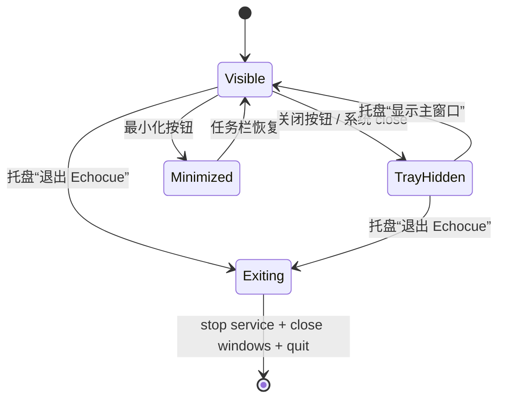

# Echocue 系统架构与详细设计说明书 v0.1

> 状态：已确认架构基线；外部 POC 与实现校准待完成
> 适用范围：Windows standalone MVP、单直播间、单一团队、人工查看 AI 建议  
> 上游依据：《需求澄清与 MVP 定义》《PRD》《技术调研与选型报告》

## 1. 设计目标与约束

本设计实现一条可预测、可取消、可审计的实时工作流：接收真实抖音弹幕，先安全过滤和确定性人设路由，再以 Qdrant 检索优先、可配置 `TextGenerationProvider` 单次生成兜底，最终通过始终置顶的 Windows 浮窗展示一条建议。DeepSeek 是首个适配器，不是业务层硬绑定。

1. 不使用 Agent 框架、多轮工具调用或候选队列。
2. `douyinLive` 本地 WS 只在用户启动 AI 服务后创建；仅 `ROOM_ONLINE` 通过启动门禁。`ROOM_OFFLINE`、`ROOM_ENDED`、用户停止或连接异常均立即关闭 WS。
3. 弹幕展示窗口期间不再启动新生成；窗口结束后只从最新窗口重新选取，不补发历史建议。
4. 每条处理弹幕以 `trace_id` 串起全链路可回放审计。无法写入审计库时停止产生新建议。
5. 端到端 P95 ≤ 3 秒是持续优化目标；`t0` 为 client 收到原始 WebSocket frame 的单调时钟，`t_end` 为浮窗首帧确认。上游事件时间仅旁路报告。
6. 人设与人工反馈均为版本化资产；人工确认的高质量反馈可回流为 golden set，但不能自动污染可直出样本。

## 2. 总体架构



### 2.1 进程边界

| 运行单元 | 职责 | 禁止事项 |
| --- | --- | --- |
| Renderer（主窗口） | React 界面、配置编辑、审计查询展示。 | 不可访问 Node、文件系统、API Key、数据库、Qdrant 或 WebSocket。 |
| Renderer（浮窗） | 仅渲染已验证的建议与窗口偏好。 | 不执行生成、检索、审计写入或配置修改。 |
| Electron Main | 服务状态机、接入适配、候选编排、provider 调用、窗口控制、IPC 权限。 | 不允许把密钥/原文审计数据传给非授权 Renderer。 |
| AuditStore Worker | SQLite 事务、字段加密/解密、哈希链、审计查询和备份。 | 不访问网络或 UI；不持有任何 Provider API Key。 |
| Qdrant Sidecar | 本地样本稀疏检索。 | 不暴露到 loopback 以外；不承担审计事实来源。 |

## 3. 服务生命周期与活动状态



### 3.1 状态定义

| 状态 | 可接受事件 | 必做动作 |
| --- | --- | --- |
| `STOPPED` | `START` | 清空内存候选/窗口，隐藏浮窗，创建一次门禁 WS。 |
| `GATE_CONNECTING` | `ROOM_ONLINE` | 记录会话开始，转 `RUNNING`。 |
| `GATE_CONNECTING` | `ROOM_OFFLINE`、超时、错误 | 关闭 WS，显示“未开播/连接失败，可手动重试”，回 `STOPPED`。 |
| `RUNNING` + activity 非 `DISPLAYING` | `COMMENT` | 审计可用时进入单条弹幕状态机；activity 可为 `LISTENING/RETRIEVING/GENERATING`。 |
| `RUNNING` + activity=`DISPLAYING` | 任意 `COMMENT` | 默认：仍创建加密审计 trace，记录 `RECEIVED → NORMALIZED → DISCARDED`，原因 `DISPLAY_WINDOW_ACTIVE`；不进入候选、不调用检索/LLM、不排队。开启「弹幕排队」（系统设置→运行机制）后：入 FIFO 队列，展示结束补发；排队超时丢弃记 `QUEUE_TIMEOUT`（WP-2）。 |
| 任意非停止状态 | `STOP`、`ROOM_ENDED`、WS 异常、审计故障 | 取消 in-flight 任务，关闭 WS，隐藏浮窗，清空最新窗口，回 `STOPPED`。 |

唯一生命周期枚举为 `STOPPED/GATE_CONNECTING/RUNNING`；唯一活动枚举为 `IDLE/GATE_CHECKING/LISTENING/RETRIEVING/GENERATING/DISPLAYING`。服务状态和每一次状态转换必须广播给主界面；UI 不得自行推断运行状态。

## 4. 实时处理工作流



### 4.1 并发、取消与新鲜度

- 运行期最多一个 `SuggestionAttempt`；activity 为 `DISPLAYING` 时不创建新 attempt。
- 每个 attempt 绑定 `session_id`、`trace_id`、`window_version`、`AbortController`。
- 用户停止、下播、WS 断开、窗口版本变化或请求超时，调用 `abort()`；任何异步返回都必须再次比对四个值。比对失败则进入 `DISCARDED`，reason 为 `STALE_SESSION/STALE_WINDOW/DEADLINE_EXCEEDED`，不可展示。
- 最新窗口只保存未展示期内的安全候选摘要；展示结束时清空，并增加 `window_version`。
- 初始窗口参数为 `window_max_age_ms=1500`、`candidate_max_count=50`、按 `source_message_id` 会话内去重；这些内部参数与候选评分快照必须写入审计，并由 POC-02 校准后固化。

### 4.2 人设路由与版本管理

1. 标准化弹幕文本（Unicode、空白、大小写/全半角；不得改变用于审计的原文）。
2. 对成员名称、昵称、别名、同音/常见错别字词表做精确匹配。
3. 无精确命中时仅允许高阈值、唯一的受控模糊匹配；保留所有候选和分数。
4. 无命中、低置信或多成员歧义时路由主要出镜人员。
5. 读取最终成员当前**已发布**版本的 Markdown 全文；不得让 LLM/Qdrant 决定成员。

人设使用 SQLite 的自然语言文本版本表，而非 Markdown 文件：编辑保存为 `draft`；用户显式“发布”后生成新的 `persona_version`（推荐 UUID + 内容 SHA-256），并原子切换为该成员 `active_version`；历史已发布版本只读、可比较、可“回滚”为新的发布版本。自然语言内容格式不限，可为 Markdown、纯文本或后续支持的富文本归一结果；业务层只读取 `content_text`。直播运行中固定使用服务启动时已加载的版本快照；发布新版本不影响当场 in-flight attempt，需用户停止后重新启动服务才生效。

### 4.3 人工打标回流与 golden set

Qdrant 始终维护两个独立 collection：`pre_set`（预置相似案例库）和 `golden_set`（主播主观认可、可用于直接建议的案例库）。golden set 不是 pre set 内按分数划出的逻辑子集，两库独立写入、独立检索、独立审计来源。审计页是 golden set 的唯一生产入口。

审计页展示建议的完整证据链后，由出镜人员或被授权配置人员按主观意愿打标；**质量分（0–100）不同于检索置信度（统一归一到 0.00–1.00）**：前者表达“主播是否喜欢/愿意使用这个答案”，后者表达“当前弹幕与历史样本的相似程度”。两者不得互相覆盖。

| 场景 | 必填记录 | 回流候选 |
| --- | --- | --- |
| 认可 AI 建议 | 人工填写质量分 `0..100`，可选评语。 | 质量分 `>=85` 时自动进入 `golden_set`；低于 85 仅保留打标记录。 |
| 不认可 AI 建议且未修正 | 原 AI 建议质量分固定 `0`，标记 `bad_case`。 | 仅当本次为 `golden_set` 直出时，标记该 golden point；LLM/pre_set 路径不修改通用案例库。 |
| 不认可且提供更优答案 | 原 AI 建议 `0`；人工修正的 `quick_reply`/`cues` 默认质量分 `85`，允许改为 `0..100`。 | 修正答案自动进入 `golden_set`。 |
| 过滤、丢弃、失败 | 可补充规则/样本标注，但没有建议质量分。 | 仅用于安全/低价值分类样本，不生成回复 payload。 |

回流记录必须固定：原始弹幕、`trace_id`、`persona_id`、`persona_version`、当时人设文本 hash、语义分类、AI 原输出（如有）、人工评分/修正、打标人、本机时间和 `feedback_status`。提交后即时执行一次幂等 upsert 到 `golden_set`，不经过 JSONL 中转，也不做 collection 重建。

审计页仅使用用户可理解的 `label_status` 进行筛选与防重复打标：`UNLABELED`（尚未打标）、`ACCEPTED`（已认可）、`REJECTED`（已拒绝）、`CORRECTED`（已提供修正）和 `NOT_APPLICABLE`（过滤/失败等无建议链路）。同一 `trace_id` 的建议只能有一条当前有效反馈；再次编辑保留修订历史。

回流结果另以内部 `sync_status` 管理：`NOT_REQUIRED`、`PENDING`、`SYNCED`、`FAILED`，并包含 `is_bad_case`。它只供服务重试、审计完整性与开发诊断使用，不经用户审计页面或普通 IPC 暴露。修正答案、或未修正但评分 `>=85` 的建议提交后写入 `golden_set`；拒绝且未修正时只可将本次直出的 `golden_set` point 标为 `is_bad_case=true`。LLM 或 `pre_set` 参考路径不修改任何 `pre_set` point。bad case 仅排除该 golden point 本身，不推断或屏蔽语义相似案例。

检索前，`golden_set` 以当前 `persona_id`、`persona_version`、`enabled=true`、`is_bad_case=false` 做 payload filter；`pre_set` 是通用库，不按人设版本过滤，只过滤 `enabled=true`、`is_bad_case=false`。检索后才由类型投票进行初筛，避免按未知类型预过滤。`is_bad_case` 默认 `false`，所以未打标案例仍能参加召回。随后对 `golden_set` 与 `pre_set` 发起两路并行 jieba-BM25 召回：输入统一经过 regex 清理、Unicode NFKC 标准化及 `jieba-wasm.cut_for_search`；文档向量已预计算 BM25 文档侧权重，查询向量的去重 token 权重固定为 `1`，Qdrant `modifier: 'idf'` 在查询时动态加权。原始 BM25 分数不能跨 collection 直接比较，必须通过 POC 固定、版本化的 score calibration 归一为 `retrieval_confidence ∈ [0.00, 1.00]`，再以该置信度为主排序/rerank 得到统一 TopK；每条结果保留 `source_collection`，审计记录两路原始结果、归一参数和最终名次。

若 Top-1 来源为 `golden_set`、payload filter 全部满足、`retrieval_confidence >= direct_push_threshold`（初始建议 `0.85`，由 POC 校准并仅作为内部配置固化）且弹幕仍在最新窗口，先经当前人设版本、当前禁忌规则版本、结构、长度和安全类别的共用输出校验器；通过后才直接选用该条 `reply`/`cues` 推送浮窗，不调用 LLM。任何条件不满足（包括 Top-1 来自 `pre_set`）均把合并 TopK 作为上下文，调用一次 LLM 生成新的回复与提词。`GENERATED → DISPLAY_READY` 也必须调用同一校验器；校验输入、规则版本、结果与拒绝原因写入审计。

### 4.4 安全规则执行契约

安全规则由版本化 `SafetyPolicyVersionV1` 管理，原始自然语言说明和关键词均保留；运行期只执行已发布版本的确定性编译结果，不在 3 秒主链路内调用 LLM 解释规则。规则发布顺序固定为：Unicode NFKC/大小写/空白归一 → 内置高风险类别与 PII detector → 精确关键词/短语 → 受控 regex → 自然语言边界的确定性编译规则。任何一步命中即 `FILTERED`，记录稳定 `SafetyReasonCodeV1`、规则版本和命中规则 ID。

`SafetyRuleCompilerV1` 仅接受可解释句式，例如“不要/禁止/不讨论 + 一个或多个明确话题”，并把话题编译为 `TOPIC_PHRASE`；无法无歧义解析、regex 非法、关键词为空或类别未知时，版本标为 `INVALID`，不得发布、不得启动服务。用户仍以自然语言配置，但 UI 必须展示“可执行/需修改”的校验结果；不得静默忽略无法执行的自然语言。内置类别至少包括 `ABUSE`、`PII`、`POLITICS`、`SEXUAL`、`ILLEGAL`、`MEDICAL_FINANCIAL_ADVICE`、`COMPETITOR`、`TRANSACTION_PRICE`、`TEAM_FORBIDDEN`。

输入过滤与输出复验必须引用同一个已发布 `safety_policy_version`，但分别写入 `INPUT_SAFETY_DECISION` 与 `OUTPUT_SAFETY_DECISION` 快照。检测器异常、规则版本缺失或编译产物校验失败时 fail closed：拒绝启动或停止服务并返回 `E_SAFETY_POLICY_INVALID`，不能降级为“无规则运行”。规则测试集必须覆盖归一化变体、同音/错别字已配置变体、regex 边界、PII、每个内置类别、允许样本和编译失败样本。

## 5. 模块接口契约

以下为领域层 TypeScript 契约草案；具体目录和错误类型在接口设计文档固定。

```ts
type ServiceLifecycle = 'STOPPED' | 'GATE_CONNECTING' | 'RUNNING';
type ServiceActivity = 'IDLE' | 'GATE_CHECKING' | 'LISTENING' | 'RETRIEVING' | 'GENERATING' | 'DISPLAYING';

interface NormalizedComment {
  traceId: string;
  sessionId: string;
  sourceMessageId: string;
  platformRoomId?: string;
  rawText: string;
  normalizedText: string;
  receivedAt: string;
}

interface PersonaRoute {
  personaId: string;
  personaVersion: string;
  personaMarkdown: string;
  decision: 'exact' | 'fuzzy_unique' | 'principal_fallback';
  candidates: Array<{ personaId: string; matchedAlias: string; score: number }>;
}

interface RetrievalHit {
  sampleId: string;
  sourceCollection: 'pre_set' | 'golden_set';
  personaVersion: string;
  text: string;
  semanticType: string;
  rawScore: number;
  retrievalConfidence: number; // [0, 1]，按 collection 校准后可比较
  payload?: { reply: string; cues: string[] };
}

interface SuggestionOutput {
  quickReply: string;
  cues: string[];
  source: 'retrieval_payload' | 'llm';
}
```

## 6. 审计存储设计

### 6.1 逻辑表

| 表 | 主键 | 用途 |
| --- | --- | --- |
| `audit_trace` | `trace_id` | 一条弹幕处理的索引、最终状态、会话与时间范围。 |
| `audit_transition` | `(trace_id, sequence_no)` | 不可跳步的状态迁移、reason code、前序 HMAC。 |
| `audit_snapshot` | `snapshot_id` | 加密大字段：原始 WS、Markdown、TopK、prompt、响应、payload。 |
| `audit_reference` | `(trace_id, sequence_no, snapshot_id)` | 迁移到快照的有序关联与内容类型。 |
| `persona_version` | `(persona_id, version)` | 发布的自然语言人设文本、hash、状态、创建来源与生效关系。 |
| `suggestion_feedback` | `feedback_id` | AI 建议/人工修正的质量分、评语、打标人、版本绑定和批准状态。 |
| `golden_set_entry` | `entry_id` | 已回流 golden point 的 `trace_id`、Qdrant point ID、同步状态和修订映射。 |
| `audit_meta` | `key` | schema 版本、密钥版本、链锚点、迁移记录。 |

每次迁移以单个 SQLite 事务写入 `audit_transition`、关联快照及 `audit_trace` 当前状态。字段值使用参数化 SQL；大字段加密后以 BLOB 保存。原文搜索仅允许在受控审计页进行解密后本地过滤，MVP 不建立明文全文索引。

### 6.2 审计失败策略

首次写入失败：取消当前 attempt、隐藏未展示建议、关闭 AI 服务并给出“审计存储不可用”的可操作提示。已完成的历史记录不可修改；人工清理空间或修复权限后，由用户手动重新启动。

## 7. 配置与本地文件

| 数据 | 位置/形式 | 安全要求 |
| --- | --- | --- |
| 应用偏好、直播间引用 | 本机配置文件 | 不保存 Cookie/签名 URL。 |
| Provider 配置与凭证 | 非密钥配置文件 / Electron `safeStorage` | 保存服务商名称、adapter type、Base URL、Model ID 与凭证引用；API Key 按 provider 独立加密，Main 解密且 UI 永不回显。 |
| 人设 | SQLite `persona_version` 自然语言文本 + metadata | 不限文本格式；draft/published 不可变版本；运行期固定 published snapshot。 |
| 禁忌规则/关键词 | 本机配置 | 修改形成版本并审计引用。 |
| Qdrant 案例库 | 独立 `pre_set` 与 `golden_set` collection | `pre_set` 按《pre_set 初始案例数据标准》由甲方初始化；两路并行召回；打标合格/修正答案即时 upsert 至 golden set。 |
| 审计库 | `audit/audit.sqlite` 及 WAL 文件 | 用户应用数据目录、字段加密、按保留期自动清理（默认 30 天、可调 7–180 天，当天首次运行清理过期完整 trace）、完全禁用导出；不可写即停止 AI 服务。 |

## 8. 安全与 IPC

1. `contextIsolation=true`、`nodeIntegration=false`；preload 仅暴露按页面授权的 IPC 方法。
2. Renderer 只能读取自己的配置视图、运行状态和分页审计详情；所有写操作均由 Main 校验 schema 与权限。
3. LLM 请求、API Key、完整人设 Markdown、Qdrant raw payload 和原文审计快照不经 IPC 广播。
4. Prometheus/OTel 只记录枚举类别、计数与耗时；不得携带 `trace_id`、弹幕原文、昵称、人设、回复、请求 ID 或密钥。
5. Qdrant 与 metrics HTTP endpoint 仅监听 `127.0.0.1`；默认不启用 OTLP 出口。

### 8.1 审计工作区交互边界

审计工作区必须有两个用户入口：**workflow 完整上下文**（按 `trace_id` 查看状态迁移、原文快照和决策依据）与**建议质量打标回流**（认可、拒绝、修正和评分）。这是能力入口要求，不规定为独立页面、独立弹窗或固定布局；UI 可组合为同一工作区的列表/详情分栏、抽屉、侧栏或其他适合直播团队使用的形式。无论组织方式如何，打标入口仅展示用户可理解的标签状态；内部的 golden 同步、bad case 与阈值不可见。

### 8.2 桌面壳层、三按钮与托盘

主窗口使用 `frame: false` 的自绘标题栏，实现左侧 macOS 风格的三个圆形控制按钮：红色关闭、黄色最小化、绿色最大化/还原。标题栏容器声明为 draggable region，三个按钮声明为 no-drag；按钮仍调用 Windows 原生窗口能力 `hide()`、`minimize()`、`maximize()`/`unmaximize()`，并提供 tooltip、焦点样式和键盘操作，不能只做视觉模拟。



`close` 事件默认 `preventDefault()` 后 `mainWindow.hide()`；不得调用 `app.quit()`。该隐藏行为不改变 Service Orchestrator 状态，运行中的 WS、浮窗和 AI 服务继续工作。仅托盘菜单的“退出 Echocue”设置一次性 `isExplicitQuit=true`，随后依次停止服务、关闭 sidecar/浮窗、flush 审计库并允许关闭主窗口；必须防止退出链再被 close handler 隐藏。

图标资产以仓库中已提供的 SVG 为唯一源：

| 用途 | SVG 源 | 构建/运行产物 |
| --- | --- | --- |
| Windows 应用、任务栏、安装包 | [`../../svg/douyin-echocue-client-app-icon.svg`](../../svg/douyin-echocue-client-app-icon.svg) | electron-builder 从 SVG 生成 Windows ICO，作为应用图标。 |
| 运行期系统托盘 | [`../../svg/douyin-echocue-client-tray-icon.svg`](../../svg/douyin-echocue-client-tray-icon.svg) | 构建阶段生成多 DPI PNG，并作为 runtime resource 随包携带；Electron main 以 `nativeImage` 加载 PNG。 |

Electron 运行期 `nativeImage` 跨平台只支持 PNG/JPEG，Windows 另支持 ICO，故 Tray 不直接读取 SVG；这只是格式转换约束，源设计仍严格使用上述 SVG。electron-builder 支持由 SVG 生成 Windows 图标。[electron-builder Icons](https://www.electron.build/docs/features/icons-and-images/)；[Electron nativeImage](https://www.electronjs.org/docs/latest/api/native-image)

## 9. 时延预算与关键指标

| 阶段 | P95 预算（初始） | 必测指标 |
| --- | --- | --- |
| 规范化/规则/路由 | 100 ms | 规则命中、路由置信度。 |
| Qdrant + 人设读取（并行） | 150 ms | TopK 检索耗时、命中/灰区比例。 |
| prompt 渲染/本地校验 | 100 ms | 输出结构失败率。 |
| Provider 单次调用 | 2,300 ms（目标预算）/ 5,000 ms（保险上限，同时服从 3 秒新鲜度 deadline） | 首 token/总耗时、超时、provider 错误。 |
| 审计事务 + 浮窗首帧 | 350 ms | audit 事务耗时、overlay first-frame。 |
| 合计 | 3,000 ms | E2E P95。 |

预算是 POC 起始假设，不是已达成承诺；直出 payload 会跳过 LLM 阶段，为性能留出余量。

## 10. POC 与开发顺序

1. 验证 Electron 版本、`node:sqlite`、Worker、WAL、DPAPI 与审计事务恢复。
2. 验证 Qdrant Windows sidecar 的打包、初始化、jieba-BM25 中文样本检索和本地回收。
3. 以 Windows x64 安装包、甲方授权真实开播房间验证 `douyinLive` 启动门禁、WS 生命周期与连续 30 分钟稳定性；归档评论数、重复率、断连/错误、到达时间、`ROOM_OFFLINE/ENDED` 关 WS 证据及凭证不落日志检查。此 POC 未通过前，MVP 不得进入端到端验收。
4. 实现规则/路由/审计状态机、人设发布版本及打标回流，再接入直出 payload、首选 Provider fallback 和浮窗。
5. 以真实样本压测时延、审计完整性、安全过滤、过期取消、golden set 排序与安装包升级；同时验证 SVG→ICO/PNG 产物、任务栏/托盘图标、关闭/Alt+F4 隐藏、托盘恢复、显式退出的 sidecar 停止与审计 flush。

## 11. 详细设计补充材料与剩余实现输入

为避免在本文重复 DDL、页面和图形化流程，已将原“待细化”项按以下边界补齐并保留本文的架构约束：

1. SQLite DDL、migration 编号、快照加密、HMAC 链、版本/反馈表、数据生命周期和检索 profile 迁移见《数据模型、接口与实时事件协议》与《数据建模与迁移设计》；
2. `douyinLive`、Qdrant、Provider、IPC、错误码及实时数据流/状态/时序见《数据模型、接口与实时事件协议》与《系统详细设计图册》；
3. 页面信息架构、窗口/托盘、审计追溯与打标入口、用户可见错误和隐私边界见《UI 信息架构与交互设计》；
4. 研发工作包、测试用例层级、POC 证据和验收门禁见《研发任务拆分、测试计划与验收标准》。

Provider 的最终 prompt 模板、JSON schema、首个 DeepSeek 适配器与 Windows 安装运行方式分别由《LLM 提示词与输出校验设计》《Windows 部署、运行与故障处理手册》维护；任何变更均必须保持本章的单次调用、5 秒保险上限、新鲜度取消、审计快照和不重试约束。
