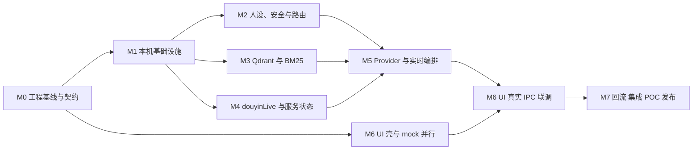

# Echocue MVP 里程碑与原子任务实施计划 v0.1

| 项目 | 内容 |
| --- | --- |
| 状态 | 已确认实施计划基线；真实环境 POC 仍须按门禁执行 |
| 日期 | 2026-08-21 |
| 适用范围 | Windows x64 standalone、单直播间、单团队 MVP |
| 计划口径 | 不估算任务周期；按可独立领取、提交、测试和验收的原子任务拆解 |
| 上游依据 | 需求、PRD、技术调研、架构、数据/接口、详细设计、UI、实施与验收文档 |

## 1. 目标与使用方法

本计划解决两个问题：一是把粗粒度的 W1–W7 转换为程序人员可以独立领取的任务；二是让任务执行者只阅读与当前任务直接相关的章节、Schema 和 fixture，而不必在开始开发前全量阅读全部项目文档。

使用规则：

1. 项目负责人维护本计划、根索引和原子追溯矩阵；单个任务执行者只需读取任务行列出的“最小阅读包”。
2. 机器可读 Schema、migration、fixture 的约束优先于示例代码；若与正文冲突，停止实现并修正文档，不得自行选择一种解释。
3. `archived/` 仅用于历史背景，不属于任何开发任务的必读材料。
4. 审查报告只用于了解缺陷来源，不作为实现契约；当前状态以修复闭环报告和本计划为准。
5. 每个任务必须独立提交代码、测试和必要的文档同步；不能用“后续联调时再测”代替任务自身的自动化完成标准。
6. POC 模板、mock 和 fixture 不是实际 POC 证据。涉及真实直播间、真实模型、真实中文样本或候选安装包的任务必须保存真实 artifact。
7. 本计划不设置开发周期；任务排序只表达依赖关系和里程碑门禁。

## 2. 文档简称与最小阅读原则

| 简称 | 文件 | 权威内容 |
| --- | --- | --- |
| `REQ` | [需求澄清与 MVP 定义](../01-requirements/Echocue-需求澄清与MVP定义-v0.1.md) | 范围、业务规则、非功能目标和已确认决策 |
| `PRD` | [产品需求文档](../02-product/Echocue-PRD-v0.1.md) | FR、用户行为、页面和产品验收 |
| `RESEARCH` | [技术调研与选型](../03-research/Echocue-技术调研与选型报告-v0.1.md) | 选型依据、技术限制和 POC 口径 |
| `ARCH` | [系统架构设计](../04-architecture/Echocue-系统架构与详细设计说明书-v0.1.md) | 进程、模块、实时工作流、安全与时延边界 |
| `PRESET` | [pre_set 数据标准](../05-data-interface/Echocue-pre_set初始案例数据标准-v0.1.md) | 甲方初始案例包及原子导入要求 |
| `CONTRACT` | [数据模型、接口与事件协议](../06-data-interface/Echocue-数据模型、接口与实时事件协议-v0.1.md) | 唯一状态、DDL、payload、IPC、reason 和 error 契约 |
| `DELIVERY` | [研发任务、测试与验收](Echocue-研发任务拆分、测试计划与验收标准-v0.1.md) | W1–W7、testcase 和 A-01～A-13 |
| `ATLAS` | [系统详细设计图册](../09-design/Echocue-系统详细设计图册-v0.1.md) | 流程、DFD、时序和状态图 |
| `DATA` | [数据建模与迁移设计](../09-design/Echocue-数据建模与迁移设计-v0.1.md) | ER、数据字典、迁移、加密、容量和回流 |
| `UI` | [UI 信息架构与交互设计](../10-ui/Echocue-UI信息架构与交互设计-v0.1.md) | 页面、窗口、浮窗、状态和权限 |
| `LLM` | [LLM 提示词与输出校验](../11-implementation/Echocue-LLM提示词与输出校验设计-v0.1.md) | Prompt、Provider、输出校验和取消 |
| `RUNBOOK` | [Windows 部署运行手册](../11-implementation/Echocue-Windows部署运行与故障处理手册-v0.1.md) | sidecar、安装、运行、容量、升级和故障处理 |
| `PROTO` | [Vite + React + TypeScript 原型](../../prototype/README.md) | 可视化布局、mock 状态和 Renderer 演进边界 |

任务执行者不需要先阅读本表全部文件。例如，实现 Provider adapter 时只读 `CONTRACT §6`、`LLM §2/§4/§6` 和 Provider fixtures；实现人设页面时只读 `UI §6/§9`、对应 IPC 行和 `PersonaPage.tsx`。

## 3. 里程碑依赖



允许并行：

- M2、M3、M4 在 M1 的公共配置、契约和存储基础稳定后并行；
- M6 的视觉组件和 mock 状态可在 M0 完成后开始，但真实 IPC 联调必须等待对应 backend；
- douyinLive、BM25、安全/路由 POC 可在各自模块完成后立即执行，不必等待全部 UI；
- M7 汇聚所有路径，任何外部 POC 或发布 manifest 不可被 mock 替代。

## 4. 通用任务完成定义

每个原子任务同时满足以下条件才算完成：

1. 代码边界只覆盖任务声明内容，没有顺带引入未授权功能；
2. 共享输入/输出使用 `contracts-v1.ts` 或由其生成的类型，未复制枚举；
3. 正常、边界、失败和越权路径具备相应自动化测试；
4. 日志、Prometheus、OTel 不包含弹幕、人设、回复、昵称、API Key、Authorization 或 `trace_id`；
5. 相关 fixture、migration、Schema 或 IPC 变更同步更新契约和追溯矩阵；
6. Windows x64 目标下完成与风险相称的构建或测试；
7. 交付说明包含运行方法、测试命令、已知限制和对应 testcase/A 编号。

## 5. M0：工程基线与开发契约

### 5.1 进入条件

- 文档修复闭环 v0.3 已完成；
- 当前开发基线、外部 POC 待执行状态已明确。

### 5.2 原子任务

| ID | 任务边界 | 前置 | 最小阅读包 | 关键输入 | 输出与完成判据 | 追溯 |
| --- | --- | --- | --- | --- | --- | --- |
| `M0-01` | 建立 Electron + Vite + React + TypeScript 工程；不接业务服务 | 无 | `RESEARCH §4.1–§4.2`；`ARCH §2/§2.1`；`PROTO §运行/复用边界` | 现有 `prototype/` | main、main preload、renderer、overlay preload/renderer 入口可分别构建；context isolation 开启 | W1、T-PKG-001 |
| `M0-02` | 建立共享 contract package | M0-01 | `CONTRACT §2/§7/§8`；[contracts-v1.ts](../06-data-interface/schema/contracts-v1.ts) | Zod schema、状态和错误枚举 | Main/preload/Renderer 依赖同一包；禁止复制字符串枚举；schema fixture 可运行 | W1、T-PROV-001、T-AUD-001 |
| `M0-03` | 建立 Unit/Contract/Integration/E2E 测试骨架 | M0-01/02 | `DELIVERY §4.1/§4.4/§8` | testcase 目录 | 分层测试命令、fixture loader、Windows CI 入口；失败退出码可靠 | 全部 T-* |
| `M0-04` | 锁定依赖并建立许可证/SBOM 入口 | M0-01 | `RUNBOOK §2.1`；[安装包清单 §2](../11-implementation/Echocue-Windows安装包清单与兼容矩阵-v0.1.md) | package lock、候选二进制表 | 锁文件、依赖清单、许可证扫描、SBOM 命令；运行期不下载二进制 | W1、T-PKG-001、A-09 |

### 5.3 退出门禁

- Windows x64 可构建空壳应用；
- contract/test package 可被各进程引用；
- Renderer 无 Node、文件系统、数据库或任意网络权限。

## 6. M1：本机配置、存储、安全与桌面壳层

### 6.1 原子任务

| ID | 任务边界 | 前置 | 最小阅读包 | 关键输入 | 输出与完成判据 | 追溯 |
| --- | --- | --- | --- | --- | --- | --- |
| `M1-01` | 实现 `settings.json` 配置仓库 | M0-02 | `ARCH §7`；`CONTRACT §3 SettingsV1`；`RUNBOOK §2.3` | SettingsV1Schema | 临时文件→fsync→原子 rename；损坏/未知字段拒绝；敏感字段不可写入 | W1、T-PROV-001 |
| `M1-02` | 实现 safeStorage Provider 凭证仓库 | M1-01 | `CONTRACT §1/§3 ProviderConfigV1`；`RUNBOOK §5.4` | credentialRef 规则 | providerId 隔离；Key 不回显；host/adapter 变化使旧凭证失效 | W1/W6、T-PROV-001、A-11 |
| `M1-03` | 实现 AES-GCM envelope、HMAC 与 DPAPI 包装 | M0-02 | `DATA §8.1`；`CONTRACT §3` envelope/AAD | 加密字段定义 | 加密、解密、密钥版本、篡改拒绝、key/HMAC 分离测试 | W3、T-AUD-001 |
| `M1-04` | 实现 SQLite migration runner | M1-03 | `DATA §7.1`；[001 migration](../06-data-interface/migrations/001_initial_schema.sql)；[migration test](../06-data-interface/fixtures/migration-contract-test.mjs) | SQL migration | 空库初始化、checksum、事务、重复启动、失败回滚均通过 | W3、T-AUD-001、T-STO-001 |
| `M1-05` | 实现 AuditStoreWorker 单写模型 | M1-04 | `ARCH §6`；`DATA §4.2`；`CONTRACT §2/§3` | TraceState/Reason、snapshot schema | 数据库只在 worker 打开；appendTransition 校验 from/to/reason；不可写触发停服事件 | W3、T-AUD-001、A-07 |
| `M1-06` | 实现主窗口三按钮、托盘和显式退出 | M0-01 | `PRD FR-11`；`UI §3`；`ARCH §8.2`；`svg/` 资产 | app/tray SVG | 关闭/Alt+F4 隐藏；托盘恢复；显式退出回收资源；按钮具备语义和可访问名 | W1、T-OVR-001、A-08 |
| `M1-07` | 实现日志、Prometheus、OTel 和诊断数据源 | M0-03/M1-01 | `PRD FR-09`；`RESEARCH §4.3`；`RUNBOOK §6` | 指标白名单 | exporter 可开关；状态/计数/耗时可观测；敏感和高基数字段反向测试 | W1、T-DIAG-001、A-13 |

### 6.2 退出门禁

- 配置、密钥、SQLite、加密和 Worker 能独立集成测试；
- 审计不可写能够可靠停止服务，而不是只记录日志；
- 主窗口关闭不会退出应用，托盘显式退出能完成清理。

## 7. M2：团队人设、安全规则和成员路由

| ID | 任务边界 | 前置 | 最小阅读包 | 关键输入 | 输出与完成判据 | 追溯 |
| --- | --- | --- | --- | --- | --- | --- |
| `M2-01` | 实现成员、名称、昵称和别名 CRUD | M1-05 | `PRD FR-02/FR-03`；`DATA §4.1`；`CONTRACT §3 persona` | persona/persona_alias 表 | 增删改查、别名唯一、主要出镜唯一；删除主要出镜前拒绝 | W3、T-PER-001、A-04 |
| `M2-02` | 实现人设草稿、发布、比较与回滚 | M2-01 | `ARCH §4.2`；`DATA §4.1/§5` | persona_version 约束 | 发布版本不可变；回滚生成新草稿/版本；相同内容可产生新版本 | W3、T-PER-001 |
| `M2-03` | 实现 SafetyRuleCompilerV1 与版本发布 | M1-05 | `PRD FR-04`；`ARCH §4.4`；`CONTRACT §2/§3 safety`；[Safety fixtures](../06-data-interface/fixtures/safety-policy-fixtures-v1.json) | 自然语言、关键词、受控 regex | 可解释规则编译；歧义/非法 regex 阻止发布；会话冻结版本 | W4、T-SAFE-001、A-03 |
| `M2-04` | 实现弹幕规范化与输入安全过滤 | M2-03 | `REQ §7.2`；`ARCH §4.4`；`CONTRACT SafetyReasonCodeV1` | raw/normalized comment | regex/NFKC/空白规范；风险、PII、禁忌在检索/模型前过滤；引擎故障 fail closed | W4、T-SAFE-001 |
| `M2-05` | 实现成员识别与人设路由 | M2-01/M2-04 | `REQ §7.3`；`PRD FR-03`；`ARCH §4.2` | alias、主要出镜、normalized comment | 精确命中优先；模糊候选/分数可审计；歧义保守；未点名回退主要出镜 | W4、T-PER-001、A-04 |
| `M2-06` | 执行安全与路由基准测试 | M2-03/04/05 | [安全与路由 POC 模板](../03-research/Echocue-安全规则与路由POC记录模板-v0.1.md) | 甲方真实/脱敏样本 | 版本化数据集、漏放/误杀、路由结果、失败 case 和签核记录 | T-SAFE-001、T-PER-001、A-03/A-04 |

## 8. M3：Qdrant、jieba-BM25 与双库检索

| ID | 任务边界 | 前置 | 最小阅读包 | 关键输入 | 输出与完成判据 | 追溯 |
| --- | --- | --- | --- | --- | --- | --- |
| `M3-01` | 实现 Qdrant sidecar 进程管理 | M0-04/M1-07 | `RESEARCH §4.5`；`RUNBOOK §5.1`；`DATA §6.1` | 固定 Qdrant binary | loopback、端口所有权、健康检查、Job Object、退出/崩溃检测 | W1/W5、T-PKG-001 |
| `M3-02` | 实现 Bm25TextPipelineV1 规范化和 jieba 分词 | M0-03 | `CONTRACT §4` 开头；`DATA §6.3` | tokenizer/version | regex→NFKC→空白/热词→cut_for_search；写入查询共用完全相同 pipeline | W5、T-RET-001 |
| `M3-03` | 实现 MurmurHash token ID 和 BM25 文档权重 | M3-02 | `RESEARCH §4.5`；`CONTRACT §4` 公式；[BM25 POC §2–3](../03-research/Echocue-Qdrant-jieba-BM25-POC记录模板-v0.1.md) | UTF-8 token、k1/b/avg_len | TS/Python index 一致；碰撞诊断；文档向量不含 IDF | W5、T-RET-001 |
| `M3-04` | 实现严格 pre_set JSONL 导入器 | M3-02 | `PRESET §1–§7`；[pre_set schema](../05-data-interface/schema/pre-set-v1.schema.json)；[valid](../05-data-interface/fixtures/pre-set-valid.jsonl)/[invalid](../05-data-interface/fixtures/pre-set-invalid.jsonl) | 甲方 JSONL | 行数/大小/Schema/重复 ID/安全全包校验；任一失败整体拒绝 | W5、T-RET-001、A-05 |
| `M3-05` | 实现 retrieval profile 和双库 bootstrap | M3-01/03/04 | `CONTRACT §4.5`；`DATA §7.2–§7.3`；`ATLAS §5` | 有效 pre_set、profile metadata | 计算 avg_len；建临时双库/index；upsert；fixture 校验；原子 alias | W5、T-RET-001 |
| `M3-06` | 实现 pre_set/golden_set 双路查询 adapter | M3-05/M2-02 | `CONTRACT §4.1/§4.2/§4.4`；`DATA §6.1–§6.2` | 当前 persona/version、query vector | payload filters 正确；query 去重 token 权重为 1；返回 raw hit 与来源 | W5、T-RET-001 |
| `M3-07` | 实现 calibration、跨库 rerank 和语义初筛 | M3-06 | `CONTRACT §4.3–§4.4`；`ARCH §4`；`BM25 POC §4` | 两库 raw hits、calibration artifact | raw score 不直接跨库比较；输出 [0,1] 置信度、TopK、语义结论 | W5、T-RET-001 |
| `M3-08` | 实现 golden 高置信直出决策 | M3-07 | `ARCH §4.3`；`CONTRACT §4.2–§4.4` | merged TopK、persona/version | 仅 golden Top-1、当前版本、enabled、非 bad case、达到内部阈值可直出 | W5/W6、T-RET-001、A-05 |
| `M3-09` | 执行 Qdrant/jieba-BM25 POC | M3-01–08 | [BM25 POC 模板](../03-research/Echocue-Qdrant-jieba-BM25-POC记录模板-v0.1.md) | 甲方样本 | hash fixture、中文检索、profile metadata、calibration、阈值和性能 artifact | T-RET-001、A-05 |

## 9. M4：douyinLive 接入与服务状态机

| ID | 任务边界 | 前置 | 最小阅读包 | 关键输入 | 输出与完成判据 | 追溯 |
| --- | --- | --- | --- | --- | --- | --- |
| `M4-01` | 实现 douyinLive 随包 sidecar 管理 | M0-04/M1-06 | `RESEARCH §3.2–§3.5`；`RUNBOOK §5.2` | 固定 Windows x64 binary | 仅用户启动服务时拉起；Job Object；不支持 external/shared mode | W1/W2、T-PKG-001、A-09 |
| `M4-02` | 实现本地 WebSocket 事件 adapter | M4-01 | `RESEARCH §3.4`；`CONTRACT §5` | WS fixtures | ONLINE/OFFLINE/ENDED/COMMENT 正确映射；礼物/点赞不进入生成 | W2、T-CON-001 |
| `M4-03` | 实现 lifecycle/activity 状态机 | M1-05/M4-02 | `ARCH §3`；`CONTRACT §4.6`；`ATLAS §8.1` | ServiceViewState | lifecycle 三值、activity 六值；状态由 Main 广播；非法转换拒绝 | W2、T-CON-002 |
| `M4-04` | 实现手动启动门禁和停止流程 | M3-01/M4-03 | `PRD FR-08`；`ATLAS §3/§7.1`；`RUNBOOK §4.1–§4.2` | 配置/审计/Qdrant/source health | 任一失败拒绝启动；关闭 WS/sidecar；未开播或中断后不自动恢复 | W2、T-CON-002、A-02 |
| `M4-05` | 执行真实直播间 douyinLive POC | M4-01–04 | [douyinLive POC 模板](../03-research/Echocue-douyinLive-Windows-x64-POC记录模板-v0.1.md) | 真实开播房间 | 30 分钟计数、事件、关闭时序、SHA/SBOM/许可证、异常与风险签核 | T-CON-001、A-01 |

## 10. M5：Provider、提示词与实时建议编排

| ID | 任务边界 | 前置 | 最小阅读包 | 关键输入 | 输出与完成判据 | 追溯 |
| --- | --- | --- | --- | --- | --- | --- |
| `M5-01` | 实现 Provider 配置服务和连接测试 | M1-01/02 | `PRD FR-06/FR-08`；`CONTRACT §3/§7`；`UI §7.1` | ProviderConfigV1 | 服务商名称、adapter type、Base URL、Model ID、Key；HTTPS/host/重定向安全校验 | W6、T-PROV-001、A-11 |
| `M5-02` | 实现 TextGenerationProvider 稳定接口 | M0-02 | `ARCH §5`；`CONTRACT §6`；`LLM §2` | GenerateSuggestion contract | SDK 类型不越过 adapter；统一 result/error/abort/audit metadata | W6、T-PROV-001 |
| `M5-03` | 实现 DeepSeek 首个 adapter | M5-01/02 | `RESEARCH §5.4/§5.6`；`LLM §4`；[Provider fixtures](../06-data-interface/fixtures/provider-contract-fixtures-v1.json) | DeepSeek fixture | 非流式 JSON Output；不发送 tools；tool_calls 按 PROTOCOL 失败 | W6、T-PROV-001 |
| `M5-04` | 实现 OpenAI-compatible 替代 adapter contract | M5-02 | `RESEARCH §5.2–§5.3`；`CONTRACT §6`；Provider fixtures | compatible fixture | 第二 adapter 通过相同业务 contract，证明业务层无供应商硬绑定 | W6、T-PROV-001、A-11 |
| `M5-05` | 实现确定性 PromptAssembler | M2-02/M3-07 | `LLM §3.1–§3.3` | 冻结人设、安全版本、TopK | 固定消息布局、注入隔离、版本化模板和确定性截断；相同输入同 prompt | W6、T-PROV-001 |
| `M5-06` | 实现 golden/LLM 共用输出校验器 | M2-03/M5-05 | `LLM §5`；`CONTRACT §6` | SuggestionOutput schema | quick reply ≤80；cues 2–3/≤40；结构、安全、人设和新鲜度复验 | W6、T-PROV-001、A-06 |
| `M5-07` | 实现 SuggestionAttempt 实时编排 | M2-05/M3-08/M4-04/M5-06 | `ARCH §4/§4.1`；`ATLAS §4/§7.2/§8.2` | SourceComment、route、retrieval、provider | 单时刻一个 attempt；golden 优先、LLM 一次；展示期不生成、不排队 | W6、T-PERF-001、A-06 |
| `M5-08` | 实现全链路时钟、deadline 和 abort | M5-07 | `RESEARCH §6.1–§6.2`；`CONTRACT §6`；`LLM §6` | monotonic timestamps | t0 原始 WS frame，t_end 首帧 ack；5 秒保险服从更早 freshness deadline；晚到丢弃 | W6、T-PERF-001 |
| `M5-09` | 实现生成路径全量审计快照 | M1-05/M5-07 | `CONTRACT §3` snapshot role；`LLM §7`；`ATLAS §7.2` | workflow context | raw、route、TopK、prompt、provider、validation、overlay 全部可回放；敏感日志隔离 | W3/W6、T-AUD-001、A-07 |

## 11. M6：正式 Renderer 与独立浮窗

M6 任务可以先使用 mock IPC 完成视觉和状态，真实完成判据仍要求接入 CONTRACT §7 的正式 IPC。

| ID | 任务边界 | 前置 | 最小阅读包 | 关键输入 | 输出与完成判据 | 追溯 |
| --- | --- | --- | --- | --- | --- | --- |
| `M6-01` | 主窗口导航、布局和全局状态组件 | M0-01/02 | `UI §2/§3.3/§9`；`prototype/src/App.tsx` | prototype shell | 七个正式入口；overlay 只作独立窗口；空/加载/错/隐私状态组件 | W1/W6、T-OVR-001 |
| `M6-02` | 运行页和启动门禁 UI | M4-03/04 | `UI §4`；`CONTRACT §4.6`；`prototype/src/pages/RunPage.tsx` | ServiceViewState | 启动、停止、门禁、未开播、source/audit 错误均由真实状态驱动 | W2/W6、T-CON-002 |
| `M6-03` | 直播间与 AI 配置页 | M5-01 | `UI §7.1`；`CONTRACT §3/§7`；`ConfigPages.tsx RoomAi` | config/provider IPC | 统一字段、测试连接、Key 不回显、清除确认、失败保留输入 | W6、T-PROV-001、A-11 |
| `M6-04` | 团队与人设页 | M2-01/02 | `UI §6/§9`；`PRD §7.2`；`PersonaPage.tsx` | persona IPC | 成员增删、主出镜、别名、草稿、发布、预览、比较、回滚新版本 | W3/W4、T-PER-001 |
| `M6-05` | 安全与禁忌页 | M2-03 | `UI §7.2/§9`；`ARCH §4.4`；`ConfigPages.tsx Safety` | safety IPC | 自然语言、关键词增删、编译错误定位、发布与下次启动生效提示 | W4、T-SAFE-001 |
| `M6-06` | 浮窗偏好页 | M1-01 | `UI §5/§7`；`PRD FR-07`；`ConfigPages.tsx Preferences` | overlay preferences | 时长、尺寸、透明度、字号、主题、点击穿透、默认恢复和持久化 | W6、T-OVR-001、A-08 |
| `M6-07` | 实现 Electron 独立置顶浮窗 | M5-07/08/M6-06 | `UI §5`；`ARCH §8.2`；`OverlayPage.tsx` | validated suggestion + read-only prefs | `@昵称`、置顶、拖拽、首帧 ack、到期隐藏、跨屏回退；overlay preload 最小权限 | W6、T-OVR-001 |
| `M6-08` | 诊断页 | M1-07/M4-03 | `UI §8.1/§9`；`PRD FR-09`；`ConfigPages.tsx Diagnostics` | diagnostic summary | 最近接收/处理/时延/容量、可复制脱敏错误；无正文/Key | W1、T-DIAG-001、A-13 |
| `M6-09` | 审计列表和 workflow 详情 | M5-09 | `UI §8.2/§9`；`PRD FR-10`；`AuditPage.tsx Workflow` | audit.search/getWorkflow | 授权提示、筛选、分页、按需解密、完整状态/原文/证据 | W7、T-AUD-001、A-07 |
| `M6-10` | 打标与修订入口 | M6-09 | `UI §8.2` 打标表；`DATA §4.3`；`AuditPage.tsx LabelForm` | audit.submitLabel | 认可/拒绝/修正、0–100、默认 85、保存失败保留输入、修订而非覆盖 | W7、T-AUD-001 |
| `M6-11` | Renderer/overlay IPC 权限和 schema 测试 | M6-01–10 | `CONTRACT §7`；`ARCH §8` | IPC allowlist | overlay 无配置/审计权限；错误 sender、未知 channel、非法字段/traceId 全拒绝 | W1/W7、T-AUD-001、T-OVR-001 |

## 12. M7：回流、集成、验收与发布

| ID | 任务边界 | 前置 | 最小阅读包 | 关键输入 | 输出与完成判据 | 追溯 |
| --- | --- | --- | --- | --- | --- | --- |
| `M7-01` | 实现 feedback 修订事务和 outbox | M1-05/M6-10 | `DATA §4.3`；`CONTRACT §3 outbox`；`ATLAS §7.3/§8.3` | label request | feedback、trace 当前状态、job 同事务；revision/幂等键阻止重复 | W7、T-AUD-001 |
| `M7-02` | 实现 golden UPSERT worker | M3-05/M7-01 | `CONTRACT §3/§4.2`；`DATA §6.2` | correction/accepted feedback | 修正或评分≥85 进入 golden；绑定实际 persona/version；单点增量写入 | W7、T-RET-001 |
| `M7-03` | 实现 golden bad-case worker | M7-01/02 | `CONTRACT §4.3`；migration trigger/test | rejected direct source | 仅拒绝且无修正的 golden 直出 point 标坏；pre_set/LLM 路径不修改 point | W7、T-RET-001、A-05 |
| `M7-04` | 完成全量 Contract/Integration tests | M1–M6 相关模块 | `DELIVERY §4.1/§4.2/§4.4` | 全部 fixture | WS、Qdrant、Provider、IPC、SQLite、状态、reason/error、回流覆盖 | 全部 T-* |
| `M7-05` | 完成模拟 E2E 实时流 | M5/M6/M7-03 | `ATLAS §4/§7`；`DELIVERY T-CON/T-RET/T-AUD/T-OVR` | 可重复 mock stream | 过滤、直出、LLM、过期、展示抑制、停服、审计故障均生成对照审计 | A-02～A-08 |
| `M7-06` | 执行端到端时延和建议质量 POC | M4-05/M5/M6-07 | `RESEARCH §6.4`；`DELIVERY §4.3/§5` | 真实房间、Provider、甲方样本 | P50/P95/P99、格式率、建议质量、LLM 削减率；未达标形成持续优化项 | T-PERF-001、T-QUAL-001、A-06/A-10 |
| `M7-07` | 执行容量、WAL、完整性和恢复演练 | M1-04/05/M3-01 | `DATA §8.2`；`RUNBOOK §5.3/§8.3`；`DELIVERY A-12` | 长时审计数据 | 每千条增长、2 GiB 门禁、预警、256 MiB 停服、checkpoint 和受控恢复通过 | T-STO-001、A-12 |
| `M7-08` | Windows 安装、升级、退出和兼容测试 | M0-04/M7-04 | `RUNBOOK §3/§4/§8`；安装包清单 §3–§4 | release candidate | 一键安装、无 Docker/静默下载、migration 升级、托盘/sidecar/Job Object 无残留 | T-PKG-001、A-09 |
| `M7-09` | 生成正式 manifest、SHA、签名和 SBOM | M7-08 | [安装包清单 §2/§4](../11-implementation/Echocue-Windows安装包清单与兼容矩阵-v0.1.md) | 候选安装包 | 所有模板空值替换为真实版本、commit、SHA、许可证、签名和 SBOM ref | T-PKG-001 |
| `M7-10` | 执行 MVP 最终验收与签核 | M2-06/M3-09/M4-05/M7-04–09 | `DELIVERY §6–§8`；[原子追溯矩阵](../00-index/Echocue-需求到验收原子追溯矩阵-v0.1.md) | 测试/POC/release artifacts | A-01～A-13 均绑定真实证据；未通过项按优先级阻止相应发布声明 | A-01～A-13 |

## 13. 任务领取与交付协议

### 13.1 领取前

任务执行者只做以下准备：

1. 阅读任务行指定章节；
2. 检查前置任务产物和测试是否存在；
3. 查看任务相关 Schema、fixture 和 IPC；
4. 在实现说明中复述本任务的包含范围、不包含范围和不变量；
5. 若发现前置契约冲突，先提交文档/契约修复，不继续猜测实现。

### 13.2 提交时

每个任务提交必须提供：

- 代码路径和模块入口；
- 新增或修改的公开接口；
- 执行过的测试及结果；
- 错误、取消、越权和恢复路径；
- 相关 testcase/A 编号；
- 是否影响契约、migration、fixture、UI 或安装包；
- 未关闭风险和后续依赖。

### 13.3 禁止混入的内容

- 自动向直播间发送弹幕；
- 多直播间、MCN 后台或云端审计；
- Agent loop、多轮反思或自动 Tool Calls；
- Renderer 直连数据库、Qdrant、WS 或 Provider；
- pre_set 运行期修改或用户可见 golden/bad-case/sync/threshold；
- 自动删除永久审计；
- 未经过 Schema 的 IPC、配置或 Provider 响应；
- 为等待旧弹幕而建立生成队列或重试过期建议。

## 14. 标准原子任务卡模板

后续将本计划中的每一行派发给程序人员、Codex 或 Claude Code 时，使用以下模板，不再附带整套文档：

```md
# [任务 ID] 任务名称

## 目标
一句话描述本任务最终要实现的能力。

## 包含范围
- ...

## 不包含范围
- ...

## 前置任务与输入
- 前置任务：...
- 输入 Schema/fixture：...

## 最小必读材料
- 文件 §章节：阅读目的

## 必须保持的不变量
- ...

## 建议代码边界
- package/module：职责

## 实现要求
1. ...

## 测试要求
- 正常：...
- 边界：...
- 失败/取消：...
- 权限/隐私：...

## 完成标准
- ...

## 追溯
- D/FR：...
- Testcase：...
- Acceptance：...
```

## 15. 计划变更控制

1. 新需求先获得 D/FR 编号，再新增或修改任务；
2. 公共状态、错误码、Schema、IPC 或表结构变更必须先修改 `CONTRACT` 和机器可读 artifact；
3. 新任务必须声明前置关系和最小阅读包，禁止只写“参考全部项目文档”；
4. 删除或合并任务前必须确认其 testcase 和 acceptance 已迁移到其他任务；
5. 外部 POC 未通过时，可以继续不依赖该结论的开发和优化，但不得删除门禁或降低验收目标。
