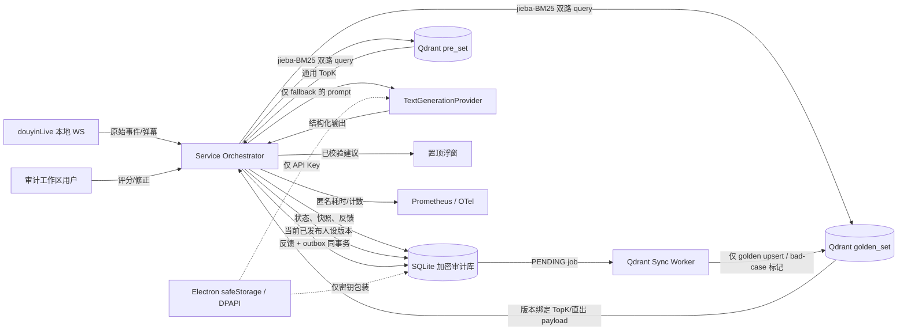
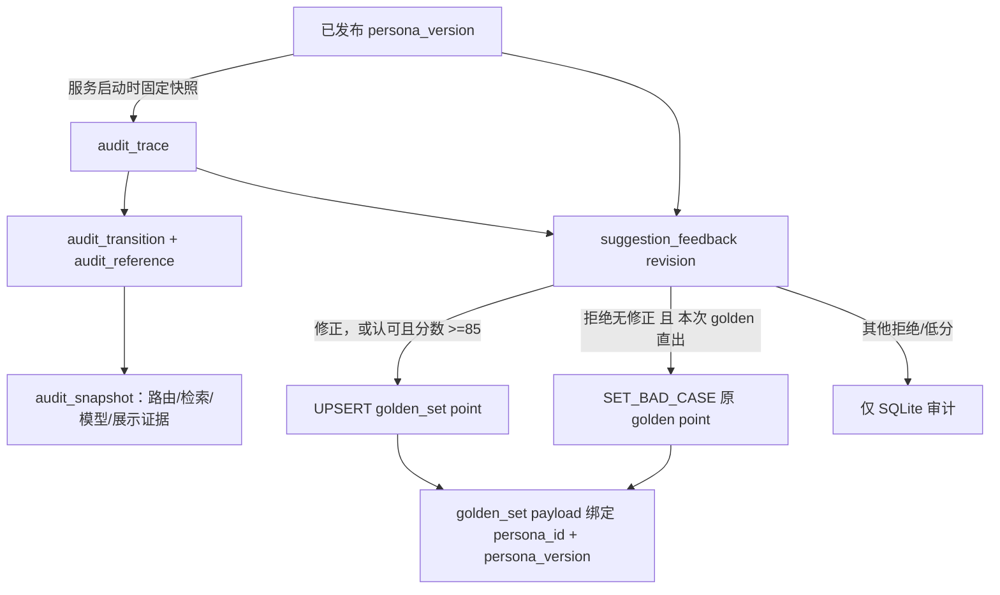
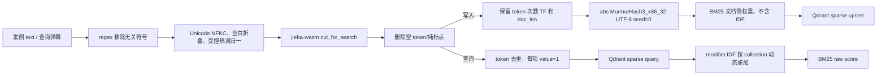
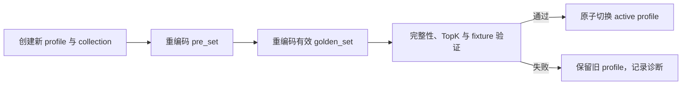

# Echocue 数据建模与迁移设计 v0.1

> 状态：详细设计  
> 范围：Windows x64 standalone MVP 的本机 SQLite、Qdrant 与安全边界  
> 上游依据：《需求澄清与 MVP 定义》《PRD》《技术调研与选型报告》《系统架构与详细设计说明书》《数据模型、接口与实时事件协议》《pre_set 初始案例数据标准》  
> 约束：本文件重组既有数据契约，不改变既已确认的产品与算法基线；发生冲突时以《数据模型、接口与实时事件协议》为字段与接口事实来源。

## 1. 数据域、事实来源与不变量

| 数据域 | 事实来源 | 读写规则 | 关键不变量 |
| --- | --- | --- | --- |
| 人设与版本 | SQLite | 仅 Main/`AuditStoreWorker` 写；Renderer 经白名单 IPC 访问。 | 自然语言内容存 SQLite；已发布版本不可变；每位主播恰有一个主出镜人。 |
| 直播会话与审计 | SQLite | 审计 Worker 独占写入。 | 每条进入处理链路的弹幕都有 `trace_id`；审计不可写即停止服务；本机永久保存、MVP 不导出。 |
| 用户打标与回流任务 | SQLite | 在一次事务内写反馈、trace 用户状态和 outbox。 | 同一 trace 每一修订最多一份反馈；用户不可见同步/bad-case 内部状态。 |
| 通用相似案例 | Qdrant `pre_set` | 首次 JSONL 导入，运行期只读。 | 通用、不绑定人设版本；仅作分类/LLM 上下文，绝不直出。 |
| 主播认可案例 | Qdrant `golden_set` | 仅由审计打标的 outbox 增量写入。 | 严格绑定 `persona_id + persona_version`；仅高置信 Top-1 可直出。 |
| 运行设置 | 原子写入的本机 JSON | Main 通过 schema 白名单更新。 | 不存 API Key、Cookie、签名 URL 或审计原文。 |
| API Key、数据密钥包装物 | Electron `safeStorage` / DPAPI | 仅 Main 解密。 | 不进入 SQLite、Qdrant、日志或 IPC 返回值。 |
| 指标 | Prometheus / OTel | 仅匿名诊断。 | 不含原文、昵称、人设、回复、`trace_id`、provider request id 或密钥。 |

以下不变量必须由代码、数据库约束和验收测试共同保证：

1. `pre_set` 不因任何用户拒绝、低分或修正而修改；`golden_set` 是独立 collection，不是 `pre_set` 的逻辑分区。
2. 拒绝且未修正只在“本次建议由该 golden point 直接推送”时将该 point 标记为 `is_bad_case=true`；LLM fallback 与 `pre_set` 命中不可标坏任何案例，也不得泛化到相似案例。
3. `quality_score`（主播主观 0–100）和 `retrieval_confidence`（检索校准后 0–1）是不同坐标系，禁止混用。
4. 单条 golden 回流只 upsert 新 point 或标坏既有直出 point，不重算旧稀疏向量、不重建 collection。
5. 所有读取工作流上下文、提交打标、配置或人设变更必须经 Main 的 Zod 校验 IPC；Renderer 不得直连 SQLite/Qdrant。

## 2. 总体数据流与存储边界



实线是受控业务数据流；虚线表示密钥边界。Qdrant 不是审计事实来源：检索证据、payload、模型原始请求/响应、最终决策和回流动作均须先/后写入 SQLite 加密快照，才能支持完整回访。

## 3. SQLite ER 图

```mermaid
erDiagram
  PERSONA ||--o{ PERSONA_VERSION : has
  PERSONA ||--o{ PERSONA_ALIAS : owns
  LIVE_SESSION ||--o{ AUDIT_TRACE : contains
  AUDIT_TRACE ||--o{ AUDIT_TRANSITION : transitions
  AUDIT_TRACE ||--o{ SUGGESTION_FEEDBACK : receives
  AUDIT_TRANSITION ||--o{ AUDIT_REFERENCE : cites
  AUDIT_SNAPSHOT ||--o{ AUDIT_REFERENCE : attached_as
  PERSONA_VERSION ||--o{ SUGGESTION_FEEDBACK : binds
  SUGGESTION_FEEDBACK ||--o{ QDRANT_SYNC_JOB : creates

  PERSONA {
    text persona_id PK
    text display_name
    integer is_principal
    text active_version FK
  }
  PERSONA_VERSION {
    text persona_version PK
    text persona_id FK
    text status
    blob content_envelope
    text content_hmac
  }
  PERSONA_ALIAS {
    text alias_id PK
    text persona_id FK
    text alias_text
    text alias_kind
  }
  LIVE_SESSION {
    text session_id PK
    text room_reference
    text platform_room_id
    text started_at
  }
  AUDIT_TRACE {
    text trace_id PK
    text session_id FK
    text source_message_id
    text final_state
    text label_status
  }
  AUDIT_TRANSITION {
    text trace_id PK_FK
    integer sequence_no PK
    text from_state
    text to_state
    text entry_hmac
  }
  AUDIT_SNAPSHOT {
    text snapshot_id PK
    text content_type
    blob envelope
    text content_hmac
  }
  AUDIT_REFERENCE {
    text trace_id PK_FK
    integer sequence_no PK_FK
    text snapshot_id PK_FK
    text role
  }
  SUGGESTION_FEEDBACK {
    text feedback_id PK
    text trace_id FK
    integer revision_no
    text persona_version FK
    integer quality_score
    text sync_status
  }
  QDRANT_SYNC_JOB {
    text job_id PK
    text feedback_id FK
    text action
    text state
    text idempotency_key
  }
```

`persona.active_version` 和 `audit_trace.current_feedback_id` 属于受控逻辑外键：SQLite 触发器/Worker 事务必须验证其归属实体，避免仅按字符串引用造成跨人设或跨 trace 关联。所有 UUID 使用 UUID v7；Qdrant point ID 是例外，采用稳定 UUID v5（见第 6 节）。所有持久时间均为 ISO-8601 UTC。

## 4. SQLite 数据字典、约束与索引

### 4.1 人设和会话

| 表 | 主键与关键字段 | 约束/索引 | 用途 |
| --- | --- | --- | --- |
| `persona` | `persona_id`；`display_name`、`is_principal`、`active_version` | `is_principal IN (0,1)`；部分唯一索引 `ux_persona_one_principal WHERE is_principal=1`；active version 必须是同人设已发布版本。 | 团队成员、主出镜人和当前版本指针。 |
| `persona_version` | `persona_version`；`persona_id`、`status`、`content_envelope`、`content_hmac`、`created_from_version` | FK 到 `persona`；`status ∈ DRAFT/PUBLISHED/SUPERSEDED`；父版本必须同属该人设；相同正文允许作为新的回滚版本发布，`content_hmac` 仅作完整性/重复提示，不唯一。 | 不限格式的自然语言人设正文及不可变历史。 |
| `persona_alias` | `alias_id`；`persona_id`、`alias_text`、`alias_kind`、`enabled` | `alias_kind ∈ NAME/NICKNAME/ALIAS/TYPO_VARIANT`；`UNIQUE(persona_id, alias_text)`。 | 直播弹幕的确定性成员路由词表。 |
| `safety_policy_version` | `safety_policy_version`；原始自然语言/关键词/编译规则 envelope、`compiler_version`、状态和校验错误 | `status ∈ DRAFT/PUBLISHED/SUPERSEDED/INVALID`；只有编译成功的发布版本可绑定会话。 | 保留用户自然语言输入并提供可重复执行的确定性规则快照。 |
| `live_session` | `session_id`；`room_reference`、`platform_room_id`、`started_at`、`ended_at`、`end_reason`、`safety_policy_version`、`provider_id`、`adapter_type`、`model_id` | `session_id` 主键。仅在 `ROOM_ONLINE` 门禁后创建；固定当场安全规则与 Provider 快照。 | 一次手动启动成功后的直播会话。 |

发布操作应在一个事务内：校验 draft → 标记目标 `PUBLISHED` → 更新 `persona.active_version` → 记录版本快照引用。直播开始时读取已发布版本并固定到会话/trace 快照；运行中发布新版本不会热切换，必须停止后手动重新启动。

### 4.2 审计、状态机与快照

| 表 | 主键与关键字段 | 约束/索引 | 用途 |
| --- | --- | --- | --- |
| `audit_trace` | `trace_id`；`session_id`、`source_message_id`、`received_at`、`final_state`、`label_status`、`current_feedback_id` | FK 到 `live_session`；`UNIQUE(session_id, source_message_id)`；`label_status` 为用户可见枚举。建议索引 `(received_at DESC)`、`(label_status, received_at DESC)`。 | 单条弹幕可回放总索引；被过滤、展示期间丢弃的弹幕也必须建 trace。 |
| `audit_transition` | `(trace_id, sequence_no)`；`from_state`、`to_state`、`reason_code`、`previous_hmac`、`entry_hmac` | FK 到 `audit_trace`；复合主键保证顺序唯一。建议索引 `(trace_id, sequence_no)`。 | 不可跳步的状态转换和哈希链。 |
| `audit_snapshot` | `snapshot_id`；`content_type`、`envelope`、`content_hmac` | 加密 envelope BLOB；禁止明文大字段。 | 原始 WS、规范化弹幕、人设版本、TopK、prompt、模型输入输出、最终建议等正文。 |
| `audit_reference` | `(trace_id, sequence_no, snapshot_id)`；`role` | FK `(trace_id, sequence_no)` 到 transition，FK `snapshot_id` 到 snapshot。 | 将特定状态转换与所需证据快照关联。 |
| `audit_meta` | `key`；`value_envelope`、`updated_at` | 加密元信息。 | 链锚点、密钥版本等。 |

`AuditStoreWorker.appendTransition()` 必须在**同一 SQLite 事务**内读取前态、校验允许迁移、写 transition/快照/reference、更新 trace 终态和完成时间；失败抛出 `E_AUDIT_STATE_INVALID` 或 `E_AUDIT_UNAVAILABLE`。状态图由 06 协议文档唯一规定，关键终态为 `FILTERED`、`DISCARDED`、`FAILED`、`HIDDEN`；成功展示只能 `DISPLAYED → HIDDEN`，展示前失效则 `DISCARDED + DEADLINE_EXCEEDED`。浮窗展示期的新弹幕必须写为 `RECEIVED → NORMALIZED → DISCARDED`，原因 `DISPLAY_WINDOW_ACTIVE`，不得进入队列或补发。

审计快照 role 的最低集合为：

| 阶段 | 必需 role |
| --- | --- |
| 接收/规范化 | `RAW_WS_EVENT`、`NORMALIZED_COMMENT` |
| 过滤 | `FILTER_DECISION`、`INPUT_SAFETY_DECISION` |
| 路由 | `PERSONA_ROUTE`、`PERSONA_VERSION_SNAPSHOT` |
| 检索 | `GOLDEN_QUERY_RESULT`、`PRE_QUERY_RESULT`、`RERANK_DECISION` |
| LLM | `RENDERED_PROMPT`、`LLM_REQUEST_META`、`LLM_RAW_RESPONSE`、`LLM_PARSED_OUTPUT`、`OUTPUT_VALIDATION`、`OUTPUT_SAFETY_DECISION` |
| golden 直出 | `DIRECT_PAYLOAD`、`DIRECT_DECISION` |
| 展示/终态 | `OVERLAY_RESULT`、`FINAL_REASON` |

### 4.3 打标、outbox 与幂等性

| 表 | 主键与关键字段 | 约束/索引 | 用途 |
| --- | --- | --- | --- |
| `suggestion_feedback` | `feedback_id`；`trace_id`、`revision_no`、`persona_id`、`persona_version`、`quality_score`、`correction_envelope`、`label_status`、`sync_status`、`is_bad_case`、`source_collection`、`source_point_id`、`target_point_id` | `UNIQUE(trace_id, revision_no)`；评分 `0..100`；FK `(persona_id, persona_version)` 到版本；枚举受限。建议索引 `(trace_id, revision_no DESC)`、`(sync_status, created_at)`。 | 用户看得见的打标状态及其不可覆盖的修订历史。 |
| `qdrant_sync_job` | `job_id`；`feedback_id`、`target_collection`、`action`、`idempotency_key`、`state`、`attempts` | `idempotency_key UNIQUE`；数据库 CHECK 固定 `target_collection='golden_set'`；`SET_BAD_CASE` 另由 trigger 校验源确为本次 golden 直出；`action ∈ UPSERT/SET_BAD_CASE`。建议索引 `(state, updated_at)`。 | 让 SQLite 提交和 Qdrant 最终一致的事务外盒。 |

`audit.submitLabel` 的事务顺序固定为：写入 feedback 修订 → 更新 `audit_trace.label_status/current_feedback_id` → 若满足回流条件写入 `qdrant_sync_job`。`sync_status` 由 job 派生，禁止独立更新。job 以 `feedbackId:revisionNo:action` 作为幂等键，只允许 `PENDING→RUNNING→SUCCEEDED/FAILED`，到达退避时间后 `FAILED→PENDING`；Qdrant 成功后事务性标记 `SUCCEEDED/SYNCED`，失败记录错误并指数退避。用户 UI 仅看到 `UNLABELED/ACCEPTED/REJECTED/CORRECTED/NOT_APPLICABLE`，绝不展示 golden、bad case 或同步状态。

## 5. 版本、审计与反馈追溯关系



回放一条 trace 必须能得到：原始事件与规范化文本、硬规则结论、成员路由候选与最终人设版本快照、两库 TopK/原始 score/校准配置/最终 rerank、直出或 LLM 的输入输出、浮窗结果、用户标签及其修订、触发的 outbox job 和最终 Qdrant point ID。此追溯以当时的人设版本为准，不能以当前 active version 反向替代。

## 6. Qdrant collection、payload 与 BM25 处理契约

### 6.1 collection 与访问策略

| collection | 初始来源 | 写策略 | 查询 filter | 可直出 |
| --- | --- | --- | --- | --- |
| `pre_set` | 甲方 UTF-8 JSONL 导入包 | 仅初始化/受控重新导入；运行期只读。 | `enabled=true AND is_bad_case=false`，不按人设/语义类型预过滤。 | 否。只用于初筛分类和 LLM 上下文。 |
| `golden_set` | 初始为空 | outbox 的合格反馈增量 upsert，或仅对直出源 point 标坏。 | `persona_id=current AND persona_version=current AND enabled=true AND is_bad_case=false`。 | 是，但仅 Top-1、校准置信度达到内部阈值、当前安全/结构校验通过且仍新鲜。 |

两库均采用 Qdrant Server `>=1.19.0` 的 named sparse vector `bm25_zh_jieba_v1`，配置 `modifier: 'idf'`。应创建 payload index：两库的 `enabled`、`is_bad_case`、`semantic_type`，以及 golden 的 `persona_id`、`persona_version`。`semantic_type` 不得作为查询先验 filter，因为它正是要由检索证据投票得出的初筛结论。

业务 `case_id` 与 Qdrant `point_id` 分离：`point_id = UUIDv5('echocue:{collection}:{case_id}')`。`pre_set` JSONL 的 `id` 映射为 `case_id`，不可假设其可直接作为 Qdrant ID。每次检索与回流审计同时保存二者。

### 6.2 payload 字典

```ts
interface PreSetPayload {
  schema_version: '1.0'; case_id: string;
  tokenizer_version: 'zh_jieba_search_v1';
  text: string; semantic_type: string; description: string;
  reference_reply?: string; reference_cues?: string[]; tags?: string[];
  enabled: boolean; is_bad_case: boolean;
}

interface GoldenSetPayload {
  case_id: string; tokenizer_version: 'zh_jieba_search_v1';
  source_trace_id: string; persona_id: string; persona_version: string;
  text: string; semantic_type: string; reply: string; cues: string[];
  quality_score: number; enabled: boolean; is_bad_case: boolean;
  created_at: string; updated_at: string;
}
```

Qdrant payload 仅保存为检索与建议所必需的案例内容；完整原始 WS 事件、prompt、LLM raw response 和反馈正文是 SQLite 加密审计数据，不作为 Qdrant 审计替代品。`pre_set` 的初始文本必须按数据标准脱敏；API Key、Cookie 和授权信息绝不可出现。

### 6.3 jieba-BM25 稀疏向量处理流



写入/查询必须使用同一 `Bm25TextPipelineV1`、regex、Unicode 规范、热词/同义词词表与 `jieba-wasm.cut_for_search`。分词词典与词表版本纳入检索 profile；人名、昵称、团队专属词与热词注入 jieba 自定义词典，防止错误切分。

对文档 `d` 的写入权重是：

```text
w_d(t) = tf(t,d) * (k1 + 1)
         / (tf(t,d) + k1 * (1 - b + b * doc_len / avg_doc_len_baseline))
```

Token index 与 FastEmbed `compute_token_id` 对齐：`abs(MurmurHash3_x86_32(UTF8(token), seed=0))`。TS 使用 `murmurhash3js-revisited`，且每个版本以 FastEmbed/Python `mmh3` fixture（中文、emoji、ASCII）校验 UTF-8、signed 32-bit 和 seed 一致性。不得维护有状态词典、不得换用 SHA；理论 hash 碰撞须记录 POC 指标和审计诊断，不能静默改变 index 规则。

`avg_doc_len_baseline` 在导入完整有效 `pre_set` 后按其 jieba token 长度均值计算并冻结；`pre_set` 与 `golden_set` 共用。`k1=1.2`、`b=0.75` 仅为 POC 起点，三者经真实中文样本校准后固化为 `Bm25ZhJiebaProfileV1`。写入 vector **不得包含 IDF**；启用 `modifier: 'idf'` 后，Qdrant 依据每个 collection 当前文档频率在查询时动态施加 IDF。IDF 不依赖平均文档长度，故 golden 增量回流无需重建。

原始 BM25 score 不能跨 collection 比较；POC 形成版本化 calibration artifact，将每一路 score 映射为 `[0,1]` 的 `retrieval_confidence`，随后 rerank 为合并 TopK。每次检索审计记录 Qdrant 版本、tokenizer version、BM25 profile ID、词表 version、calibration artifact ID、两路 raw hits 和最终排名。

## 7. migration、检索 profile 迁移和部署初始化

### 7.1 SQLite migration 规范

1. migration 文件单调编号，例如 `001_initial_schema.sql`；每个 migration 带 SHA-256 checksum。
2. 启动时由 Worker 检查 `schema_migration(version, applied_at, checksum)`，只执行尚未应用且 checksum 一致的 migration；同一批 DDL/数据修复使用单个事务。
3. 启动前依次设置 `foreign_keys=ON`、`journal_mode=WAL` 与受控 `busy_timeout`；migration 失败即阻断启动、保留原库，不尝试“半修复”。
4. 扩展字段采用向后兼容的新增/回填/切换三步，禁止将不可恢复的 schema 破坏与应用版本升级混在一次无验证发布中。
5. 每个 migration 需有空库安装、已有真实审计库升级、重复启动幂等和失败恢复测试。不得以删除数据库或删除永久审计记录作为升级手段。

### 7.2 BM25 profile 受控迁移

单条反馈回流永远不触发 collection 重建。仅当 `avg_doc_len_baseline`、`k1`、`b`、jieba/自定义词典、regex/归一规则、热词词表或 token-index namespace 变更时，才允许新建 profile：



切换不得发生在直播进行中；新旧 profile 的 collection metadata 必须记录 profile ID、Qdrant 版本、tokenizer version、词表版本、参数及 calibration artifact ID。旧 collection 在验证和回滚窗口内保留，是否清理由受控维护流程决定，绝不触及 SQLite 永久审计。

### 7.3 首次安装初始化顺序

1. 创建应用数据目录，启动本机 Qdrant sidecar（仅 loopback）。
2. 初始化/迁移 SQLite，验证字段加密、HMAC 链锚点、可写性与 safeStorage 密钥可用性。
3. 离线整包校验甲方 `pre_set` JSONL，分词并写本机 staging；拒绝未知 `schema_version`、重复 `id`、额外字段、超限或敏感内容，计算并冻结 `avg_doc_len_baseline`。
4. 创建带 profile 版本后缀的临时 `pre_set`/`golden_set` collection、sparse vector、payload index 和 metadata；随后批量 upsert staging 中的 `pre_set`，`golden_set` 初始为空。
5. 校验 point 数、跨语言 hash fixture 与查询 fixture 后原子切换 active alias；失败只隔离/删除本次临时 collection，旧 active profile 不变。
6. 仅当 SQLite、Qdrant、profile、安全规则和 Provider 配置均健康时，允许用户进行 `ROOM_ONLINE` 启动门禁。

## 8. 加密、完整性与数据生命周期

### 8.1 加密和完整性边界

所有敏感 SQLite 正文采用 canonical AES-GCM envelope BLOB：

```json
{"alg":"AES-256-GCM","keyVersion":"...","nonceB64":"...","ciphertextB64":"...","tagB64":"...","aadVersion":"1"}
```

AAD 固定为 `tableName|primaryKey|columnOrContentType|aadVersion`，使密文不能被跨行或跨列替换。数据加密密钥与 HMAC 密钥必须独立随机生成，并由 `safeStorage`/DPAPI 包装保存。内容完整性使用 HMAC-SHA-256（UTF-8 canonical JSON）；禁止把无密钥普通 SHA-256 作为内容完整性保证。`audit_transition` 通过 `previous_hmac → entry_hmac` 串成链，链锚点密文保存在 `audit_meta`。

SQLite 敏感列包括人设正文、审计快照、人工修正内容、密钥元信息；API Key 完全不属于 SQLite。Qdrant 为本机 loopback sidecar，保存经过导入/回流规则允许的案例 text 和 payload；其并非全盘加密替代品，因此不写原始 WS、凭证、Cookie 或 provider header。日志与 OTel/Prom 指标只保留匿名枚举、计数、时延。

### 8.2 生命周期

| 数据 | 保存策略 | 删除/导出 |
| --- | --- | --- |
| SQLite 审计、人设版本、反馈和迁移记录 | 默认永久保留在本机。 | MVP 不提供导出；不得因应用升级自动删除。 |
| `pre_set` | 保留导入版本，运行期只读。 | 仅受控重新导入或 profile 迁移；不能由打标动作删除/修改。 |
| `golden_set` | 随合格反馈增量保存；bad case 通过 payload 排除。 | 仅 profile 迁移或受控维护处理；拒绝不泛化删除同类案例。 |
| WAL/临时文件 | SQLite 正常 checkpoint/原子写入的实现文件。 | 不承载独立事实；必须遵守加密库与崩溃恢复策略。 |
| OTel/Prom 指标 | 诊断用途，匿名。 | 按运行环境诊断策略保留；不用于业务回放。 |

磁盘空间、权限、解密或事务故障导致审计无法持久化时，当前 attempt 必须取消，未展示建议隐藏，服务停止并提示用户修复后手动重启；历史审计不可被自动清理来“恢复服务”。容量策略固定为：安装/启动时要求数据卷至少 2 GiB 可用；运行期每 60 秒检查一次，低于 1 GiB 或 10%（取更高门槛）触发 `E_STORAGE_LOW` 预警，低于 256 MiB 时禁止新 attempt 并按审计不可用停服。诊断页仅显示容量和估算，不显示原文；每 1,000 条审计的实测增长量在 POC 中记录并用于剩余容量估算。发布验收必须包含 WAL checkpoint、满盘停服、释放空间后完整性检查及受控本机备份/恢复演练。

## 9. 实现验收清单

1. 空库安装、重复启动、历史库升级均可验证 migration 幂等，且 `foreign_keys`、WAL、checksum 与触发器生效。
2. 人设发布不能指向跨人设/非发布版本；直播期间不热切换；每个 trace 能还原当时版本。
3. 每条弹幕都可通过 trace/transition/snapshot/reference 回放；展示期弹幕被审计但不入队。
4. feedback 与 outbox 在同一 SQLite 事务；重复提交不重复 upsert；失败 job 可重试且不暴露给用户。
5. `pre_set` 被拒绝后仍不变；仅 golden 直出且拒绝无修正的源 point 随后不能被召回。
6. jieba 分词、MurmurHash token index、BM25 文档权重和 query value=1 经 fixture 与 Qdrant `modifier.IDF` 验证；两个 collection 共用冻结的平均文档长度基线。
7. 全部敏感 SQLite 字段为可解密的 canonical envelope、HMAC 链连续，日志/指标和 IPC 不泄漏原文或密钥。
