# Echocue 系统详细设计图册 v0.1

> 状态：详细设计补充交付  
> 范围：Windows x64 standalone MVP，单直播间、单团队、人工查看建议  
> 读取顺序：本图册将既有需求、产品、技术选型、架构和数据接口内容重新组织为可渲染图；不替代其字段、接口和验收细节。若有冲突，以《需求澄清与 MVP 定义》《PRD》和《数据模型、接口与实时事件协议》的已确认决策为准。

## 1. 图册边界与关键不变量

1. 只给出建议，绝不自动向抖音发送回复。
2. `douyinLive` 本地 WS 由用户手动启动触发；只有 `ROOM_ONLINE` 才能开始服务。未开播、下播、断开、用户停止或审计不可写时立即关 WS，不自动重连。
3. 每次浮窗展示一条建议，默认 10 秒且可配置。展示期仍审计新弹幕，但不检索、不生成、不排队；到期仅从最新窗口重新选择。
4. 检索是两路并行的 `pre_set` 与 `golden_set`。`golden_set` 必须按当前人设版本、启用状态和 bad case 过滤；高置信 golden payload 仍须通过当前安全、人设、结构和长度复验，才可直出。
5. 稀疏检索固定为：regex 清理 → Unicode NFKC → `jieba-wasm.cut_for_search` → FastEmbed 兼容 MurmurHash3 token ID → BM25 文档侧权重；查询 token 权重为 1，由 Qdrant `modifier: IDF` 动态施加 IDF。`avg_doc_len_baseline` 从完整 `pre_set` 首次导入测得后冻结。
6. 每条弹幕都必须有 `trace_id`。审计库首次写入失败时，取消当前 attempt、隐藏未展示建议并停止服务；审计原文永久本机保存且不进入普通日志或遥测。

## 2. 系统上下文与组件边界

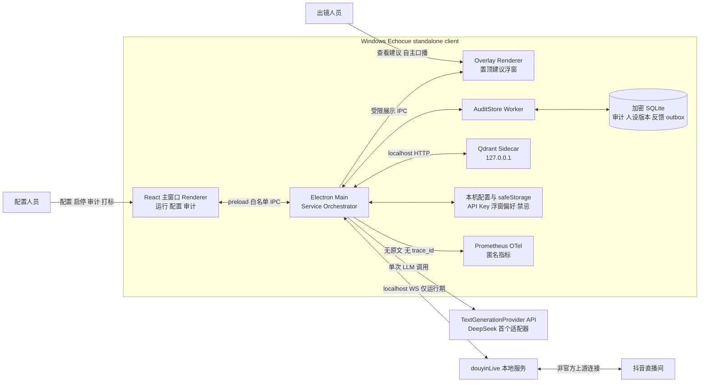

### 2.1 进程和数据访问责任

| 单元 | 负责 | 不可负责 |
| --- | --- | --- |
| 主窗口 Renderer | UI、配置编辑、受控审计查看和打标入口 | Node、文件、网络、SQLite、Qdrant、密钥 |
| 浮窗 Renderer | 已校验建议和视觉偏好 | 检索、生成、审计、配置写入 |
| Electron Main | 生命周期、WS、候选编排、检索、LLM、窗口和 IPC 授权 | 向 Renderer 广播密钥或审计快照 |
| AuditStore Worker | SQLite 事务、字段加密、审计状态、反馈和 outbox | 网络、UI、任何 Provider Key |
| Qdrant Sidecar | 两 collection 的本机稀疏检索 | 审计事实、用户可见反馈状态 |

## 3. 服务启动门禁与停止流程

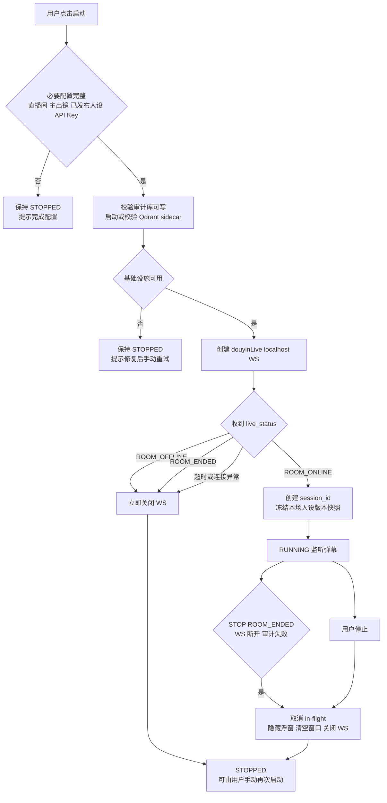

**门禁规则**：`ROOM_OFFLINE` / `ROOM_ENDED` 后不保持 WS 等待下次开播；不会自动恢复、后台轮询或弹出恢复提醒。用户必须再次点击启动，重新创建 WS 并等待新的 `ROOM_ONLINE`。

## 4. 实时建议完整功能流程

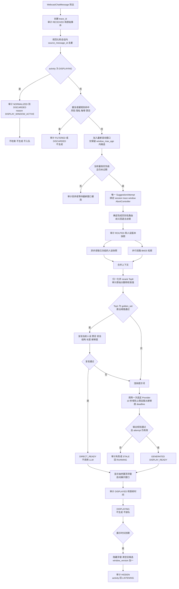

## 5. jieba-BM25 写入和查询数据流

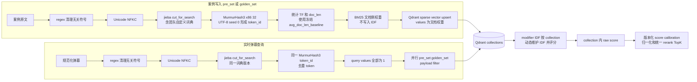

`avg_doc_len_baseline` 只在完整 `pre_set` 初始导入完成后计算并冻结；两库共享该基线。golden 打标回流仅新增 point，不改写历史向量、不因单条反馈重建 collection。只有 jieba 词典、hash、`k1`、`b` 或平均长度基线等 retrieval profile 改变，才创建版本化 collection、离线重编码并原子切换。

## 6. 数据流图 DFD

```mermaid
flowchart LR
  Actor1[配置人员]
  Actor2[出镜人员]
  Source[douyinLive WS]
  Provider[TextGenerationProvider API]

  P1((P1 服务门禁与接入))
  P2((P2 筛选 路由 检索 生成))
  P3((P3 浮窗展示))
  P4((P4 审计追溯与打标))
  P5((P5 golden 回流同步))

  D1[(D1 本机配置\n禁忌 偏好 model_id)]
  D2[(D2 人设版本\nSQLite)]
  D3[(D3 审计和反馈\n加密 SQLite)]
  D4[(D4 pre_set\nQdrant)]
  D5[(D5 golden_set\nQdrant)]
  D6[(D6 safeStorage\nAPI Key)]

  Actor1 -->|配置 启停| P1
  Actor1 -->|人设发布| D2
  Source -->|live_status 和弹幕事件| P1
  P1 -->|合格会话和规范化弹幕| P2
  P1 <--> D1
  P2 -->|人设读取| D2
  P2 -->|BM25 查询| D4
  P2 -->|BM25 查询和版本 filter| D5
  P2 -->|API Key| D6
  P2 -->|单次 prompt 请求| Provider
  Provider -->|结构化建议或错误| P2
  P2 -->|每步快照和状态| D3
  P2 -->|已校验的一条建议| P3
  P3 -->|目标弹幕 回复 提词| Actor2
  P3 -->|显示 隐藏 首帧| D3
  Actor1 -->|查看 workflow 打标 修正| P4
  P4 <--> D3
  P4 -->|反馈事件| P5
  P5 -->|outbox 状态| D3
  P5 -->|合格答案 upsert\n或 golden bad case 标记| D5
```

数据边界：D3 是审计事实来源；D4/D5 是可重建的检索索引，不替代审计。D6 的 API Key 仅 Electron Main 可解密。Prometheus / OTel 只接收匿名耗时与枚举计数，故意不画入原文数据流。

## 7. 关键时序图

### 7.1 手动启动与开播门禁

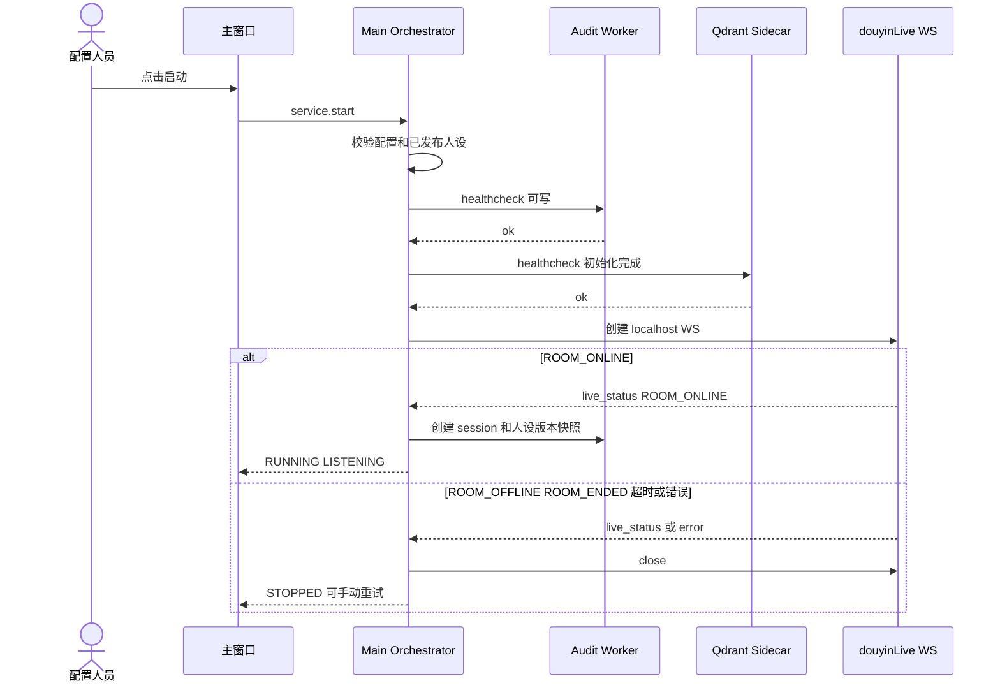

### 7.2 建议生成、golden 直出与 LLM 兜底

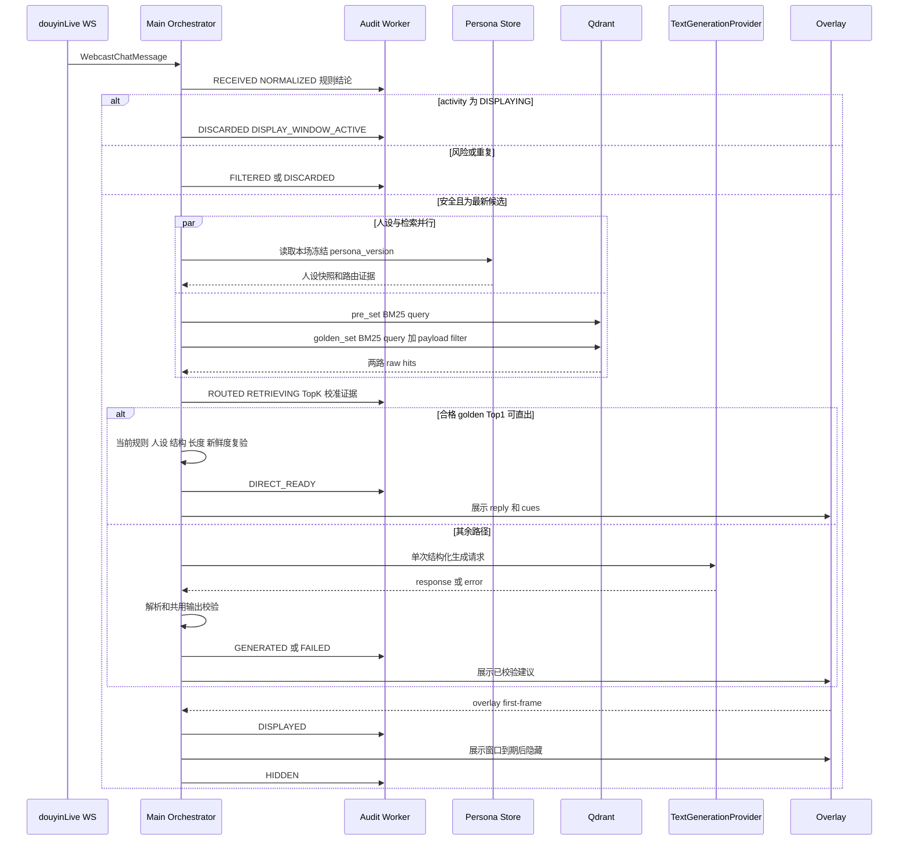

### 7.3 审计打标与 golden 增量回流

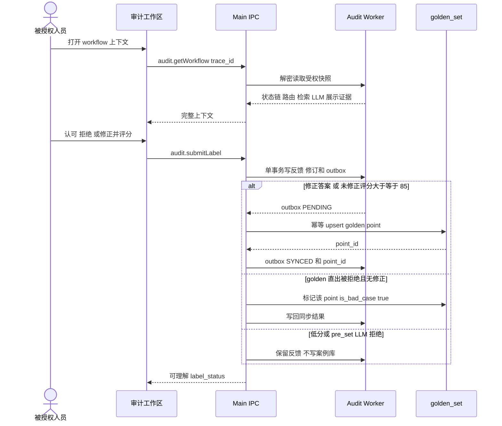

## 8. 状态机图

### 8.1 服务状态机

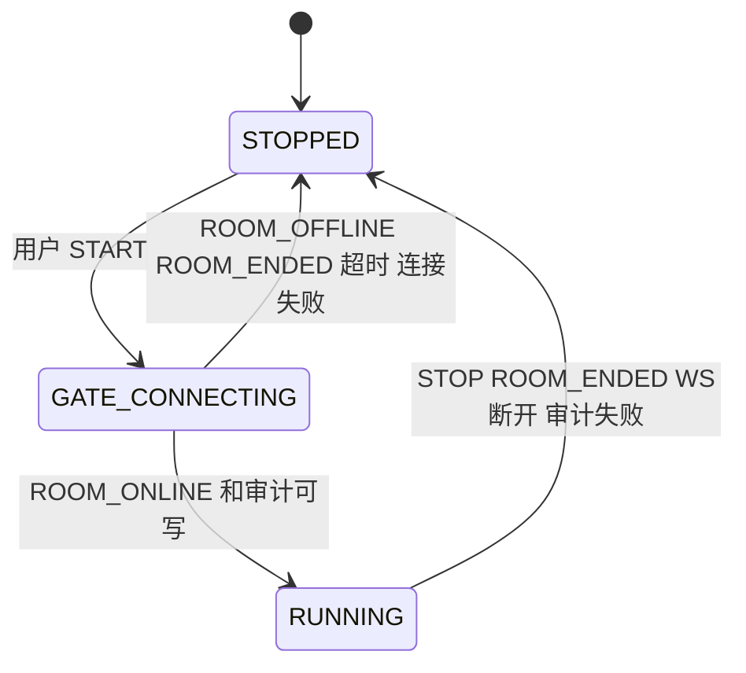

生命周期只有 `STOPPED/GATE_CONNECTING/RUNNING`。`RUNNING` 内另有唯一活动状态机：

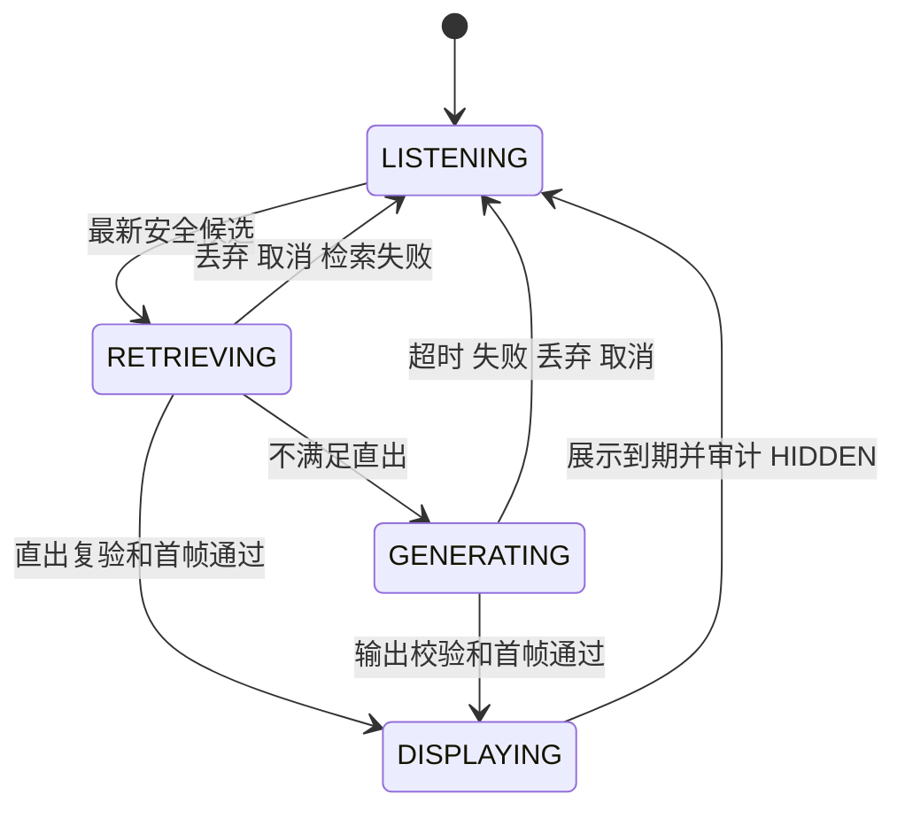

activity=`DISPLAYING` 时不创建新的 `SuggestionAttempt`；展示期间收到的新弹幕只走可审计丢弃分支。

### 8.2 单条弹幕 workflow 状态机

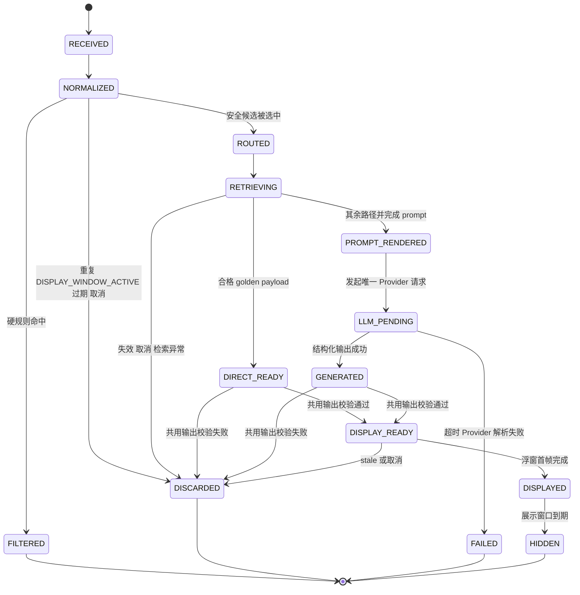

### 8.3 打标回流同步状态机

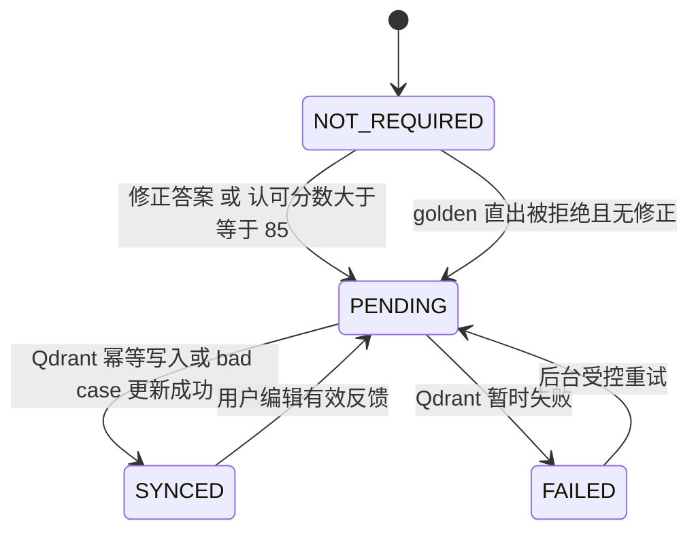

内部 `sync_status` 不在用户页面公开；用户只看到 `UNLABELED`、`ACCEPTED`、`REJECTED`、`CORRECTED`、`NOT_APPLICABLE`。

## 9. 设计可追溯与图册使用说明

| 图册内容 | 主要上游依据 | 下游使用 |
| --- | --- | --- |
| 服务门禁、展示抑制、停止策略 | 需求 D-07a、D-12、D-18；PRD FR-05、FR-08 | Main 状态机、接入 POC、验收用例 |
| 人设路由、双库检索、直出/LLM | 需求 D-13、D-16、D-17；PRD FR-03、FR-05、FR-06 | 检索模块、Prompt、审计快照 |
| jieba-BM25 数据流 | 技术调研与数据接口协议中的检索 profile | 向量编码、Qdrant 初始化、算法 fixture |
| DFD 和审计时序 | 需求 D-15、D-18；PRD FR-10 | SQLite DDL、IPC、权限与安全测试 |
| 打标回流 | 需求 D-17；PRD FR-10；架构 4.3 | feedback/outbox、golden_set 同步测试 |

本图册的 Mermaid 源码应与实现一同维护。状态、数据源、隐私边界或检索 profile 发生变更时，必须同步更新图册、接口协议、迁移和验收用例，禁止只改其中一项。
