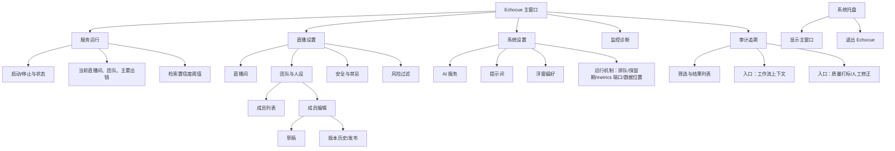
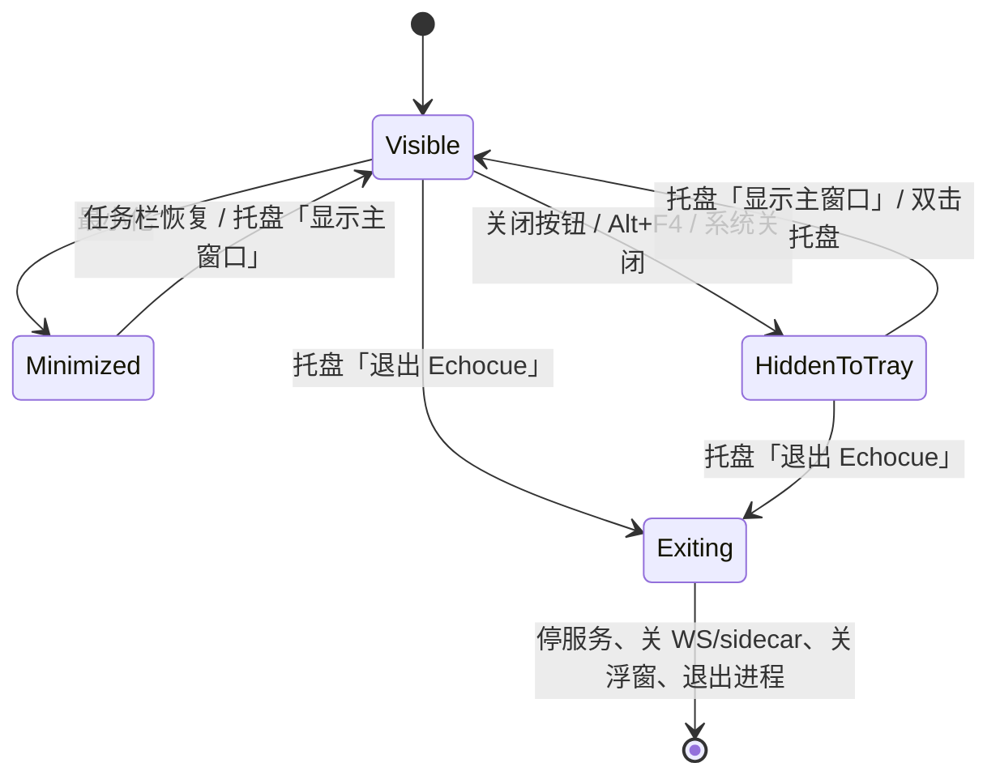
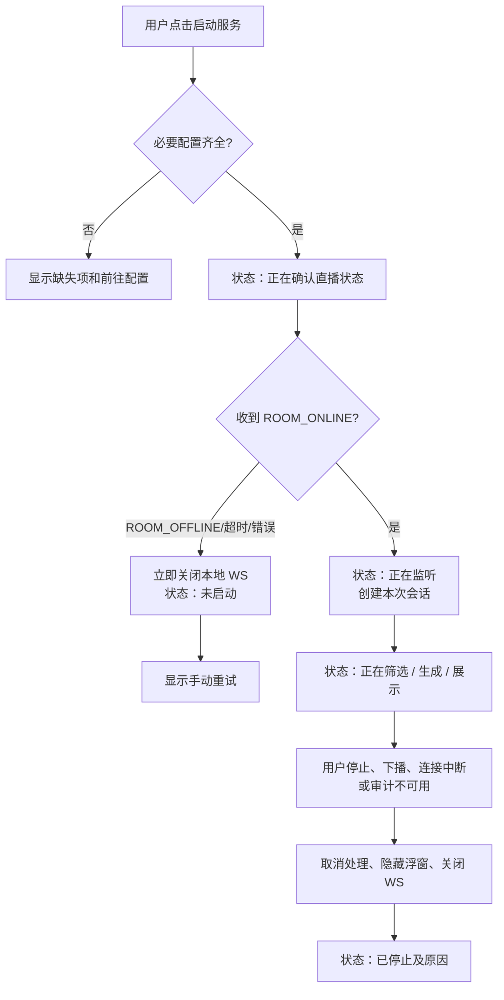
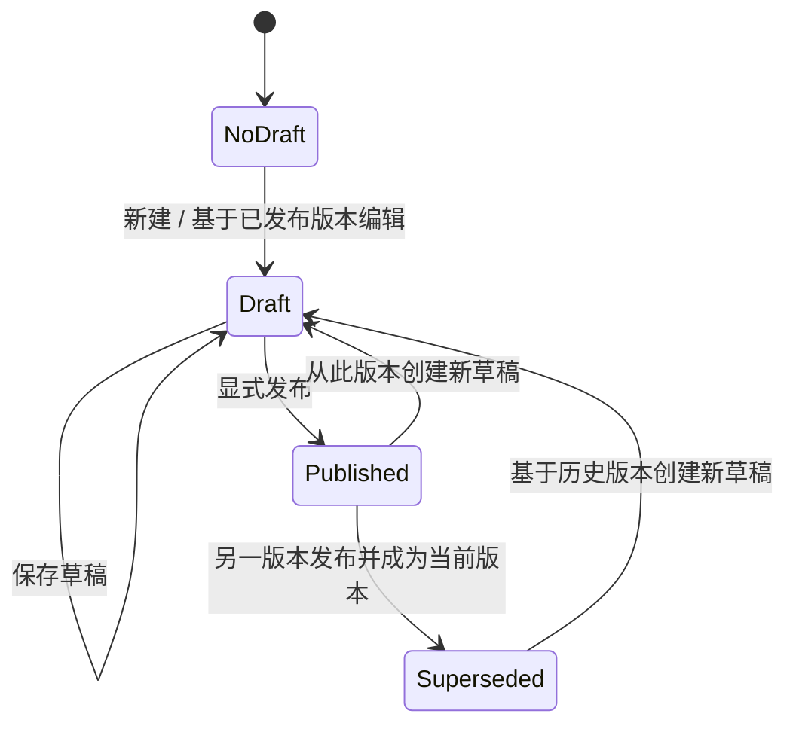
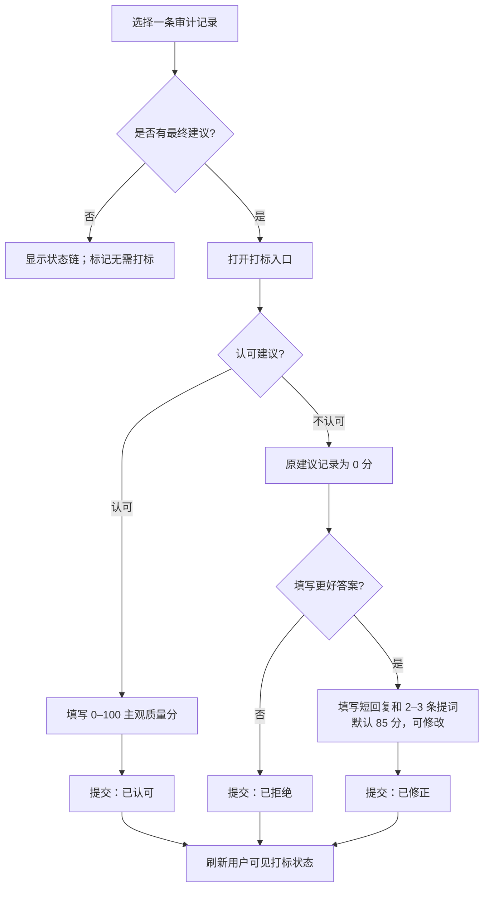

# Echocue UI 信息架构与交互设计 v0.1

> 状态：详细设计（已具备可编辑视觉原型）  
> 范围：Windows x64 standalone MVP；单直播间、单团队、仅弹出回复建议  
> 上游依据：《Echocue-需求澄清与MVP定义》《Echocue-PRD》《Echocue-系统架构与详细设计说明书》《Echocue-数据模型、接口与实时事件协议》  
> 约束：本文件描述用户可见体验；检索阈值、案例库回流、同步作业、原始置信度及模型内部细节均不在 UI 中展示。

## 0. 视觉原型与文档关系

仓库内的主原型交付为 [`prototype/`](../../prototype/README.md)：Vite + React + TypeScript，可由任意本地开发环境运行、审查和继续开发；它覆盖运行、直播间与 AI、团队与人设、安全与禁忌、浮窗偏好、诊断、审计追溯，以及直播浮窗这八个 MVP 视图。静态原型中的“直播浮窗（原型）”是独立审查页，不代表正式主窗口导航；正式实现仍是 Electron 独立置顶窗口。可编辑视觉辅助稿为 [Echocue MVP UI Prototype v0.1](https://www.figma.com/design/yh9hAwL3IhjTpIYU5zWRJD)。

`prototype/` 用于开发交接、浏览器审查与后续 Renderer 复用；Figma 仅用于人工视觉审查。本文件仍是开发和验收的交互契约。若它们在状态、权限、字段、文案含义或行为上发生冲突，以本文件及其上游领域契约为准；视觉或交互调整须同步更新原型和本文件。结构关系使用 Mermaid，不再以 ASCII 线框充当视觉稿。

## 1. 目标、对象与体验边界

界面服务两类用户：出镜人员在直播中只查看浮窗建议；配置人员在主窗口完成启动、配置、审计和打标。MVP 不提供自动回复、历史建议手动唤回、云端账号体系、多直播间管理或数据导出。

1. 运行页的第一目标是清楚地告知“能否开始监听”和“当前是否正在工作”，而不是展示技术状态细节。
2. 浮窗只承载当下的一条建议；展示窗口内不出现下一条建议，也不提供历史列表。
3. 审计原文只在配置人员主动进入审计工作区后解密显示；普通运行页、诊断页和浮窗不泄露被过滤内容、个人信息、API Key 或内部链路。
4. 人设为 SQLite 中版本化的自然语言内容，编辑格式不限；不得把旧文档中的“Markdown 文件存储”实现为 MVP 约束。

## 2. 信息架构与导航

主窗口采用左侧一级导航、右侧工作区；直播设置与系统设置为 tab 聚合页。服务运行页为默认首页；首次未完成必要配置时，导航仍可进入各配置页，但“启动服务”不可用并给出缺失项。审计工作区内，工作流上下文与打标是同一条记录详情中的两个明确入口，不要求单独页面或弹窗。

| 一级入口 | 二级 tab | 主要内容 | 运行中可编辑性 |
| --- | --- | --- | --- |
| 服务运行 | — | 启动门禁、状态、当前对象、最小诊断、检索置信度阈值（golden 直出/语义丢弃） | 可停止；阈值与配置变更下次启动生效 |
| 直播设置 | 直播间 / 团队与人设 / 安全与禁忌 / 风险过滤 | `roomReference`、成员与版本化人设、自然语言边界、自定义风险类型与关键词 | 建议停止后修改；已运行会话不热切换 |
| 系统设置 | AI 服务 / 提示词 / 浮窗偏好 / 运行机制 | provider 表单、系统提示词、浮窗视觉偏好、弹幕排队/审计保留期/metrics 端口/数据保存位置 | 视觉项即时应用；运行机制下次启动生效；数据迁移需停止服务 |
| 监控诊断 | — | 链路健康、检索库样本数、直播会话匿名业务统计 | 只读 |
| 审计追溯 | — | trace 查询、上下文、人工打标 | 审计详情须用户主动打开 |

## 3. 窗口模型与全局交互

### 3.1 主窗口：macOS 风格标题栏

主窗口使用自绘标题栏。左上角三个圆形按钮具有 macOS 视觉，但必须实现 Windows 等价行为及 tooltip：红色“关闭并隐藏到托盘”、黄色“最小化”、绿色“最大化/还原”。标题栏空白区域可拖拽；按钮、导航和表单区域不得拖拽。所有按钮可 Tab 聚焦、Enter/Space 触发，tooltip 之外还必须提供可访问名称。

视觉实现见 [`../../prototype/src/App.tsx`](../../prototype/src/App.tsx) 与对应页面组件：标题栏位于顶部，左侧为一级导航，右侧为当前工作区；三个窗口控制按钮仅占标题栏左侧，标题栏其余空白区域为可拖拽区。

窗口关闭事件（包括红色按钮、Alt+F4 和系统关闭）统一执行“隐藏主窗口 → 保留托盘和进程”；不得停止 AI 服务、关闭本地 WS 或关闭浮窗。只有托盘菜单的“退出 Echocue”才执行完整停机。任务栏图标唯一源为 [`../../svg/douyin-echocue-client-app-icon.svg`](../../svg/douyin-echocue-client-app-icon.svg)，托盘图标唯一源为 [`../../svg/douyin-echocue-client-tray-icon.svg`](../../svg/douyin-echocue-client-tray-icon.svg)；构建阶段从 SVG 生成 Windows 所需 ICO/PNG。

### 3.2 托盘

托盘单击/双击可显示主窗口；右键菜单至少含“显示主窗口”“退出 Echocue”。退出前若服务正在运行，使用确认框说明“退出会停止监听并关闭浮窗”，确认后才执行；关闭主窗口时不出现退出确认。托盘 tooltip 只显示脱敏运行概况，例如“Echocue：正在监听”或“Echocue：未启动”，不显示弹幕或人设信息。

### 3.3 全局反馈规范

| 类型 | 呈现位置 | 示例 | 行为 |
| --- | --- | --- | --- |
| 页面级阻断 | 工作区顶部状态卡 | “请先完成直播间和主要出镜人员配置” | 给出直达配置页按钮 |
| 可恢复错误 | 状态卡/诊断 | “未能连接到可用直播弹幕，可手动重试” | 允许手动重试，不自动重连 |
| 单轮非阻断 | 运行页轻提示 | “本轮建议未生成，正在继续监听” | 不弹浮窗，不打断监听 |
| 保存成功 | 就近轻提示 | “草稿已保存”“偏好已应用” | 2–4 秒后消退 |
| 破坏性操作 | 本地确认框 | 删除成员、退出应用 | 明确后果与取消入口 |

错误文案不可直接暴露 provider、Qdrant、WebSocket、阈值、请求 ID 等内部细节；诊断页可显示受控错误码和修复建议。主窗口从 `service.state.changed` 接收生命周期与活动状态，Renderer 不自行推导“生成中”“已下播”或连接异常。

## 4. 运行与启动门禁

运行页视觉实现见 [`../../prototype/src/pages/RunPage.tsx`](../../prototype/src/pages/RunPage.tsx)：状态卡必须含生命周期状态、停止操作、当前直播间/团队/主要出镜摘要；最近活动卡必须含最近接收、最近处理、端到端耗时。

| 生命周期/活动 | 可见文案 | 主操作 | 禁止/限制 |
| --- | --- | --- | --- |
| `STOPPED` | 已停止 | 启动服务 | 不显示历史建议 |
| `GATE_CONNECTING` | 正在确认直播状态 | 停止 | 启动按钮禁用，避免重复连接 |
| `RUNNING + LISTENING` | 正在监听 | 停止 | 不显示原始实时弹幕流 |
| `RUNNING + RETRIEVING/GENERATING` | 正在准备建议 | 停止 | 不展示候选、置信度或模型名 |
| `RUNNING + DISPLAYING` | 正在展示建议 | 停止 | 不提示“下一条排队中” |
| `STOPPED + ROOM_OFFLINE/ENDED/SOURCE_ERROR` | 未启动；可手动重试 | 重试启动 | 不保留 WS、不自动恢复 |
| `STOPPED + AUDIT_UNAVAILABLE` | 审计存储不可用 | 查看诊断/修复后启动 | 禁止启动生成服务 |

首次使用的空状态显示“完成配置”清单：直播间、主要出镜人员人设、AI 服务配置。API Key 输入后仅显示“已配置”或“未配置”，绝不回显密钥。AI 服务的用户可见字段统一命名为“服务商名称”“Base URL”“Model ID”“API Key”；不在 UI 中预设或绑定 DeepSeek，只允许选择已实现的 adapter type，并填写对应兼容服务。运行中发布人设或改安全规则时，界面提示“已保存，将在停止并重新启动服务后使用新版本”，不得暗中改变本次会话快照。

## 5. 浮窗（出镜人员视图）

浮窗始终置顶。新建议通过时自动显示并开始展示窗口（默认 10 秒、用户可配置）；时间届满自动隐藏。展示期内服务不生成、不排队、不补发下一条建议。新建议只会在下一次展示窗口开启后产生。

浮窗视觉实现见 [`../../prototype/src/pages/OverlayPage.tsx`](../../prototype/src/pages/OverlayPage.tsx)；信息层级固定为：`@发送者昵称`（昵称存在时）与弹幕正文、短回复建议、2–3 条提词。

浮窗仅显示目标弹幕的发送者昵称（以 `@昵称` 形式呈现）及正文（或不改变关键语义的短概要）、短回复建议和 2–3 条提词；不得显示模型、分数、规则、工作流、推理、案例来源或历史列表。浮窗不含“采用/拒绝”按钮，使用后的主观反馈统一在审计工作区完成。若上游未提供昵称，隐藏该行，不以空占位或猜测名称替代。

| 偏好 | 默认/范围 | 交互 |
| --- | --- | --- |
| 置顶 | 固定开启 | MVP 不提供关闭开关 |
| 展示时长 | 默认 10 秒，可配置 | 应用于下一次展示；提示有效值范围 |
| 位置 | 上次位置 | 直接拖拽浮窗；跨屏失效时回退安全位置 |
| 宽高 | 用户可调 | 拖拽边缘/角落；设最小尺寸避免内容截断 |
| 透明度、字体、主题 | 持久化偏好 | 预览后即时应用 |
| 点击穿透 | 默认关闭 | 开启时明确提示“将无法直接拖动，请在偏好页关闭后调整” |

浮窗状态：`HIDDEN → SHOWING → VISIBLE → HIDDEN`。停止、下播、连接断开、审计不可用或建议在显示前失效时，直接进入 `HIDDEN`；不得残留旧内容。尺寸/位置无法保存时仍保持当前可用窗口，并在主窗口提示“浮窗偏好未保存”。

## 6. 团队与人设：编辑、版本与发布

成员列表以卡片展示显示名称、主要出镜标识、当前已发布版本摘要和“编辑”。主要出镜人员必须唯一且不可为空；删除主要出镜人员前，要求先指定另一名主要出镜人员。成员名称/昵称是确定性路由词，LLM 不参与选择成员。

团队与人设视觉实现见 [`../../prototype/src/pages/PersonaPage.tsx`](../../prototype/src/pages/PersonaPage.tsx)：左侧成员列表，右侧为当前成员的别名、人设自然语言编辑区、草稿/发布操作与版本历史；最终 Renderer 必须补齐预览、版本比较、新增/删除成员与主出镜切换交互。

编辑器允许自然语言、Markdown 或纯文本等内容，不强制 JSON 字段。发布前展示只读摘要：成员、待发布内容变更、当前运行会话是否受影响。发布动作需确认；发布后不可原地修改，若需回退则以历史版本为来源创建新草稿并再次发布，以保留版本审计。别名增删改保存后在下一次服务启动生效；存在同名、空白、重复或过于短的别名时就近报错。历史版本可查看和比较，不能删除或直接覆盖。

## 7. 设置：直播间、安全、AI 与浮窗偏好

### 7.1 直播间与 AI 服务配置

直播间配置仅输入“直播间标识”，并用示例说明其来源；不要求也不尝试获取抖音管理权。AI 服务配置提供“服务商名称”“适配器类型”“Base URL”“Model ID”“API Key”和连接测试；服务商名称只用于用户识别，运行时以已验证的适配器类型和 Base URL 为准。仅允许 HTTPS、禁止跨 host 重定向；修改 host/适配器后清除旧凭证状态并要求重新输入 API Key。连接测试结果以“配置有效/认证失败/服务暂不可用”表达，原始请求和密钥不回显、不写普通日志。保存后如服务未停止，提示“下次启动生效”。

### 7.2 安全与禁忌

安全与禁忌视觉实现见 [`../../prototype/src/pages/ConfigPages.tsx`](../../prototype/src/pages/ConfigPages.tsx) 的 `Safety`：风险说明、自然语言边界、关键词/短语与保存/发布操作必须在同一工作区呈现。

安全页显示规则用途和输入校验，不显示已过滤弹幕。保存时对重复、空白及超长关键词给出字段级提示；自然语言经确定性编译后显示“可执行”或逐条“需修改”，无法解释的规则不能发布。规则自然语言内容可编辑；变更影响生效时点必须与运行页一致，且写入审计配置版本。

## 8. 诊断与审计工作区

### 8.1 诊断

诊断为只读、最小化的链路健康视图：当前运行状态、最近一次弹幕接收时间、最近一次建议生成或过滤的时间与结果摘要、最近一次端到端时延、数据卷可用容量与预计可用时长。低于预警阈值显示 `E_STORAGE_LOW` 和处置建议，但不自动删除数据。默认不显示原文、被过滤内容、个人信息、模型密钥、完整提示词或内部检索信息。诊断出现错误时提供“查看修复建议”“复制脱敏诊断摘要”（若后续允许）等不泄密操作；MVP 不支持审计导出。

### 8.2 审计列表、工作流上下文与打标入口

审计数据本机加密、默认永久保存。进入“审计追溯”时先显示本机访问提示，例如“此处包含直播审计原文，请仅由获授权配置人员查看”。确认后才查询和显示详情。列表支持时间范围、结果（已展示后隐藏/已过滤/未生成/展示前失效等）和用户可见打标状态筛选；默认按接收时间倒序分页，避免一次加载全部原文。

审计追溯视觉实现见 [`../../prototype/src/pages/AuditPage.tsx`](../../prototype/src/pages/AuditPage.tsx)；结构固定为筛选栏、分页摘要列表和选中记录详情。详情保留“工作流上下文”与“打标/查看打标”两个入口。

“工作流上下文”打开右侧详情面板或同页抽屉，按状态链时间线组织：接入与规范化、硬规则结论、成员路由及当时已发布人设版本快照、两路检索结果和语义初筛、候选/时效结论、LLM 输入输出（若调用）、浮窗结果。原始数据按需加载、仅本机展示；页面不显示内部阈值、同步状态、回流目标、bad case 标记或案例库运行机制。

“打标/查看打标”在同一详情的第二个 tab/分栏中完成；点击“进入打标”必须切换到可编辑表单。仅存在最终建议且状态为“未打标”时可提交；已打标记录显示结果并提供“编辑本次打标”，再次编辑按本条原反馈记录覆盖当前打标，不保留旧打标（覆盖式重打标）。过滤、丢弃、失败等无最终建议记录只提供“无需打标”状态，不展示评分表单。

打标表单的字段与校验：

| 场景 | 输入 | 校验/结果 |
| --- | --- | --- |
| 认可 | 质量分 0–100；可选备注 | 必填分数；提交后显示“已认可” |
| 不认可、无修正 | 拒绝确认；可选备注 | 原建议固定 0 分；显示“已拒绝” |
| 不认可、有修正 | 更优短回复、2–3 条提词、默认 85 分 | 短回复非空且不超 80 汉字；每条提词不超 40 汉字；显示“已修正” |
| 无建议链路 | 无评分表单 | 显示“无需打标” |

提交前和提交后都只显示用户可理解的状态：未打标、已认可、已拒绝、已修正、无需打标。不要向用户暗示评分会改变模型、案例库或检索；提交成功提示为“打标已保存”。提交失败保留本地输入并显示“未能保存打标，请重试”；不得让界面假装提交成功。

## 9. UI 状态与权限矩阵

| 区域 | 空状态 | 加载状态 | 错误状态 | 权限/隐私状态 |
| --- | --- | --- | --- | --- |
| 运行 | 未配置，显示完成配置 | 正在确认直播状态 | 未开播、连接中断、审计不可用 | 不显示弹幕原文 |
| 团队与人设 | 尚未添加成员 | 读取版本历史 | 保存/发布失败，草稿留在编辑器 | 主要出镜唯一、历史版本只读 |
| 直播间/AI | 未填写/未配置 | 正在测试连接 | 认证或服务错误，不回显密钥 | API Key 仅“已配置”状态 |
| 浮窗偏好 | 使用默认偏好 | 正在应用 | 保存失败但保留当前可用状态 | 点击穿透给出可恢复提示 |
| 诊断 | 暂无活动 | 刷新摘要 | 显示脱敏错误和修复建议 | 不显示原文/密钥 |
| 审计 | 无匹配记录 | 查询/加载详情 | 解密或读取失败，显示可重试 | 先确认本机访问提示；详情按需加载 |
| 打标 | 无最终建议即无需打标 | 正在保存 | 保留输入、允许重试 | 已打标显示状态；再次编辑按原记录覆盖当前打标，不产生重复记录 |

删除成员、清除 API Key、退出应用等破坏性动作均须确认；MVP 不提供清空审计记录和导出入口。键盘焦点可见、颜色不作为唯一状态表达、状态点配合文本；浮窗和主窗口的主题/字号遵循偏好，保证建议文字在最小支持尺寸下仍可读。

## 10. UI 与领域状态的映射

| UI 行为 | IPC/领域动作 | 必须呈现的结果 |
| --- | --- | --- |
| 点击启动 | `service.start(roomReference)` | 收到统一 `ServiceViewState`，进入门禁反馈 |
| 点击停止 | `service.stop()` | 立即隐藏浮窗，状态显示已停止 |
| 保存草稿/发布 | `persona.saveDraft` / `persona.publish` | 返回版本摘要；发布显示下次启动生效提示 |
| 更新偏好 | `overlay.preference.update` | 回显新偏好；浮窗即时应用可行视觉项 |
| 查询审计 | `audit.search` | 仅显示分页摘要 |
| 打开上下文 | `audit.getWorkflow(traceId)` | 按需呈现完整状态链与适用原文 |
| 提交打标 | `audit.submitLabel` | 仅返回用户可见 `labelStatus` |
| 托盘显示/退出 | `window.showMain` / 退出流程 | 恢复窗口或确认完整停机 |

浮窗 preload 只接受受验证建议和只读偏好，不可调用配置、人设、审计或服务控制。任何未知 IPC、非预期窗口来源或非法 `traceId` 都视为失败并不更新 UI。

## 11. 交付与验收自检

| 验收主题 | 本设计覆盖点 |
| --- | --- |
| 启动门禁与手动重试 | 运行流程、状态表、无自动恢复说明 |
| 浮窗新鲜度 | 单条、置顶、默认 10 秒、展示期间不生成/不排队 |
| 人设确定性与版本 | 成员别名、唯一主要出镜、草稿/发布/历史、会话快照 |
| 审计可回访 | 列表筛选、工作流上下文入口、按需解密、完整状态链 |
| 主观打标 | 认可/拒绝/修正、0–100、默认 85、状态防重复 |
| 隐私与内部机制隔离 | 浮窗/诊断脱敏；审计仅主动访问；不展示案例库回流和阈值 |
| Windows 窗口行为 | 三按钮、关闭隐藏托盘、托盘唯一退出、指定 SVG 图标来源 |

本文件不改变数据模型、IPC 白名单、状态机和检索算法的既有契约；若后续交互需求与它们冲突，应先更新上游需求/详细设计并执行可追溯审查，再调整本 UI 文档。
