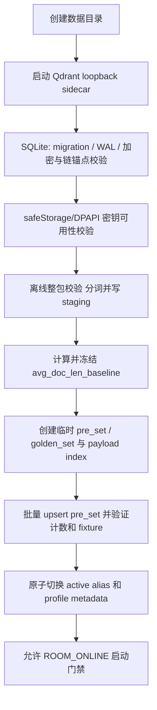

# Echocue Windows 部署、运行与故障处理手册 v0.1

发布候选的二进制、哈希、许可证、SBOM、兼容性和进程所有权必须填写并归档到 [《Windows 安装包清单与兼容矩阵》](Echocue-Windows安装包清单与兼容矩阵-v0.1.md)；模板空值不构成发布证据。

> 状态：开发交付基线  
> 适用范围：Windows x64 standalone MVP，单直播间、单团队、本机运行  
> 上游依据：《系统架构与详细设计说明书》《数据模型、接口与实时事件协议》《数据建模与迁移设计》《UI 信息架构与交互设计》  
> 本文不引入云后端、远程运维或自动恢复机制；具体安装器产品名和最终目录以构建配置为准。

## 1. 运行边界与不可违反规则

Echocue 是一个本机 standalone client。Electron Main Process 编排服务；AuditStore Worker 独占 SQLite；Qdrant 与 douyinLive 均为本机依赖，不构成云端服务。

| 规则 | 运维含义 |
| --- | --- |
| 手动启动门禁 | 只有用户点击“启动服务”后才创建 douyinLive WebSocket；仅收到 `ROOM_ONLINE` 才进入监听。 |
| 不自动重连 | `ROOM_OFFLINE`、`ROOM_ENDED`、WS 断开、门禁超时或连接异常时立即关闭 WS 并停在 `STOPPED`；用户修复后手动重试。 |
| 审计优先 | 审计首次写入、事务、加密、磁盘或权限异常时，取消当前 attempt、隐藏未展示建议、停止服务；不得绕过审计继续生成。 |
| 永久审计 | SQLite 审计、人设版本和反馈默认永久保留；MVP 无导出、无“清空审计”、不因升级自动删除。 |
| 明确退出 | 关闭主窗口只隐藏到托盘，仍可继续服务；仅托盘“退出 Echocue”经确认后停止服务、关闭 WS/sidecar、flush 审计并退出。 |
| 本机最小暴露 | Qdrant 和可能启用的诊断端点仅可监听 `127.0.0.1`；默认不启用 OTLP 出口。 |

## 2. 交付包、先决条件与目录

### 2.1 受控随包内容

安装包必须包含并校验下列固定版本产物，**首次运行不得静默下载** Qdrant、douyinLive、模型或其他二进制。版本、SHA-256 和许可证清单随安装包发布；校验失败时阻断启动并提示重新安装，不得从互联网替换文件。

| 内容 | 责任 | 运行要求 |
| --- | --- | --- |
| Echocue Electron 主程序、预加载脚本及 Renderer | 客户端 | Windows x64；Renderer 无 Node/文件系统权限。 |
| Qdrant Server `>=1.19.0` | 本机 sidecar | 仅 loopback；由 Main 受控启动/停止；只承载 `pre_set`、`golden_set`。 |
| `jieba-wasm`、BM25 profile、MurmurHash fixture | 应用资源 | 不在线下载词典；写入/查询使用同一版本。 |
| douyinLive 固定版本 Windows x64 产物 | Echocue 拥有的受控 sidecar | 随包发布；仅用户点击启动服务后由 Main 创建；停止服务/显式退出时由 Main 终止；客户端连接 `ws://127.0.0.1:1088/ws/{roomReference}`。 |
| SVG 图标源的构建产物 | 安装包资源 | 应用/任务栏 ICO 源自 [`../../svg/douyin-echocue-client-app-icon.svg`](../../svg/douyin-echocue-client-app-icon.svg)；托盘 PNG 源自 [`../../svg/douyin-echocue-client-tray-icon.svg`](../../svg/douyin-echocue-client-tray-icon.svg)。 |

MVP 部署形态已经冻结为随包受控 sidecar，不支持外部共享/甲方单独维护模式。Main 使用 Windows Job Object 绑定其拥有的 douyinLive 子进程，固定工作目录、loopback 端口、版本/SHA/许可证；用户停止服务时先关闭 Echocue WS，再终止该子进程。主窗口隐藏到托盘不改变进程；托盘显式退出必须完成同一停止顺序。端口占用或二进制校验失败返回 `E_SIDECAR_START_FAILED`，不得连接或杀死不属于本应用的外部进程。

### 2.2 前置条件

1. Windows x64，用户对其应用数据目录有读写权限；安装/启动时数据卷至少有 2 GiB 可用空间。
2. 已收到甲方提供的、通过数据标准校验的 `pre_set` JSONL；初始导入前不得启用服务。
3. 已配置至少一名主要出镜人员及其已发布人设版本、已发布且可执行的安全规则、直播间标识，以及 Provider 的服务商名称、adapter type、Base URL、Model ID 和 API Key。
4. 已完成已开播真实房间的 douyinLive 兼容性 POC；未通过前不得宣称端到端 MVP 验收完成。

### 2.3 本机数据布局

以下为安装器应使用的逻辑布局。根目录固定 `%LOCALAPPDATA%\\Echocue`（one-click 安装，安装器写入 `data-location.txt` 指针）；可在应用内「系统设置 → 运行机制 → 数据保存位置」迁移（迁移要求服务已停止，复制完成后应用自动重启，重启后从固定指针读取新根）。不得写入安装目录或共享网络路径。实际根路径需在诊断页以脱敏方式可定位。

```text
<app-data>/
  config/settings.json           # 非密钥配置，临时文件 + fsync + 原子 rename
  audit/audit.sqlite             # 审计、人设版本、反馈、outbox
  audit/audit.sqlite-wal         # SQLite WAL
  audit/audit.sqlite-shm         # SQLite shared memory
  qdrant/                        # 本地 collection 与 sidecar 数据
  logs/                          # 脱敏运行日志，非审计事实来源
  diagnostics/                   # 受控脱敏诊断摘要
```

API Key 不得出现于上述文件、SQLite、Qdrant payload、日志、崩溃报告或 IPC；其事实来源是 Electron `safeStorage`（Windows DPAPI）。

## 3. 首次安装与初始化

### 3.1 安装步骤

1. 从受控发布渠道取得 Windows x64 安装包并验证发布版本、签名/校验清单。
2. 安装完成后启动主程序。首次启动只检查本机依赖、创建数据目录和初始化向导；不得自动连接直播间、创建 WS 或调用 LLM。
3. 用户完成直播间、团队人设、安全规则、Provider 和浮窗偏好配置；API Key 输入后 UI 仅显示“已配置”。
4. 离线整包验证 `pre_set` JSONL 并写 staging：拒绝未知 `schema_version`、重复 `id`、额外字段、超限、敏感内容和无效字段。失败时不创建 active collection。
5. 初始化 SQLite、Qdrant 与检索 profile，全部健康后显示“可以启动服务”。

### 3.2 初始化事务顺序

初始化必须可重入；任一步失败即停止在未启动状态，保留已有可验证数据，不删除审计库来重试。



SQLite 初始化或迁移前必须设置 `foreign_keys=ON`、`journal_mode=WAL` 和受控 `busy_timeout`。migration 以单事务执行，记录单调版本与 checksum；失败不得“半修复”。

Qdrant 初始化先计算 profile，再创建两套临时 collection：`pre_set`（运行期只读）与 `golden_set`（仅由审计 transactional outbox 回流）。二者使用 `bm25_zh_jieba_v1`、`modifier: 'idf'` 与既定 payload index。完整 upsert 和 fixture 验证通过后才原子发布 active alias；失败只清理/隔离本次临时 collection。`golden_set` 增量回流不会重建 collection。

## 4. 日常启动、停止与窗口行为

### 4.1 用户启动服务

1. 用户在运行页点击“启动服务”。Main 先校验已发布人设/安全规则、直播间引用、Provider 配置与凭证、SQLite 可写、Qdrant 健康及 profile 完整性。
2. Main 校验并启动归本应用所有的 douyinLive sidecar，再创建本机 WS 请求直播状态；此时 lifecycle=`GATE_CONNECTING`、activity=`GATE_CHECKING`。
3. 只有 `ROOM_ONLINE`：创建 `live_session`、固定本次已发布人设/安全规则快照、转为 `RUNNING`。
4. `ROOM_OFFLINE`、超时或错误：**立即关闭 WS 并终止本应用拥有的 douyinLive sidecar**、回 `STOPPED`，显示“未开播/连接失败，可手动重试”。不保留后台轮询和重连任务。

### 4.2 运行期停止条件

下列事件都必须取消 in-flight attempt，隐藏浮窗、清除内存候选窗口、关闭本地 WS，并终止本应用拥有的 douyinLive sidecar：用户停止、`ROOM_ENDED`、`ROOM_OFFLINE`、WS 断开、审计不可用。Provider 超时、结构校验失败或单轮失败仅记录加密审计并继续监听；不得重试已过期弹幕。

展示窗口默认 10 秒且可配置。展示期间的后续弹幕仍写入审计（`RECEIVED → NORMALIZED → DISCARDED`，`DISPLAY_WINDOW_ACTIVE`），但不得进入队列、检索或 LLM；窗口结束只从最新窗口开始处理，不补发历史建议。

### 4.3 托盘与显式退出

| 用户动作 | 结果 |
| --- | --- |
| 红色关闭按钮、Alt+F4、系统关闭主窗口 | `preventDefault()` 后隐藏至托盘；AI 服务、已持有 WS 和浮窗均不因此停止。 |
| 黄色最小化按钮 | 最小化至任务栏；服务状态不变。 |
| 托盘“显示主窗口”/双击 | 恢复主窗口。 |
| 托盘“退出 Echocue” | 若服务运行，先确认“退出会停止监听并关闭浮窗”；确认后停止服务、关闭 WS 与 sidecar、flush/关闭 AuditStore，再退出进程。 |

任何退出链必须设置一次性 `isExplicitQuit`，防止 close handler 再把退出误处理为隐藏托盘。

## 5. Sidecar 与存储运行规范

### 5.1 Qdrant

- 由 Main 以受控子进程启动，启动前确认端口只绑定 `127.0.0.1`；健康检查失败时不允许启动 AI 服务。
- 不向 Renderer 开放 Qdrant endpoint、管理密钥或原始 payload。Qdrant 不是审计事实来源，不保存原始 WS、prompt、LLM raw response、Cookie 或 provider header。
- `pre_set` 不允许运行期打标修改；`golden_set` 只能由 SQLite outbox 幂等 upsert 或对本次 golden 直出源执行 `SET_BAD_CASE`。
- 进程异常或 collection/profile metadata 不匹配：停止 AI 服务，不自行下载/重建/清空库；用户修复后手动启动。profile 变更必须离线新建 collection、批量重编码并原子切换，不得在直播中静默改变。

### 5.2 douyinLive

- 仅接收 `ws://127.0.0.1:1088/ws/{roomReference}` 事件；`WebcastChatMessage` 才进入生成链路，礼物/点赞只用于匿名连接诊断。
- 当服务未启动、门禁失败或已停止时不得保持 Echocue WS。对方服务即使自行轮询，也不改变客户端“无 WS、手动重试”的边界。
- POC 和发布前检查必须覆盖 `ROOM_ONLINE`、突然 `ROOM_ENDED`、后续 `ROOM_OFFLINE`、WS 断开和再次手动启动；记录脱敏事件证据，禁止记录 Cookie/授权信息。

### 5.3 SQLite、WAL 与审计

AuditStore Worker 是数据库唯一写入者。每条 trace 的 transition、snapshot、reference 与当前状态在单一事务内写入；非法状态迁移报 `E_AUDIT_STATE_INVALID`。

- 运行中不得手工复制、移动、删除 `audit.sqlite`、`-wal` 或 `-shm`；三者共同构成一致性视图。
- 关闭时由 Worker 完成受控 checkpoint/close；若进程崩溃，下一次启动按 SQLite WAL 恢复并先执行完整性、迁移和解密/链锚点校验。
- 磁盘空间、权限、锁、解密、事务或完整性故障导致不可写时，报 `E_AUDIT_UNAVAILABLE` 并停服。不得删除历史审计、关闭 WAL 或降级为无审计模式来恢复。
- 每 60 秒检查数据卷可用空间；低于 1 GiB 或卷容量 10%（取更高门槛）报 `E_STORAGE_LOW`，诊断页显示容量与按 POC“每千条增长量”估算的剩余时长；低于 256 MiB 时禁止新 attempt 并按 `E_AUDIT_UNAVAILABLE` 停服。任何阈值都不得触发自动删除。

### 5.4 密钥与加密

敏感 SQLite 正文采用 AES-256-GCM canonical envelope；AAD 固定绑定表、主键、内容类型和版本。数据加密密钥与 HMAC 密钥独立随机生成，以 `safeStorage`/DPAPI 包装；完整性使用 HMAC-SHA-256 链。

- 禁止在日志、诊断摘要、截图、工单或支持沟通中索取/输出 API Key、DPAPI 包装内容、明文人设、弹幕原文或完整审计快照。
- 用户 Windows profile、DPAPI 保护域或密钥材料丢失时，历史加密审计可能不可解密；不得以新密钥覆盖旧数据或伪称恢复成功。需保留原数据并提示人工评估。
- 清除 API Key 是独立的破坏性操作；不等于删除审计或重置数据密钥。

## 6. 日志、指标与诊断

普通日志和 OTel/Prometheus 仅作运行诊断，均不是审计回放来源。可记录匿名枚举、计数、耗时、版本和错误码；严禁出现弹幕原文、昵称、人设、回复、prompt、`trace_id`、provider request ID、API Key、Cookie 或 Authorization header。

| 通道 | 默认策略 | 边界 |
| --- | --- | --- |
| 本机运行日志 | 脱敏、按受控运行策略轮转 | 不替代永久审计；不得作为原文备份。 |
| Prometheus | loopback 匿名指标，可按构建配置关闭 | 不向公网暴露。 |
| OpenTelemetry | 默认无 OTLP 出口 | 若未来显式启用，仅匿名计数/时延；先经安全评审。 |
| 诊断页 | 最小只读健康摘要与受控错误码 | 不显示原文、阈值、密钥或案例库内部机制。 |

## 7. 故障代码与处置

UI 对普通用户显示可理解的文案；诊断页可显示以下受控代码与修复建议。错误发生后**不会自动重连或自动恢复服务**。

| 代码 | 含义与即时动作 | 操作员处置 |
| --- | --- | --- |
| `E_CONFIG_INVALID` | 配置缺失/无效，拒绝启动。 | 补齐直播间、主出镜、人设/安全规则发布或 Provider 配置后手动启动。 |
| `E_SIDECAR_START_FAILED` | 受控 sidecar 校验、端口或启动失败。 | 检查安装完整性和端口占用；不得结束未知外部进程。 |
| `E_SOURCE_UNAVAILABLE` | 无法创建/维持 WS；停服并关闭 WS/本应用 sidecar。 | 检查本地组件和网络状态，重新点击启动。 |
| `E_ROOM_OFFLINE` / `E_ROOM_ENDED` | 未开播或已下播；关闭 WS/本应用 sidecar。 | 确认直播开播后手动重试。 |
| `E_QDRANT_UNAVAILABLE` | sidecar 未就绪、崩溃、端口/metadata 异常；拒绝启动或停服。 | 查看本机端口、磁盘、受控二进制完整性和 collection 诊断；修复后手动启动。 |
| `E_AUDIT_UNAVAILABLE` | 审计库不可写、解密/事务/完整性失败；取消 attempt 并停服。 | 检查磁盘空间、目录权限、Windows profile/DPAPI；不要删除库或 WAL。 |
| `E_AUDIT_STATE_INVALID` | 检测到非法 workflow 迁移；当前链路失败并停服。 | 保留库与脱敏诊断，交由开发人员分析迁移/状态机缺陷后修复。 |
| `E_SAFETY_POLICY_INVALID` | 安全规则缺失、编译失败或版本损坏。 | 在安全页修正并发布规则，随后手动启动。 |
| `E_PROVIDER_AUTH` / `E_PROVIDER_BILLING` | API Key 认证或账户计费失败；本轮不生成。 | 更新 Key 或账户状态；重新测试配置。 |
| `E_PROVIDER_RATE_LIMIT` / `E_PROVIDER_NETWORK` / `E_PROVIDER_SERVER` / `E_PROVIDER_TIMEOUT` | 单轮 Provider 失败或保险上限/新鲜度取消；记录审计后继续监听。 | 检查配置、模型服务与时延；不重试过期弹幕。 |
| `E_PROVIDER_PROTOCOL` / `E_PROVIDER_OUTPUT_INVALID` | 返回协议或输出校验失败。 | 保留脱敏诊断；检查 adapter/模型兼容性。 |
| `E_GOLDEN_SYNC_FAILED` | 内部回流同步失败，不展示给普通用户。 | 后台幂等重试；诊断维护入口处理。 |
| `E_STORAGE_LOW` | 数据卷进入预警区，尚未自动删除数据。 | 释放其他应用空间或扩容；低于硬门槛将停服。 |

## 8. 升级、回滚、备份与恢复边界

### 8.1 应用升级

1. 用户从托盘“退出 Echocue”，确认已完成正常停机后再执行安装升级；运行中不得覆盖 executable、sidecar 或数据文件。
2. 新版本启动时先校验受控二进制版本，再执行 SQLite migration。migration 仅向前、带 checksum、可重复启动；失败立即阻断服务并保留原库。
3. 不得以卸载/重装、删库、清理 WAL 或重新导入替代历史审计迁移。升级后必须验证 audit 可写、历史 trace 可读、HMAC 链锚点可验、Qdrant metadata/profile 匹配。
4. 若需要回滚应用版本，只能回退到与现有 schema/profile 兼容的受控版本；不兼容时先停止并制定显式迁移/恢复方案，不得破坏数据强行降级。

### 8.2 检索 profile 升级

只有 `avg_doc_len_baseline`、`k1`、`b`、jieba/归一化/热词规则、token-index namespace 或 calibration artifact 变更时，才允许创建新 profile。操作须在停服状态进行：创建新 collection → 批量重编码有效 `pre_set` 与 `golden_set` → 校验计数、metadata、抽样召回和审计 → 原子切换。旧 collection 留在受控验证/回滚窗口；永不影响 SQLite 永久审计。

### 8.3 备份与恢复

MVP **不提供用户可操作的审计导出或备份/恢复 UI**，也不支持把审计复制到云端。若因灾难恢复需要受控本机备份，只能在服务已完全停止、AuditStore 正常关闭并完成一致性 checkpoint 后，由获授权维护流程使用 SQLite 一致性备份机制处理；不得直接复制运行中的单个 `.sqlite` 文件，也不得遗漏 `-wal/-shm`。

恢复前保留故障现场副本，恢复后以只读方式验证 migration 版本、加密 envelope、HMAC 链锚点、审计 trace 和 Qdrant profile metadata；验证失败时保持停服。恢复操作不等同于用户导出能力，不允许自动清理或替换未验证历史数据。

## 9. 发布前运行检查

| 类别 | 必须通过的检查 |
| --- | --- |
| 安装与离线性 | Windows x64 空机安装；所有 sidecar/词典资源随包且校验通过；首次运行无静默二进制下载。 |
| 初始化 | SQLite WAL/migration/加密/HMAC 可用；`pre_set` 导入校验和平均文档长度冻结成功；双 collection 与 metadata 健康。 |
| 真实直播 POC | 甲方真实已开播房间连续 30 分钟；验证 `ROOM_ONLINE` 门禁、评论事件、`ROOM_ENDED/OFFLINE` 立即关闭 WS、断连后无自动重连。 |
| 性能 | `t0` 为 client 收到原始 WS frame 的单调时钟、`t_end` 为浮窗首帧确认；真实网络/人设/Provider 下测量 P95，持续优化目标不超过 3 秒，Provider 5 秒为保险上限且服从新鲜度 deadline。 |
| 审计 | 每条弹幕均有 trace；展示期弹幕审计但不排队；完整工作流、版本快照、TopK、输出与反馈可回放；不可写即停服。 |
| 安全 | Key 不进入 SQLite/Qdrant/日志/IPC；Qdrant/指标仅 loopback；日志与指标无原文、昵称、trace ID 或凭证。 |
| 桌面行为 | 三个窗口按钮正确；关闭隐藏托盘且服务不变；只有托盘显式退出停止服务、关闭 WS/sidecar、flush 审计。 |
| 升级恢复 | 空库、历史库、失败 migration、sidecar 异常、WAL 崩溃恢复和 DPAPI 不可用均有演练记录；无删库“修复”。 |
| 容量 | 记录每千条审计增长量；验证 2 GiB 启动门槛、低空间预警、256 MiB 停服、WAL checkpoint、释放空间后的完整性检查和受控本机恢复。 |

## 10. 交付责任与记录

开发方交付安装包校验清单、版本兼容矩阵、migration/profile 变更记录、POC 脱敏结果和发布前检查记录。甲方提供真实测试直播间、合规的 `pre_set`、API 账户配置与真实人设/弹幕样本，并确认运行主机的权限、磁盘和本机数据保留责任。

任何与本文冲突的“自动恢复、后台重连、删库释放空间、把审计上传云端或绕过审计生成”的实现，均视为不符合 MVP 设计，必须先回到上游需求和架构文档进行变更评审。

## 11. 本地构建安装包（迭代用，非发布门禁）

正式发布仍走 `release.md` 的 `PUBLISH <版本>` 信号与 `release-windows.yml`（tag 触发重建并验证）。本地构建仅用于迭代：

| 路径 | 命令 | 前置 |
| --- | --- | --- |
| WSL2 + Docker | `npm run package:win:local` | Docker daemon 已启动；`node_modules` 就绪（缺失则容器内 `npm ci`）；首次拉取 `electronuserland/builder:wine` 并下载 Windows electron/NSIS（**构建期下载**，符合 A-09 运行期不下载） |
| Windows 主机 | `powershell -NoProfile -ExecutionPolicy Bypass -File scripts/build-local.ps1` | Windows 侧可访问仓库（建议 `C:\` 下 `git clone` 副本）、Node 22+ |

产物：`release/Echocue Setup <ver>.exe` + `manifest.json`/`hashes.json`（`release:manifest`）+ `licenses.json`/`sbom.cdx.json`（`compliance`）。本地验证安装/启动/卸载：`npm run verify:local`（`win-install-verify.ps1`，支持 `ECHOCUE_INSTALLER` 覆盖安装包路径、`ECHOCUE_VERIFY_CLEAN_DATA=1` 触发卸载清理分支）。

**常见错误**：`wine is required`（Linux/WSL2 直接 `package:win` 缺 Wine）→ 用 Docker 镜像或先启动 Docker daemon；构建期下载 Windows 二进制属正常，不是运行时下载。
